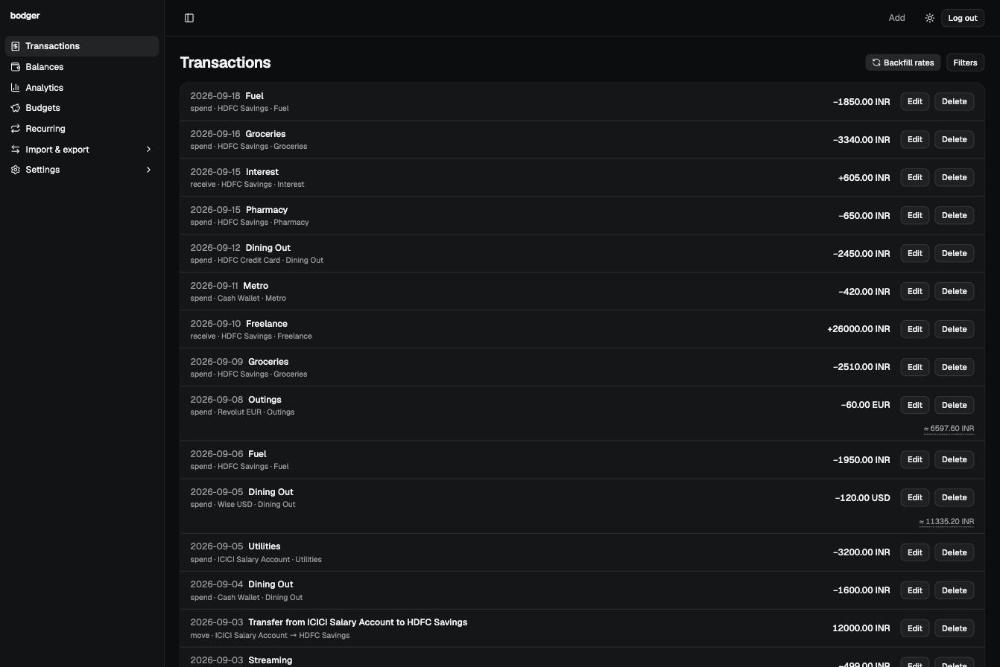
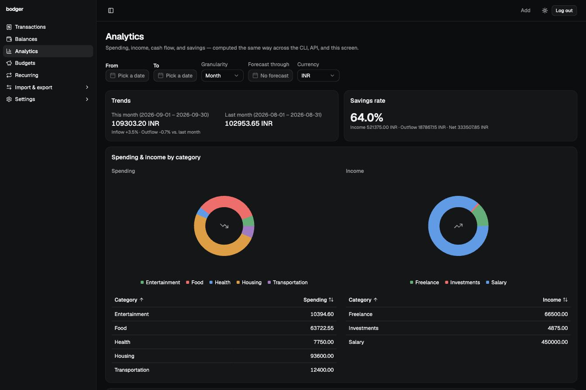
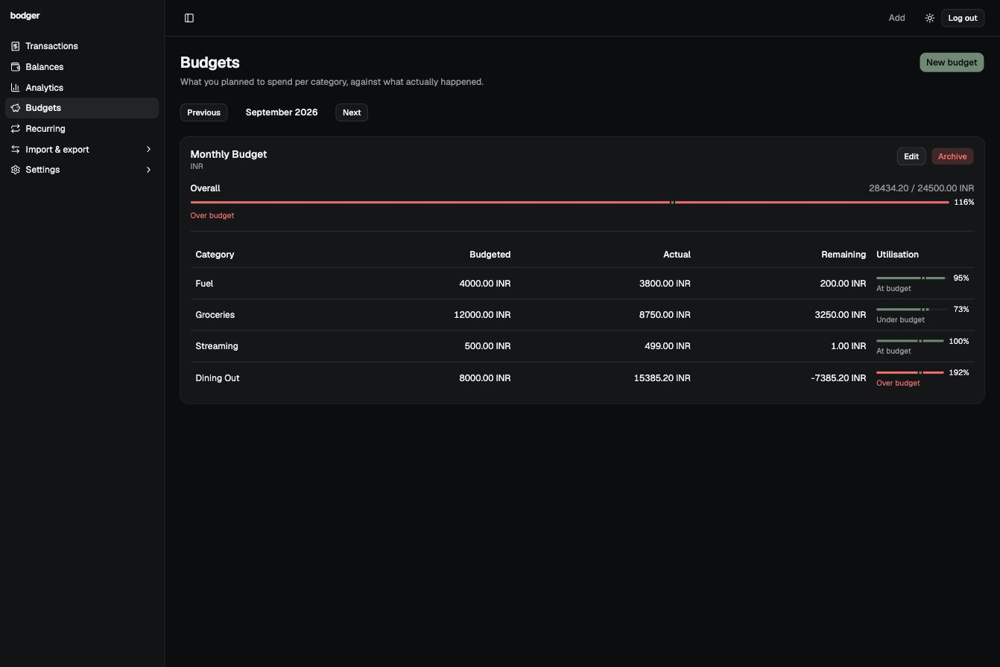
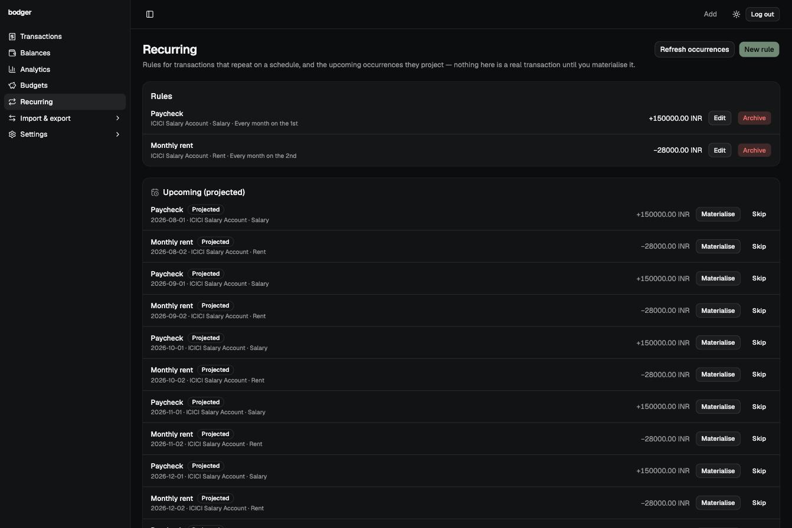
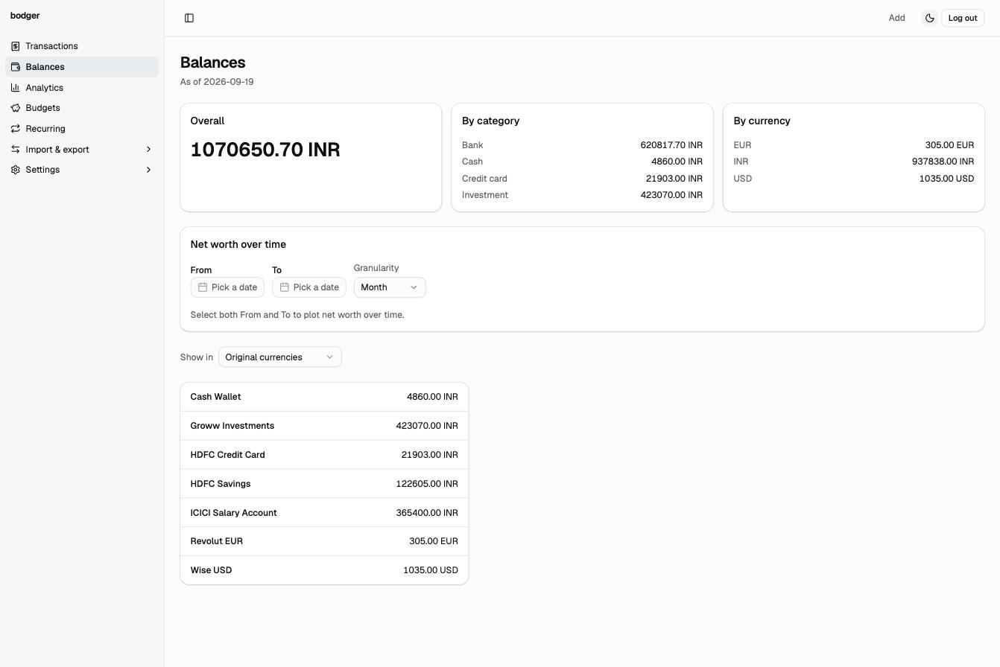

# bodger

A personal finance application you actually host yourself. Record what you spend, what comes in, and what moves between your accounts — then find out where it all went.

`bodger` is built around one idea: **one financial core, several thin interfaces over it.** A command line, a REST API, a web UI, and a local MCP server for AI agents all call the same code, so they can never disagree about what your money did.

<p align="center">
  
</p>

> [!NOTE]  
> bodger exists to solve one person's (that's me and mine) problem: self-hosting personal finance instead of handing it to a third party. Features get built because I needed them to replace my existing expense tracking software and/or I found them cool :)

> **Status: pre-1.0, actively developed.** All ten planned milestones are shipped — domain model, CLI, REST API, web UI, multi-currency/FX, analytics, import/export, budgets, MCP server, recurring transactions and ai-assisted categorisation are all built and tested. See [Status](docs/architecture.md#9-status) for the detail and [Milestones](#milestones) below for what's left. Prebuilt binaries are on the [Releases page](https://github.com/anirudhgray/bodger/releases), or build from source with `make build`.

---

## What it's for

Personal finance for a normal person — not accounting software. You should never need to know what a debit, a journal entry, or a chart of accounts is to use it. That's a deliberate constraint on the engineering, not a marketing line — see [ADR-0010](docs/decisions/0010-personal-finance-not-accounting-software.md).

- **Record money moving.** Spend, earn, transfer between your own accounts. Fast entry, sensible defaults, few required fields.
- **Multi-currency, properly.** Every amount carries its currency. Accounts have their own. Reports convert explicitly, and every converted number tells you which rate it used and when.
- **Understand it.** Balances, income, expenses, net cash flow, spending by category, trends, budgets.
- **Get your history in.** CSV and statement import with preview, duplicate detection, and rollback — nothing touches your ledger until you say so.
- **Get your data out.** A versioned, complete, human-readable export. It's your money; it should never be stuck in here.
- **Talk to it.** An MCP server so an AI assistant can check balances, record transactions, and run reports directly against your own data — with tiered permissions and confirmation on anything destructive.
- **Self-host it.** One binary, one SQLite file. Back it up by copying it; move to a new machine by copying it there. Docker packaging is planned but not shipped yet — see [issue #64](https://github.com/anirudhgray/bodger/issues/64).

## Interfaces

| | |
| --- | --- |
| **CLI** | `bodger spend 800 groceries --account "HDFC Savings" --on 2026-08-14` |
| **REST API** | `bodger serve` — what the web UI talks to, and what your scripts can too |
| **Web UI** | Dashboards, charts, review workflows. Built into the binary; no separate deployment |
| **MCP server** | `bodger mcp` — let a local AI agent read and record against your own data |

None of these is the "real" one. They are peers over the same application layer, and a [CI test](docs/decisions/0005-shared-application-layer.md#enforcement) proves the same input through any of them produces the same result.

## See it in action

| | |
| --- | --- |
|  |  |
|  |  |

More screens — the fast-entry form, a bank statement mid-import — are in [`docs/user-guide.md`](docs/user-guide.md) next to the sections that describe them.

The CLI and the MCP server, recorded with [VHS](https://github.com/charmbracelet/vhs):

<p align="center">
  
</p>

<p align="center">
  
</p>

## Documentation

| Document | What's in it |
| --- | --- |
| [Architecture](docs/architecture.md) | Layers, surface boundaries, milestones, current status |
| [Data model](docs/data-model.md) | The financial domain — accounts, transactions, postings, budgets, currency |
| [Schema / ERD](docs/schema/README.md) | The actual current SQLite schema, generated from the migrations, with an entity-relationship diagram |
| [UX principles](docs/ux-principles.md) | Who this is for, and the expectations every surface is held to |
| [Design system](docs/design-system.md) | The web UI's color, type, spacing, and component primitives |
| [Decision records](docs/decisions/) | Why the load-bearing calls were made the way they were |
| [Contributing](docs/contributing.md) | Toolchain setup, build commands, conventions |
| [User guide](docs/user-guide.md) | Installing, first run, recording transactions, reading balances, the CLI reference |

New here? Read [`docs/data-model.md`](docs/data-model.md) first. The domain model was designed before any interface, deliberately, and everything else makes more sense once you know it.

## Milestones

Each milestone leaves the application working, testable, and useful — see [`docs/architecture.md`'s Milestones section](docs/architecture.md#8-milestones) for what each one actually covers and why it's named what it is.

- [x] M1 · Arda — Ledger core, CLI, and REST API
- [x] M2 · The Shire — Web UI and authentication
- [x] M3 · Rivendell — UI polish and design system
- [x] M4 · The Grey Havens — Multi-currency and FX
- [x] M5 · Orthanc — Analytics and charts
- [x] M6 · Fangorn — Import and export
- [x] M7 · Gondor — Budgets
- [x] M8 · Moria — MCP server
- [x] M9 · Lothlórien — Recurring transactions
- [ ] M10 · Valinor — AI-assisted suggestions

## Building

Requires Go and Node at the versions pinned in [`.tool-versions`](.tool-versions) (`asdf install` or `mise install`).

```sh
make setup        # install dependencies
make setup-hooks  # activate the repo's git hooks - once per clone
make check        # format, vet, lint, test - exactly what CI runs
make build        # produces bin/bodger
```

Want realistic data to develop against instead of an empty ledger? `BODGER_DB_PATH=/tmp/bodger-dev.db make seed-dev` seeds a scratch database with a password, a couple of API tokens, a spread of accounts, a real category tree, and months of transactions via the real CLI — a US/EUR-centric dataset by default, or `make seed-dev-in` for an INR-centric one with a budget and recurring rules included. See [`scripts/seed-dev.sh`](scripts/seed-dev.sh).

Full details in [`docs/contributing.md`](docs/contributing.md).

## License

[MIT](LICENSE).
