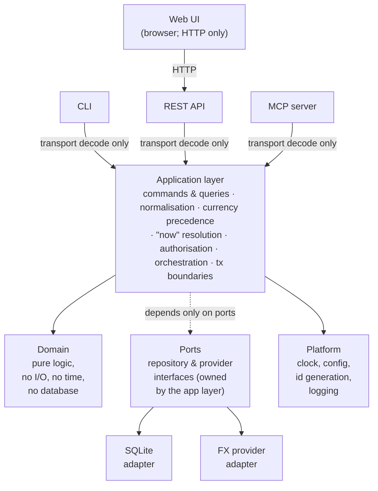

# Architecture

How `bodger` is put together: the layers, the boundary each surface is allowed to touch, the milestone sequence, and where the project currently stands.

For *what* the system stores, read [`data-model.md`](data-model.md) — it is the source of truth for financial semantics and was written first, deliberately. For *who it's for and how it should feel*, read [`ux-principles.md`](ux-principles.md), which every surface is held to. For the web UI's *visual* language — color, type, spacing, component primitives — read [`design-system.md`](design-system.md). This document describes the machinery around it.

---

## 1. The one architectural principle

> One coherent set of financial capabilities, and several thin interfaces over them.

The CLI, the REST API, the web UI, and the MCP server are **peers**. None of them is the "real" application with the others bolted on. Any business rule that exists in only one of them is a bug, and the project has a test suite whose entire job is to catch that ([ADR-0005](decisions/0005-shared-application-layer.md)).

---

## 2. Layers



Dependencies point inward. `domain` imports nothing from the project. `app` imports `domain` and `ports`. Adapters import `ports`. Surfaces import `app`. A surface importing `domain` directly, or an adapter importing `app`, is a CI failure, not a code-review opinion (§6).

### What each layer is for

**`domain`** — Money, Currency, Account, Category, Transaction, Posting, Budget, and their invariants. Pure functions and value objects. No database, no clock, no network, no config. This is where the exhaustive test coverage lives, because it is the layer where correctness is cheap to assert.

**`app`** — The use-case layer, and the only layer that knows what "now" is. Exposes one method per user intent (`RecordOutflow`, `RecordTransfer`, `ListTransactions`, `AccountBalances`, …), each taking a **command or query struct** and returning a result struct. Owns transaction boundaries, authorisation, currency precedence, date resolution, and every default. See [ADR-0005](decisions/0005-shared-application-layer.md).

**`ports`** — Interfaces the app layer needs the outside world to satisfy: `TransactionRepository`, `AccountRepository`, `FxRateProvider`, `Clock`. Defined by the consumer, not the implementer.

**`adapters`** — Implementations of ports. SQLite persistence, migrations, FX providers. Swappable without the app layer noticing.

**`surface`** — HTTP handlers, CLI commands, MCP tools. Each one does exactly three things: decode transport input into a command struct, call one app method, encode the result. Any `if` statement in a surface that isn't about presentation is a design smell.

Surfaces are also where [`ux-principles.md`](ux-principles.md) applies: they own every string a person reads, and they are the only place the product's vocabulary and defaults can go wrong.

They render errors, they never classify them. An error arrives from the application layer already carrying its code, its user-safe message, and its field path; the surface looks up the status or exit code in one shared table. A handler choosing its own HTTP status is the same class of defect as a handler parsing its own date — see [ADR-0011](decisions/0011-error-model.md).

**`platform`** — Cross-cutting infrastructure: the clock, config loading, ID generation, structured logging, and the error registry ([ADR-0011](decisions/0011-error-model.md)) that every surface renders from.

### The rule that matters most

**A surface may not resolve a default, parse a domain value, or ask what time it is.**

If the CLI parses `"2026-08-14"` into a date and the API parses it too, they will eventually disagree about `"14/08/2026"`, `"today"`, or what happens at a month boundary in `Asia/Kolkata`. So a surface never resolves a date itself — it passes the raw string through and the app layer normalises, because only the app layer holds the clock and the user's timezone. The same is true of anything else that needs a repository lookup (which account does "hdfc savings" mean?) or instance config (what currency applies by default?): only fields with no such dependency are typed at the boundary. This is CLAUDE.md's normalise-once rule, and with four surfaces it is the rule most likely to erode silently. [ADR-0005](decisions/0005-shared-application-layer.md) specifies both the contract, precisely which fields it applies to and why, and the mechanism that enforces it.

---

## 3. Surface boundaries

| Surface | Reaches the app layer via | Ships in | Purpose |
| --- | --- | --- | --- |
| **CLI** | Direct in-process call | `bodger` binary | Fast entry, scripting, automation, debugging |
| **REST API** | Direct in-process call | `bodger serve` | The web UI's only interface; external clients and integrations |
| **MCP server** | Direct in-process call | `bodger mcp` | Local tool-calling agents over the user's own data |
| **Web UI** | HTTP → REST API | Static assets embedded in the binary | Dashboards, charts, review-heavy workflows |

Three of the four surfaces link the application layer directly. Only the web UI must cross a network boundary, because it runs in a browser.

This is the arrangement that makes the normalise-once rule easiest to keep: the CLI and MCP call the *same Go function* the HTTP handler calls, so there is no second implementation to drift. Routing the CLI and MCP through HTTP instead would also satisfy normalise-once, but it would force a server to be running to record a transaction, and would make the MCP server a network client of a service it usually shares a machine with. See [ADR-0001](decisions/0001-technology-stack.md).

**Consequence to know about:** more than one process can open the same SQLite database — `bodger serve` in Docker and `bodger tx add` in a terminal. WAL mode plus a busy timeout makes this safe for personal-scale concurrency, and this is a documented constraint rather than an accident. [ADR-0007](decisions/0007-persistence-and-migrations.md) covers it, including the Postgres path that removes it.

### What the web UI may not do

The web UI holds **no financial logic**. No client-side balance summation, no client-side currency conversion, no client-side period arithmetic, no client-side category rollup. It renders what the API computed. The moment a number is computed in TypeScript, the CLI and MCP cannot produce it, and the product has quietly grown a second financial model.

Formatting a server-supplied minor-unit integer for display is presentation and belongs in the browser. Deciding *which* rate converted it is not.

### What MCP tools may not do

MCP tools map one-to-one onto app-layer methods. They never touch the repository layer or emit SQL, and they are classified explicitly:

- **read** — queries and analytics. Always allowed.
- **write** — creating and editing transactions. Allowed, audited.
- **destructive** — deletion, bulk edits, import commit, rollback. Requires explicit confirmation and is disabled by default.

Details land with the MCP milestone; the classification is fixed now so tools aren't retrofitted into it.

---

## 4. Technology

Full rationale in [ADR-0001](decisions/0001-technology-stack.md). Summary:

| Concern | Choice |
| --- | --- |
| Backend, CLI, MCP | **Go 1.27** — one static binary, trivial cross-compilation for a NAS or VPS, strong stdlib HTTP, cheap to keep layers separated |
| Database | **SQLite** via `modernc.org/sqlite` (pure Go, no cgo) |
| Migrations | **goose**, SQL files embedded with `embed.FS` |
| HTTP routing | **stdlib `net/http.ServeMux`** — method+pattern routing since Go 1.22; no framework |
| CLI framework | **cobra** |
| OpenAPI generation/validation | **`github.com/getkin/kin-openapi`** — generates `internal/surface/http/openapi.json` from the REST API's own DTOs and route table, and validates real e2e-test responses against it (issue #36) |
| MCP | **`github.com/modelcontextprotocol/go-sdk`** (official) |
| Web UI | **React + TypeScript + Vite**, built to static assets embedded in the Go binary |
| Auth | Session cookies for the browser, hashed API tokens for CLI/MCP/scripts; see [ADR-0006](decisions/0006-authentication-and-multi-user-path.md) |
| Deployment | Single container + Docker Compose; SQLite file on a volume |
| Toolchain pin | `.tool-versions` (asdf/mise) |
| Task runner | `Makefile` |
| CI | GitHub Actions running the same `make` targets |

Self-hosting is the deployment target that shaped most of this: one binary with the web UI baked in, one SQLite file to back up, `docker compose up`, and no separate database container to operate.

---

## 5. Repository layout

```
cmd/bodger/            single binary: serve, mcp, and all CLI commands
internal/
  domain/              pure financial model — money, ledger, budget
  app/                 use cases; commands, queries, normalisation
    normalize/         the ONLY place raw input becomes domain values
  ports/               repository and provider interfaces
  adapters/
    sqlite/            repositories + migrations/
    fxprovider/        FX rate providers
  surface/
    http/              REST handlers, router, DTOs
    cli/               cobra commands
    mcp/               MCP tool definitions
  platform/            clock, config, idgen, logging, error registry
web/                   React + Vite app; built assets embedded at compile time
docs/                  architecture, data model, ADRs, guides
```

---

## 6. Enforcement

Conventions that live only in a document decay. These are checked by `make check` — split into `make check-go`/`make check-web` in CI, run only for the side a commit actually touches (see [contributing.md](contributing.md#commands)):

- **Layer boundaries** — an import-graph check fails the build if `domain` imports anything project-local, if a surface imports `domain` or an adapter, or if an adapter imports `app`.
- **No wall clock outside the clock** — `time.Now()` anywhere but `internal/platform/clock` fails the build. Time is injected, which also makes date-boundary tests deterministic.
- **No environment reads outside config** — `os.Getenv` outside `internal/platform/config` fails the build.
- **No unclassified errors out of the app layer** — a `fmt.Errorf` or `errors.New` in `internal/app` that isn't wrapped as an `*errs.Error`'s cause fails the build, so every failure a surface receives arrives with a code ([ADR-0011](decisions/0011-error-model.md)). `internal/domain` and the adapters are unaffected: their errors are meant to be plain, or to *become* that cause.
- **Surface conformance suite** — one table of raw inputs driven through the CLI, the REST API, and MCP, asserting all three produce identical normalised command structs. This is the test that catches normalise-once erosion, and it is why the API is in milestone 1 alongside the CLI rather than after it.
- **Vocabulary** — [`ux-principles.md` §2](ux-principles.md#2-vocabulary)'s banned-term table is checked against the error registry's default messages and every cobra help and flag usage string. Conformance checks that surfaces *behave* alike; this checks that they *speak* alike. See [`contributing.md`](contributing.md#the-vocabulary-check).
- **OpenAPI document freshness and response validation** — `internal/surface/http/openapi.json` is generated from the REST API's own DTOs and route table (issue #36); one test re-runs the generator and fails the build on any drift from a forgotten `go generate`, and the package's end-to-end tests validate every real response against that same document, so a handler whose response doesn't match its own declared schema fails too.
- **`TZ=UTC` in CI** — so a test that accidentally depends on the host timezone fails on the machine that matters.

---

## 7. Testing strategy

Weighted toward the layer where correctness is decided:

- **Domain** — exhaustive, deterministic, table-driven. Every invariant in [`data-model.md` §14](data-model.md#14-invariants-that-must-have-tests).
- **App** — use-case tests against an in-memory repository, with a frozen clock and a fixed timezone. Currency precedence, period boundaries, authorisation.
- **Persistence** — repository tests against a real temp-file SQLite database, plus a migrate-up/migrate-down cycle on every migration.
- **Surfaces** — thin. Enough to prove decoding and encoding; the shared conformance suite covers the rest.
- **Round-trip** — export → import → export is byte-identical modulo surrogate IDs and timestamps.
- **Web UI** — component tests with Vitest; end-to-end kept deliberately sparse — a small number of targeted Playwright tests, each run against a real build of the production binary, not a substitute for each screen's own Vitest coverage. A new one earns its place for a real, distinct user-facing flow through the whole stack (e.g. issue #65's login → record → balance → logout, or issue #101's dark-mode toggle surviving a real reload) — not to click-test every element, and not instead of a Vitest test for the underlying logic when one is possible. UI tests are not where financial correctness is established.

Fixtures cover multiple currencies, transfers, splits, refunds, credit cards, imported duplicates, month boundaries, and a leap day.

---

## 8. Milestones

Each milestone leaves the application working, testable, and useful. Ordering after M2 is revisable as the product teaches us something.

Milestones get a **name** as well as a number, taken from fantasy and sci-fi worlds and planets — M1 is *Arda*, the world itself, which is what everything after it sits on. Names are assigned when a milestone is actually created and scoped, not reserved in advance; the unnamed ones below are sketches, and naming them now would imply more certainty about their scope than exists. Eventual releases will take the name of the milestone they complete rather than inventing a second vocabulary — see [`docs/releasing.md`](releasing.md) for how a release is actually cut.

### M1 · Arda — Ledger core, CLI, and REST API
The smallest genuinely usable slice: record money moving and see where you stand.

Domain model (money, accounts, categories, transactions, postings, transfers, splits) · SQLite persistence and migrations · application layer with the normalisation contract · CLI · read/write REST API · derived balances · the layer-boundary and conformance checks from §6.

Single currency per account; a cross-currency transfer is rejected with a clear error rather than silently mis-converted. No auth — the server binds `127.0.0.1` and refuses a non-loopback bind until auth exists ([ADR-0006](decisions/0006-authentication-and-multi-user-path.md)). No web UI, no MCP, no FX, no budgets, no import.

Two surfaces ship together deliberately: the conformance suite needs two surfaces to compare, and the normalise-once contract is far cheaper to establish now than to retrofit across four.

### M2 · The Shire — Web UI and authentication
Fast transaction entry, transaction list with filters, account balances, settings. Session-cookie auth for the browser, hashed API tokens for CLI/MCP. This is the milestone where a non-technical person can use the product — ordinary folk, no accountants, which is the Shire's whole character in the Arda (M1) world.

A Docker image and Compose file (issue #64) were built alongside this milestone but shipped as a fast-follow rather than blocking it: PR #72 is complete and verified, but held on [#93](https://github.com/anirudhgray/bodger/issues/93), a read-visibility bug that leaves a containerized instance unauthenticatable after its first-run password is set. Docker packaging isn't core to "a non-technical person can use the product" the way the web UI and auth are, so #64 was moved out of the M2 milestone rather than holding M2 open on an external bug fix; it merges whenever #93 is resolved.

### M3 · Rivendell — UI polish and design system
The unglamorous pass before FX adds more surface to get wrong: a deliberate
visual language instead of shadcn's install defaults, plus the UI debt M2
shipped with rather than blocked on. Design tokens (color, type, spacing,
radius, elevation) drafted first as mockups via Claude Design, then
documented in `docs/design-system.md`; the existing `web/src/components/ui`
primitives audited and brought into line with it. Cross-navigation between
related screens and a responsive layout for small screens
([#89](https://github.com/anirudhgray/bodger/issues/89),
[#88](https://github.com/anirudhgray/bodger/issues/88)) land here rather
than as ad-hoc fixes, since both are exactly the kind of thing a real
design system should settle once rather than patch per-screen.

### M4 · The Grey Havens — Multi-currency and FX
Cross-currency transfers enabled. FX provider abstraction, rate storage, explicit conversion policies, reporting currency. Every converted figure carries its rate, date, source, and policy ([ADR-0004](decisions/0004-multi-currency-and-fx.md)). Rate fetching is always an explicit, user-triggered action — never a background poller — and a fetch is the only thing that ever writes to `fx_rates`; there is no manual-rate entry. Named for the Havens where those who cross over the Sea depart from — a fitting name for the milestone where money finally crosses between currencies.

### M5 — Analytics and charts
The shared query/filter model ([ADR-0009](decisions/0009-query-and-analytics-model.md)), spending and income by category, cash flow, trends, savings rate. Charts in the web UI and machine-readable output from the CLI, both over the same analytics methods.

### M6 — Import and export
The staged import pipeline, CSV import with column mapping, duplicate detection, preview and commit. Canonical versioned JSON export and full backup ([ADR-0008](decisions/0008-import-export-architecture.md)). Export lands before or with import: backup is what makes import safe to attempt.

### M7 — Budgets
Monthly category budgets, actual vs budget, remaining, utilisation, history. Rollover stays deferred.

### M8 — MCP server
`bodger mcp` over stdio. Read, write, and destructive tool tiers with confirmation and audit.

### M9 — Recurring transactions
Rules, scheduled occurrences, materialisation, forecasting. Occurrences never touch a balance.

---

## 9. Status

**M1 · Arda shipped as [v0.1.0](https://github.com/anirudhgray/bodger/releases/tag/v0.1.0).**
**M2 · The Shire is complete** — see the [M2 milestone](https://github.com/anirudhgray/bodger/milestone/2)
for its issues. Issue #65 (auth flow and web e2e smoke tests) was the last
milestone item; #64 (docker-compose, [PR #72](https://github.com/anirudhgray/bodger/pull/72))
was moved out of M2 rather than holding the milestone open on
[#93](https://github.com/anirudhgray/bodger/issues/93), a read-visibility
bug in containerized `bodger serve` unrelated to the milestone's own goal
— see §8. It's tracked as backlog, unmilestoned, until #93 is resolved.

**M3 · Rivendell is complete** — see the [M3 milestone](https://github.com/anirudhgray/bodger/milestone/3)
for its issues. [#100](https://github.com/anirudhgray/bodger/issues/100)
(design tokens), [#101](https://github.com/anirudhgray/bodger/issues/101)
(auditing `components/ui` and the existing pages against them —
`docs/design-system.md`), [#89](https://github.com/anirudhgray/bodger/issues/89)
(cross-navigation), [#88](https://github.com/anirudhgray/bodger/issues/88)
(responsive layout, including wiring `sidebar` into `AppLayout`'s nav), and
[#107](https://github.com/anirudhgray/bodger/issues/107) (splitting Settings
into nested subpages under `/settings`, now that #88 settled `AppLayout`'s
own nav as a `Sidebar` — Settings' own sub-nav is a `tabs` strip for
switching sections once already on one, plus a collapsible `Sidebar`
submenu for jumping to one directly; see `docs/design-system.md`'s `tabs`
section for why both exist), [#104](https://github.com/anirudhgray/bodger/issues/104)
(wiring the remaining Radix-portal primitives into pages — `popover`+
`calendar` landed as a real date picker in #118, and the native-`<select>`-
to-Radix swap landed in two steps: a `command`/`combobox`-based Combobox
for the three category pickers alongside #106, below, then a themed
Radix rebuild of `components/ui/select.tsx` itself for every remaining
`<select>` in the app (account/category type dropdowns, TransactionDialog's
account fields, TransactionsList's account/type filters) — its native
predecessor's open dropdown was unstyled browser chrome, the one control
left that didn't respect the app's own theme; see `docs/design-system.md`'s
"Select: Radix, not native" section, including a real Radix Select gotcha
found and fixed along the way. `dialog`/`alert-dialog` and `dropdown-menu`
were deliberately left unwired, per #104's own "only if a real spot turns
up" scoping — no row's inline actions have outgrown a plain button group,
and deletes/archives stay intentionally unconfirmed, docs/ux-principles.md
§5), and [#106](https://github.com/anirudhgray/bodger/issues/106)
(category hierarchy view + quick-create from pickers: Settings' category
list and every category picker now show the real parent/child tree via a
new Combobox primitive, with an inline "+ Create category" row in the
transaction dialog's own picker — see `docs/design-system.md`'s
"Combobox and category hierarchy" section) are done.

**M4 · The Grey Havens is in progress.**
[ADR-0012](decisions/0012-fx-rate-provider.md) picked Frankfurter as the FX
rate provider; the `fx_rates` schema, transfer rate columns, and the
`users.reporting_currency` column landed as schema-only groundwork; and the
domain layer's `Rate` value type, the nearest-earlier-within-staleness-
window rate-selection rule, and cross-currency transfer support followed.
[#132](https://github.com/anirudhgray/bodger/issues/132) wires the ladder's
last missing rung — per-user reporting currency — into
`internal/app/normalize`'s resolution and the two call sites
(`CreateAccount`, `buildOutflowOrInflowPosting`) that previously hardcoded
it to `""`.
[#134](https://github.com/anirudhgray/bodger/issues/134) adds
`internal/app.ConvertAmount`, the single policy-aware conversion query
ADR-0004 calls for (`transaction_date`/`current`/`pinned`, each resolving
its own lookup date rather than defaulting to "today"), and extends
`AccountBalances` to convert through it — a missing rate for one account's
currency is reported in the result's `Unconverted` list rather than
failing the whole query or silently dropping that account.
[#135](https://github.com/anirudhgray/bodger/issues/135) adds the last two
app-layer FX use cases: `FetchFxRates`, the one explicit, network-touching,
store-writing action for FX (defaults to every currency pair
`FxRateRepository.InUsePairs` reports for the actor, quoted against their
resolved reporting currency, at the current date; accepts an optional
base-currency filter and an optional `from`/`to` backfill range that
delegates to the provider's `FetchRange` once per pair rather than looping
over dates; every pair is fetched into memory before anything is written,
then stored in one `StoreBatch` call, so a provider failure partway
through leaves `fx_rates` untouched rather than partially populated), and
`ListFxRates`, a pure stored-data-only read — never touching
`FxProvider` — that is a thin wrapper over `ConvertAmount`, optionally
converting an amount alongside the resolved rate's own provenance; this is
what will power every "≈ N as of `<date>`" display, including for a
transaction amount that hasn't been persisted anywhere yet.
[#133](https://github.com/anirudhgray/bodger/issues/133) wires that
domain-level cross-currency support into `RecordTransfer`/`EditTransaction`
themselves: `buildTransferPostings` no longer rejects a from/to currency
mismatch, `ledger.Transaction` gained a `WithFxRate`/`FxRate`
copy-transform-and-accessor pair for carrying an implied rate through
construction and reconstruction, and `internal/adapters/sqlite`'s
transaction repository reads and writes `transactions.fx_rate_used`/
`fx_rate_source` — populated only for a cross-currency transfer, per
ADR-0004, and read back as the stored value rather than re-derived from the
postings on every `Get`/`List`. Sending the to-leg's amount independently
(rather than reusing the from-leg's raw number across both currencies) is
still a separate, unstarted surface change. Every surface exposing this
app-layer work
([#136](https://github.com/anirudhgray/bodger/issues/136)–[#141](https://github.com/anirudhgray/bodger/issues/141),
[#145](https://github.com/anirudhgray/bodger/issues/145)) remains open.

| Milestone | Status |
| --- | --- |
| M0 — Architecture, docs, toolchain, CI | ✅ Complete |
| M1 · Arda — Ledger core, CLI, REST API | ✅ Complete (v0.1.0) |
| M2 · The Shire — Web UI and authentication | ✅ Complete |
| M3 · Rivendell — UI polish and design system | ✅ Complete |
| M4 · The Grey Havens — Multi-currency and FX | 🟨 In progress |
| M5 — Analytics and charts | ⬜ Not started |
| M6 — Import and export | ⬜ Not started |
| M7 — Budgets | ⬜ Not started |
| M8 — MCP server | ⬜ Not started |
| M9 — Recurring transactions | ⬜ Not started |

Delivered in M0: this document, [`data-model.md`](data-model.md), [`ux-principles.md`](ux-principles.md), ADRs 0001–0011, [`contributing.md`](contributing.md), a placeholder [`user-guide.md`](user-guide.md), `.tool-versions`, `Makefile`, and the GitHub Actions workflow.

The bootstrap product brief has been fully absorbed into these documents and can be deleted; nothing in `docs/` cites it. See [`decisions/README.md`](decisions/README.md#on-the-brief).

Delivered so far in M1:

- `internal/domain/money` and `internal/domain` — `Money` and `Date` value
  objects, currency reference data, arithmetic, formatting/parsing, JSON
  marshalling (issue #1).
- `internal/platform/clock`, `internal/platform/config`,
  `internal/platform/idgen`, `internal/platform/logging`,
  `internal/platform/errs` — injected clock, layered config, ID
  generation, structured logging, shared error registry (issue #4).
- `internal/domain/ledger` — `Account`, `Category`, `Tag`, `Transaction`,
  and `Posting`, with the invariants from data-model.md §14 and a pure
  `Balance` function (issue #2). `Account` and `Category` carry the full
  data-model.md §4/§6 field set — `Institution`, `SortOrder`, and
  `ArchivedAt` — persisted through the SQLite adapter below (issue #22).
- `internal/ports` — `AccountRepository`, `CategoryRepository`,
  `TransactionRepository`, and `TagRepository` interfaces, and
  `internal/adapters/sqlite` — their `modernc.org/sqlite` implementation:
  the ADR-0007 pragmas, a single-connection write pool and a pooled read
  pool, goose migrations embedded via `embed.FS` with a tested
  `-- +goose Down` and pre-migration `VACUUM INTO` backup, and the single
  M1 user seeded with a fixed UUID (ADR-0006) by the first migration
  (issue #3).
- `internal/app/normalize` — `Amount`, `Currency`, `DateOf`, `Ref`,
  `Text`, and `Tag`: the only place raw surface input becomes a domain
  value, per the normalise-once contract (ADR-0005). `internal/app`'s
  `Service` container wires the clock, config, ID generator, and
  repository ports together once for every future surface to share, and
  the `cmd/bodger` root command bootstraps config, the database,
  migrations, and the container, with no subcommands registered yet
  (issue #5).
- `internal/app`'s use-case methods: account and category CRUD (create,
  rename, archive, list — plus reparent for categories), `RecordOutflow`,
  `RecordInflow`, `RecordTransfer`, edit and soft-delete a transaction
  (writing a `transaction_revision` row per data-model.md §7),
  `ListTransactions` with the reduced M1 filter (date range, account,
  category subtree, kind), offset pagination, and a fully deterministic
  sort, and `AccountBalances(asOf)` computed from postings per ADR-0002
  (issue #6).
- `internal/surface/cli` — `spend`, `receive`, `move`, `balance`,
  `transactions` (list/edit/delete), `accounts`
  (list/add/rename/archive/set-opening-balance), and `categories`
  (list/tree/add/rename/reparent/archive), registered onto `cmd/bodger`'s
  root command. Every command decodes flags into a command struct and
  calls exactly one application method; `--json` gives stable
  machine-readable output on every data-returning command (issues #7 and
  #30). Every use case `internal/app` exposes now has a command; the CLI
  speaks one vocabulary throughout, so a transaction is filtered and
  described with the verb that recorded it (`spend`/`receive`/`move`)
  rather than the application layer's own kind names.
- `internal/surface/http` — bodger's REST API, on stdlib
  `net/http.ServeMux`, registered as `bodger serve` onto the same root
  command. Every handler decodes JSON into a command or query struct,
  calls exactly one application method, and encodes the result — the same
  adapter-contract discipline as the CLI. Covers accounts, categories,
  transactions (including cursor-paginated listing), transfers, and
  balances, plus `/healthz`; `GetAccount`, `GetCategory`, and
  `GetTransaction` were added to `internal/app` alongside it so a single
  resource's `GET /{id}` route has one application method to call.
  Ships with an OpenAPI 3 description (`internal/surface/http/openapi.json`)
  generated, not hand-written, from `routeTable` and this surface's own
  request/response DTOs via [`kin-openapi`](https://github.com/getkin/kin-openapi)'s
  `openapi3gen` (issue #36) — a CI test regenerates it and fails the
  build on any drift from a forgotten `go generate`, and the package's
  end-to-end tests validate every real response against the same
  document via `openapi3filter`, so a handler whose response doesn't
  match its own declared schema fails CI too. `internal/platform/config`
  gained `HTTPBindAddr` (default `127.0.0.1:8080`) and refuses to load a
  configuration that binds anywhere but loopback, since there is no
  authentication yet (issue #8, ADR-0006).

- `internal/lint` — the mechanical guard ADR-0011 names but didn't have:
  a parse of `internal/app` that fails `make check` on any `fmt.Errorf` or
  `errors.New` not nested inside a `Wrap(...)` call, so no error can reach
  a surface without a code. `NewService`'s nil-dependency checks, the one
  existing violation, now return `errs.Internal` with the dependency name
  in the logged cause (issue #12).
- `internal/lint`'s remaining two mechanical checks from §6: an
  import-graph test enforcing the layer table in §2 (`domain` imports
  nothing project-local outside its own subtree; `app` imports `domain`,
  `ports`, `platform`; adapters import `ports`, `domain`, `platform`;
  surfaces import `app`, `platform`, and `ports` — never `domain`, never
  an adapter), and a banned-symbol check confining `time.Now()` to
  `internal/platform/clock` and `os.Getenv` to `internal/platform/config`
  across the whole tree, superseding `internal/surface/http`'s own
  narrower stopgap for the latter. `internal/surface/conformance` drives
  outflow, inflow, and transfer through the CLI and REST API's real entry
  points under a frozen, deliberately hostile instant, asserting an
  identical observable result — or an identical error code and field —
  across date resolution, amount and currency parsing, account/category
  resolution (exact, case-insensitive, ambiguous, not-found), Unicode
  text normalisation, and tag normalisation (issue #9). This was M1's
  last remaining item against the scope in §8: everything the milestone
  promised is now built and mechanically enforced.

Delivered so far in M2:

- `web/` — the React + TypeScript + Vite scaffold (issue #58): Tailwind
  and shadcn/ui (Radix primitives copied into `web/src/components/ui`,
  not an npm-installed themed component library), a routing skeleton
  (`web/src/routes.tsx`) with placeholder screens for the issues below to
  fill in, and `npm run dev`'s Vite dev server proxying `/api` and
  `/healthz` to a locally running `bodger serve` so frontend iteration
  doesn't need a production build each time. The dev server runs over
  `https://localhost:5173`, not plain HTTP (issue #86, `vite-plugin-mkcert`
  in `vite.config.ts`): the session cookie is `Secure`, and Safari doesn't
  reliably honour that attribute over `http://localhost` (a currently-open
  WebKit inconsistency — issue #85's investigation has the detail), so
  without real TLS here Safari can't complete login against the dev
  server at all. First run per machine prompts once for the OS password
  to trust the generated local CA. `make build-web` builds
  straight into `internal/platform/webui/dist`, which that package
  `go:embed`s; nothing under `dist/` is tracked except an empty
  `.gitkeep` (so `go build`/`go test`/`go vet` keep working on a Go-only
  checkout before `npm run build` has ever run), and a real build is free
  to empty and rewrite the directory without ever touching a tracked file
  — `internal/platform/webui`'s own placeholder page lives in a sibling
  `placeholder/` directory outside Vite's output path instead, and is
  served in `dist/index.html`'s place until a real build exists.
  `internal/surface/http.NewServerHandler` serves whichever one `Dist()`
  returns alongside the REST API, falling back to `index.html` for any
  path that isn't a real static asset so a hard refresh on a client-side
  route still resolves. Holds no financial logic and imports no domain
  type, per §3.
- `internal/platform/auth` — pure, no-I/O Argon2id password hashing
  (`golang.org/x/crypto/argon2`) behind a hand-rolled, self-describing
  PHC-string encode/decode, with default parameters starting from
  RFC 9106 §4's small-memory recommended set per ADR-0006's "tuned for a
  small server" line; opaque cryptographically random session-token
  generation and hashing; and `bdg_`-prefixed API-token generation stored
  as a SHA-256 hash per ADR-0006's credential table. No repository,
  use-case, HTTP, or CLI code yet — this is the foundation the
  persistence, application, and surface auth issues build on (issue #53).
- The persistence half of M2 auth (issue #54, ADR-0006, ADR-0007):
  migration `00010_add_auth_tables.sql` adds a nullable `password_hash`
  column to `users`, a `sessions` table (hashed token, sliding-expiry
  bookkeeping via `created_at`/`last_used_at`/`expires_at`), and an
  `api_tokens` table (hashed token, user-supplied name, optional expiry,
  soft revocation via `revoked_at`) — the exact shapes
  `internal/platform/auth` (issue #53) already produces. `internal/ports`
  gained `SessionRepository` and `APITokenRepository`, implemented over
  SQLite by `internal/adapters/sqlite`'s `SessionRepository` and
  `APITokenRepository`. Both `GetByTokenHash` methods skip the
  actor-filtering convention every other repository method here
  follows, because establishing who the actor is is exactly what that
  lookup is for; a session is revoked with a hard `Delete` (ADR-0006),
  an API token with a soft `Revoke` that keeps it listable. No use-case
  or surface wiring yet — issue #55 builds login, logout, and token
  issuance on top of these.
- The application-layer half of M2 auth (issue #55, ADR-0006): `internal/app/auth.go`
  adds `Login`, `Logout`, `SetPassword`, `CreateAPIToken`, `ListAPITokens`,
  and `RevokeAPIToken`, plus `AuthenticateSession` and
  `AuthenticateAPIToken` — the two entry points a future HTTP surface's
  auth middleware (issue #56) calls to turn a live session cookie or
  bearer token into an `ActorID`, sliding a session's expiry forward
  (`SessionRepository.Touch`) or recording an API token's use
  (`APITokenRepository.Touch`) on every successful check. `internal/ports`
  gained a minimal `UserRepository` (`GetByID`, `SetPasswordHash`),
  implemented over SQLite by `internal/adapters/sqlite`'s
  `UserRepository`; `Service` gained `Users`, `Sessions`, and `APITokens`
  fields alongside matching `NewService` parameters. Three design calls
  where ADR-0006 and the issue left room: there is no username or email
  column anywhere in the schema and building one is out of scope, so
  `Login` takes only a password and verifies it against the single
  seeded user (`ports.SeededUserID`) rather than carry a `Username`
  field that would drive no real lookup; wrong password and "no
  password set yet" (a fresh install) both fail `Login` identically,
  with the same generic message, so neither is distinguishable from
  outside, and `AuthenticateSession`/`AuthenticateAPIToken` apply the
  same rule to an unrecognised, expired, or revoked credential; and a
  session's sliding-expiry window is 30 days, a default ADR-0006 doesn't
  pin down. Every use case has an in-memory-repository, frozen-clock
  test in `internal/app/auth_test.go`, including the actor-resolution
  audit the issue asked for: a session authenticated via
  `AuthenticateSession` resolves to an `ActorID` that, fed into the
  pre-existing `ListAccounts`, returns only that actor's own accounts.
- **Structured logging is actually wired up.** `internal/platform/logging.New`
  (constructed in M1, issue #4) was never called anywhere in the running
  binary — `cmd/bodger` now constructs one `*slog.Logger` in `main`, shared
  by the CLI and `bodger serve`, writing JSON to stderr. `internal/surface/cli.RenderError`
  and `internal/surface/http`'s `respondError` both log an `*errs.Error`'s
  full cause chain through it (via `LogValue`) before rendering the safe
  message, closing the gap ADR-0011 left open: an `Internal`-coded error's
  driver detail was previously discarded, not logged. `internal/platform/config`
  gained `LogLevel` (`BODGER_LOG_LEVEL`; default `"info"`, shared by both
  surfaces — see [`contributing.md`](contributing.md#logging) for why). A
  rotating log file was considered and deliberately deferred rather than
  adding a dependency unilaterally (issue #43).
- The REST API's auth surface (issue #56, ADR-0006), with issue #71
  ("log out everywhere") folded into the same PR rather than shipping
  separately. `internal/surface/http/auth_middleware.go`'s `requireAuth`
  wraps every `routeTable` route but `/healthz` and
  `POST /api/v1/auth/login` (the new `route.Public` field marks the two):
  it resolves an `Authorization: Bearer` token or a `bodger_session`
  cookie into a real `ActorID` via `Service.AuthenticateAPIToken`/
  `AuthenticateSession`, replacing the M1 hardcoded
  `ports.SeededUserID` everywhere — every handler now reads the actor via
  `actorID(r)` (previously a niladic `actorID()`). The session cookie is
  `HttpOnly`, `Secure`, `SameSite=Lax`, with sliding expiry reset on every
  request. **CSRF**: a cookie-authenticated state-changing request
  (anything but `GET`/`HEAD`) without an `X-Bodger-CSRF` header is
  rejected with `not_allowed`; a bearer-token request is exempt, since a
  page a browser is tricked into submitting can't be made to send an
  `Authorization` header. New routes: `POST /api/v1/auth/login`,
  `POST /api/v1/auth/logout`, `POST /api/v1/auth/logout-all` (issue #71),
  and `POST/GET /api/v1/auth/tokens` plus
  `DELETE /api/v1/auth/tokens/{id}`.

  Issue #71's enumeration and bulk revoke landed on `ports.SessionRepository`
  itself (`ListByUser`, `DeleteAllByUser`), implemented over SQLite, with
  a `LogoutAllSessions` use case in `internal/app/auth.go` on top. One
  design call the issue explicitly left open: `SetPassword` now also
  calls `DeleteAllByUser`, revoking every session on a password change,
  including whichever one made the change, if any — there's no
  `CurrentSessionID` to exempt one, since nothing in this milestone calls
  `SetPassword` from an authenticated web session yet (only the
  session-less CLI); forcing re-authentication everywhere is the safer
  default regardless.

  ADR-0006's non-loopback refuse-to-start rule moved: it used to live
  entirely in `internal/platform/config.validateHTTPBindAddr`, which
  rejected any non-loopback bind outright, but "is authentication
  configured" is now database state that package has no access to.
  `validateHTTPBindAddr` still checks an address is structurally valid;
  the new `config.IsLoopback` reports whether a host is loopback, and
  `internal/surface/http/server.go`'s `checkBindAddr` — run once the
  `*app.Service` exists — refuses a non-loopback bind unless
  `Service.IsAuthConfigured` (a password has been set on the seeded
  user) reports true.
- Web UI login and session handling (issue #59), replacing the `/login`
  placeholder from issue #58's scaffold. `web/src/lib/api.ts`'s
  `apiFetch` is the one place the web UI calls the REST API from: it
  always sends `credentials: "include"` and always attaches the
  `X-Bodger-CSRF` header on a non-`GET`/`HEAD` request, so no individual
  call site has to remember issue #56's CSRF rule itself. `web/src/lib/session.ts`
  wraps `login`, `logout`, and `checkSession` on top — there's no
  dedicated "who am I" endpoint (adding one would be a REST API change,
  out of scope for a web-only issue), so `checkSession` reuses
  `GET /api/v1/auth/tokens`, a real protected route, purely as a session
  probe, discarding its response. `web/src/routes.tsx` gives the `/`
  layout route and the `/login` route each a data-router `loader`
  (`requireAuth`, `redirectIfAuthenticated`) built on `checkSession`: an
  unauthenticated visit to anything under `/` redirects to `/login`, and
  an already-authenticated visit to `/login` redirects back — the "route
  guard" issue #59 asks for, enforced before either route ever renders
  rather than as an effect inside one. `web/src/pages/Login.tsx` is the
  real login screen (password only — there's no username field, matching
  `internal/surface/http/auth.go`'s `loginRequest`); `web/src/App.tsx`'s
  nav bar swaps its old static "Log in" link for a working "Log out"
  button, since everything inside `AppLayout` is already known-
  authenticated by the loader above it. Two new shadcn-style primitives,
  `web/src/components/ui/input.tsx` and `label.tsx` (the latter over
  `radix-ui`'s `Label`), join the existing `button.tsx`. No client-side
  token handling anywhere — the session credential is the `HttpOnly`
  cookie the browser already manages.
- `web/src/pages/Balances.tsx` (issue #63) — the "what do I have
  available?" screen (ux-principles.md §1), replacing the `/balances`
  placeholder. Renders `GET /api/v1/balances`' response for every
  account exactly as the API returns it: `amount` is displayed as the
  plain decimal string the wire format already is, never parsed into a
  number or summed across accounts — no client-side financial logic,
  per §3, and no cross-account total, since that would need currency
  conversion M4 hasn't built yet. `web/src/lib/api.ts` gained a small
  `getBalances` helper alongside `apiFetch`, not a restructuring of it.
- Fast transaction entry (issue #60), replacing the `/transactions/new`
  placeholder. `web/src/pages/TransactionEntry.tsx` mirrors the CLI's own
  verbs — Spend / Receive / Move — over the REST API's existing
  `POST /api/v1/transactions` (outflow/inflow) and `POST /api/v1/transfers`
  endpoints, following ux-principles.md §3's fast-entry budget: three
  required fields for the common case (amount, category, account), a
  date the screen never asks for unless "Add details" is opened (the API
  resolves "today" server-side, per ADR-0005), and no confirmation dialog
  for an ordinary entry (§5). The account field defaults to the most
  recently used one, remembered in `localStorage` per browser (not
  server-side state — a per-viewer convenience, not data), falling back
  to the only account when there's just one and hiding its picker
  entirely in that case. Splits stay out of scope (M1 has no split-entry
  use case); notes and tags sit behind the same "Add details" disclosure
  as the date. A validation failure leaves every typed field in place
  rather than clearing the form (§5's "partial input is preserved").
  `web/src/lib/api.ts` gained `listAccounts`, `listCategories`,
  `recordOutflow`, `recordInflow`, and `recordTransfer` — new, separate
  functions alongside `apiFetch` rather than changes to it, since the
  remaining M2 web screens (issues #61–#63) add their own functions to
  this file in parallel. `web/src/components/ui/select.tsx` is a new
  primitive: a plain native `<select>` styled to match `input.tsx` rather
  than a Radix combobox, since the account/category pickers here are
  short, flat, search-free lists that don't earn the extra dependency yet.
- Web UI transaction list with filters (issue #61), replacing the
  `/transactions` placeholder. `web/src/pages/TransactionsList.tsx` lists
  the REST API's cursor-paginated `GET /api/v1/transactions`, with date
  range, account, category, and type filters behind a "Filters" toggle —
  the "occasional" progressive-disclosure layer (ux-principles.md §4), not
  shown by default. Type filtering and each row's own type label use the
  same spend/receive/move vocabulary the CLI does
  (`internal/surface/cli/transactions.go`'s `transactionTypeFor`), not the
  REST wire spelling (`outflow`/`inflow`/`transfer`) — a small,
  presentation-only translation table in the page component, the same
  deliberate CLI-and-web-diverge-from-the-wire-API case that file's own
  doc comment already carves out for the CLI alone. Edit is inline,
  pre-filling a form from the row and submitting the transaction's full
  new state on save — `PATCH /api/v1/transactions/{id}` is a full
  replacement, not a partial patch (`internal/surface/http/auth.go`'s
  sibling `editTransactionRequest` doc comment explains why: this
  package's raw-string command fields already use `""` to mean something
  specific, which would collide with also meaning "leave this field
  alone"). Delete is a plain inline button with no confirmation dialog,
  matching the CLI's own `transactions delete` (soft, reversible in the
  database; ux-principles.md §5 reserves confirmation for genuinely
  hard-to-undo actions). `web/src/lib/api.ts` gained typed
  `listTransactions`/`updateTransaction`/`deleteTransaction`/`listAccounts`/`listCategories`
  helpers alongside `apiFetch`. No client-side total or rollup over the
  filtered list (architecture.md §3) — this screen renders what the API
  returns and nothing it computes itself.
- The settings screen (issue #62), replacing the `/settings` placeholder:
  password change, API-token management, and accounts/categories CRUD, on
  the same "one screen, exactly one existing application call per action"
  discipline as the rest of the web UI. A new `POST /api/v1/auth/password`
  route (`internal/surface/http/auth.go`'s `changePassword`) wires the
  in-app case onto `app.SetPassword` (issue #55), distinct from #57's
  CLI-only first-run/recovery `set-password` — the same use case, a
  different surface. `SetPassword` already revokes every session on
  change (#56/#71), including the one that made the request, so
  `changePassword` clears the caller's own cookie too, and the web
  client navigates to `/login` afterward rather than staying on a page
  whose session is already dead. `web/src/lib/settings.ts` adds typed
  wrappers for all of it — password change, API-token create/list/revoke,
  and account/category create/rename/archive/reparent — over the existing
  `apiFetch`, without touching `api.ts` itself. `web/src/pages/Settings.tsx`
  renders the three sections; API-token creation shows the plaintext
  value exactly once, in the creation response only, never in the list.
  Category reparenting is a per-row "move to" `<select>` calling the
  existing `PATCH /api/v1/categories/{id}` route's `parent` field.
  Instance-level config (currency, timezone, bind address) stays out of
  scope here — see deferred issue #32.

- `internal/surface/cli`'s `auth` command group (issue #57): `set-password`
  (prompts for a new password with typed input hidden via `golang.org/x/term`,
  reading a single line from stdin instead when it isn't run interactively —
  e.g. piped in a script) and `token create`/`list`/`revoke`, wired onto
  `internal/app/auth.go`'s use cases (issue #55) the same one-command,
  one-application-call way as every other command in this package.
  `set-password` has no HTTP counterpart and must not gain one (ADR-0006):
  the in-process CLI opens the SQLite file directly and needs no credential,
  so filesystem permissions on `bodger.db` are the actual boundary, and this
  command is the CLI-driven password reset ADR-0006 promises instead of an
  email flow.
- Frontend types generated from `openapi.json`, not hand-transcribed
  (issue #83). Reviewing #60/#61/#62 found that each had independently
  guessed the wire shape of `Account`/`Category` — two of the three
  guessed nonexistent account kinds (`"checking"`, `"savings"`) instead
  of the real set, and it only compiled because `type` was a bare
  `string` nothing checked against the real enum. `web/src/lib/api-types.ts`
  is now generated straight from `internal/surface/http/openapi.json` via
  [`openapi-typescript`](https://www.npmjs.com/package/openapi-typescript)
  (`npm run generate:api-types`, wired into `make generate` alongside the
  Go-side `openapi.json` generation it depends on), and `web/src/lib/api.ts`
  /`settings.ts` alias `Account`/`Category`/`Transaction`/`ApiToken`/etc.
  and their `type` enums from it instead of declaring their own — a field
  or enum value that doesn't exist on the wire is now a `tsc` error, not a
  silent guess. `npm run check:api-types` (`openapi-typescript --check`,
  the same regenerate-and-diff trick `openapigen_test.go` uses on the Go
  side) runs as part of `npm run test`, so `make check`/CI fails on drift
  between the checked-in file and a fresh run of the generator. Compile-time
  types only, matching the Go side — no frontend runtime schema validation.
- Account/category type display copy humanized in the web UI (issue #90).
  `Settings.tsx`'s account-type `<select>`, account list row, and category
  list row previously rendered `AccountKind`/`CategoryKind`'s wire values
  (`credit_card`, `expense`) straight into user-facing text —
  `TransactionsList.tsx`'s `kindLabel` had already solved the identical
  problem for transaction kind but nothing carried the pattern to
  account/category type. `Settings.tsx` now has matching
  `accountKindLabel`/`categoryKindLabel` functions (same one-vocabulary
  rationale, docs/ux-principles.md §7) that translate the wire enum to
  display copy; the `<option>` elements keep the wire value as `value`
  and show the humanized label as text. The CLI has the identical gap and
  is deliberately not touched here (issue #90's own stated scope).
- Auth flow and web e2e smoke tests (issue #65), the milestone's own
  "sits on top of the whole milestone" last item. The API-level auth flow
  bullet (login → session cookie → protected request succeeds → logout →
  same cookie rejected, plus CSRF header present/absent) was already
  fully covered by `internal/surface/http/auth_test.go`, landed as part
  of issue #56's own PR (`TestLogin_SetsSessionCookie_AndAuthenticatesSubsequentRequests`,
  `TestCSRF_CookiePOSTWithoutHeaderIsRejected`,
  `TestCSRF_CookiePOSTWithHeaderSucceeds`,
  `TestCSRF_BearerTokenPOSTIsExempt`, `TestLogout_RevokesSessionCookie`) —
  nothing new was needed there. The web e2e smoke test itself is new:
  `web/e2e/smoke.spec.ts` ([Playwright](https://playwright.dev)) drives a
  real Chromium browser through log in → record a transaction → see the
  updated balance → log out, against a real build of the production
  binary rather than `npm run dev` (`web/e2e/global-setup.ts` runs
  `npm run build` and a real `go build`, then seeds a temp SQLite database
  via the CLI and starts the binary on a fixed loopback port over plain
  HTTP) — deliberately not the dev server, since `vite-plugin-mkcert`
  installs a local CA through an interactive `sudo` prompt on first run
  (issues #86/#85), unusable unattended. `npm run test` runs it as its
  last step, so it's part of `make test`/`make check`/CI, which now
  installs Chromium first (`.github/workflows/ci.yml`). Writing this test
  surfaced a real gap in issue #60's fast transaction entry screen: the
  application layer requires a non-empty transaction description
  (`internal/app/transactions_record.go`'s `resolveCommonFields`), which
  the CLI already works around by defaulting it to the category name for
  spend/receive (or "Transfer from X to Y" for move — `internal/surface/cli/entries.go`'s
  `newSpendCmd` doc comment, issue #7's own flagged decision), but
  `TransactionEntry.tsx` never replicated that default — a transaction
  recorded without opening "Add details" and typing a description failed
  server-side. `TransactionEntry.tsx` now has a matching
  `defaultDescription` helper following the identical convention, fixed
  in the same PR as the test that caught it.

Not yet built: everything else in §2.

This section is updated **in the same PR** as the work it describes, per CLAUDE.md — not in a later docs pass.

---

## 10. Decision records

Indexed, with their status and a one-line summary each, in [`decisions/README.md`](decisions/README.md). That file is the single list — this document links to individual ADRs inline where they're relevant rather than duplicating the table.
