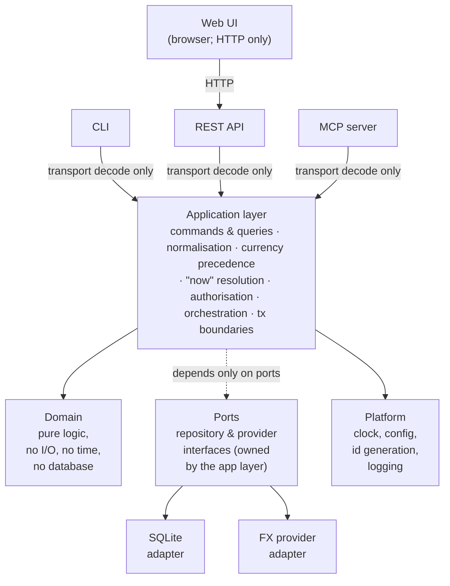

# Architecture

How `bodger` is put together: the layers, the boundary each surface is allowed to touch, the milestone sequence, and where the project currently stands.

For *what* the system stores, read [`data-model.md`](data-model.md) — it is the source of truth for financial semantics and was written first, deliberately. For *who it's for and how it should feel*, read [`ux-principles.md`](ux-principles.md), which every surface is held to. For the web UI's *visual* language — color, type, spacing, component primitives — read [`design-system.md`](design-system.md). This document describes the machinery around it.

---

## 1. The one architectural principle

> One coherent set of financial capabilities, and several thin interfaces over them.

The CLI, the REST API, the web UI, and the MCP server are **peers**. None of them is the "real" application with the others bolted on. Any business rule that exists in only one of them is a bug, and the project has a test suite whose entire job is to catch that ([ADR-0005](decisions/0005-shared-application-layer.md)).

---

## 2. Layers



Dependencies point inward. `domain` imports nothing from the project. `app` imports `domain` and `ports`. Adapters import `ports`. Surfaces import `app`. A surface importing `domain` directly, or an adapter importing `app`, is a CI failure, not a code-review opinion (§6).

### What each layer is for

**`domain`** — Money, Currency, Account, Category, Transaction, Posting, Budget, and their invariants. Pure functions and value objects. No database, no clock, no network, no config. This is where the exhaustive test coverage lives, because it is the layer where correctness is cheap to assert.

**`app`** — The use-case layer, and the only layer that knows what "now" is. Exposes one method per user intent (`RecordOutflow`, `RecordTransfer`, `ListTransactions`, `AccountBalances`, …), each taking a **command or query struct** and returning a result struct. Owns transaction boundaries, authorisation, currency precedence, date resolution, and every default. See [ADR-0005](decisions/0005-shared-application-layer.md).

**`ports`** — Interfaces the app layer needs the outside world to satisfy: `TransactionRepository`, `AccountRepository`, `FxRateProvider`, `Clock`. Defined by the consumer, not the implementer.

**`adapters`** — Implementations of ports. SQLite persistence, migrations, FX providers. Swappable without the app layer noticing.

**`surface`** — HTTP handlers, CLI commands, MCP tools. Each one does exactly three things: decode transport input into a command struct, call one app method, encode the result. Any `if` statement in a surface that isn't about presentation is a design smell.

Surfaces are also where [`ux-principles.md`](ux-principles.md) applies: they own every string a person reads, and they are the only place the product's vocabulary and defaults can go wrong.

They render errors, they never classify them. An error arrives from the application layer already carrying its code, its user-safe message, and its field path; the surface looks up the status or exit code in one shared table. A handler choosing its own HTTP status is the same class of defect as a handler parsing its own date — see [ADR-0011](decisions/0011-error-model.md).

**`platform`** — Cross-cutting infrastructure: the clock, config loading, ID generation, structured logging, and the error registry ([ADR-0011](decisions/0011-error-model.md)) that every surface renders from.

### The rule that matters most

**A surface may not resolve a default, parse a domain value, or ask what time it is.**

If the CLI parses `"2026-08-14"` into a date and the API parses it too, they will eventually disagree about `"14/08/2026"`, `"today"`, or what happens at a month boundary in `Asia/Kolkata`. So a surface never resolves a date itself — it passes the raw string through and the app layer normalises, because only the app layer holds the clock and the user's timezone. The same is true of anything else that needs a repository lookup (which account does "hdfc savings" mean?) or instance config (what currency applies by default?): only fields with no such dependency are typed at the boundary. This is CLAUDE.md's normalise-once rule, and with four surfaces it is the rule most likely to erode silently. [ADR-0005](decisions/0005-shared-application-layer.md) specifies both the contract, precisely which fields it applies to and why, and the mechanism that enforces it.

---

## 3. Surface boundaries

| Surface | Reaches the app layer via | Ships in | Purpose |
| --- | --- | --- | --- |
| **CLI** | Direct in-process call | `bodger` binary | Fast entry, scripting, automation, debugging |
| **REST API** | Direct in-process call | `bodger serve` | The web UI's only interface; external clients and integrations |
| **MCP server** | Direct in-process call | `bodger mcp` | Local tool-calling agents over the user's own data |
| **Web UI** | HTTP → REST API | Static assets embedded in the binary | Dashboards, charts, review-heavy workflows |

Three of the four surfaces link the application layer directly. Only the web UI must cross a network boundary, because it runs in a browser.

This is the arrangement that makes the normalise-once rule easiest to keep: the CLI and MCP call the *same Go function* the HTTP handler calls, so there is no second implementation to drift. Routing the CLI and MCP through HTTP instead would also satisfy normalise-once, but it would force a server to be running to record a transaction, and would make the MCP server a network client of a service it usually shares a machine with. See [ADR-0001](decisions/0001-technology-stack.md).

**Consequence to know about:** more than one process can open the same SQLite database — `bodger serve` in Docker and `bodger tx add` in a terminal. WAL mode plus a busy timeout makes this safe for personal-scale concurrency, and this is a documented constraint rather than an accident. [ADR-0007](decisions/0007-persistence-and-migrations.md) covers it, including the Postgres path that removes it.

### What the web UI may not do

The web UI holds **no financial logic**. No client-side balance summation, no client-side currency conversion, no client-side period arithmetic, no client-side category rollup. It renders what the API computed. The moment a number is computed in TypeScript, the CLI and MCP cannot produce it, and the product has quietly grown a second financial model.

Formatting a server-supplied minor-unit integer for display is presentation and belongs in the browser. Deciding *which* rate converted it is not.

### What MCP tools may not do

MCP tools map one-to-one onto app-layer methods. They never touch the repository layer or emit SQL, and they are classified explicitly:

- **read** — queries and analytics. Always allowed.
- **write** — creating and editing transactions. Allowed, audited.
- **destructive** — deletion, bulk edits, import commit, rollback. Requires explicit confirmation and is disabled by default.

Details land with the MCP milestone; the classification is fixed now so tools aren't retrofitted into it.

---

## 4. Technology

Full rationale in [ADR-0001](decisions/0001-technology-stack.md). Summary:

| Concern | Choice |
| --- | --- |
| Backend, CLI, MCP | **Go 1.27** — one static binary, trivial cross-compilation for a NAS or VPS, strong stdlib HTTP, cheap to keep layers separated |
| Database | **SQLite** via `modernc.org/sqlite` (pure Go, no cgo) |
| Migrations | **goose**, SQL files embedded with `embed.FS` |
| HTTP routing | **stdlib `net/http.ServeMux`** — method+pattern routing since Go 1.22; no framework |
| CLI framework | **cobra** |
| OpenAPI generation/validation | **`github.com/getkin/kin-openapi`** — generates `internal/surface/http/openapi.json` from the REST API's own DTOs and route table, and validates real e2e-test responses against it (issue #36) |
| MCP | **`github.com/modelcontextprotocol/go-sdk`** (official) |
| Web UI | **React + TypeScript + Vite**, built to static assets embedded in the Go binary |
| Auth | Session cookies for the browser, hashed API tokens for CLI/MCP/scripts; see [ADR-0006](decisions/0006-authentication-and-multi-user-path.md) |
| Deployment | Single container + Docker Compose; SQLite file on a volume |
| Toolchain pin | `.tool-versions` (asdf/mise) |
| Task runner | `Makefile` |
| CI | GitHub Actions running the same `make` targets |

Self-hosting is the deployment target that shaped most of this: one binary with the web UI baked in, one SQLite file to back up, `docker compose up`, and no separate database container to operate.

---

## 5. Repository layout

```
cmd/bodger/            single binary: serve, mcp, and all CLI commands
internal/
  domain/              pure financial model — money, ledger, budget
  app/                 use cases; commands, queries, normalisation
    normalize/         the ONLY place raw input becomes domain values
  ports/               repository and provider interfaces
  adapters/
    sqlite/            repositories + migrations/
    fxprovider/        FX rate providers
  surface/
    http/              REST handlers, router, DTOs
    cli/               cobra commands
    mcp/               MCP tool definitions
  platform/            clock, config, idgen, logging, error registry
web/                   React + Vite app; built assets embedded at compile time
docs/                  architecture, data model, ADRs, guides
```

---

## 6. Enforcement

Conventions that live only in a document decay. These are checked by `make check` — split into `make check-go`/`make check-web` in CI, run only for the side a commit actually touches (see [contributing.md](contributing.md#commands)):

- **Layer boundaries** — an import-graph check fails the build if `domain` imports anything project-local, if a surface imports `domain` or an adapter, or if an adapter imports `app`.
- **No wall clock outside the clock** — `time.Now()` anywhere but `internal/platform/clock` fails the build. Time is injected, which also makes date-boundary tests deterministic.
- **No environment reads outside config** — `os.Getenv` outside `internal/platform/config` fails the build.
- **No unclassified errors out of the app layer** — a `fmt.Errorf` or `errors.New` in `internal/app` that isn't wrapped as an `*errs.Error`'s cause fails the build, so every failure a surface receives arrives with a code ([ADR-0011](decisions/0011-error-model.md)). `internal/domain` and the adapters are unaffected: their errors are meant to be plain, or to *become* that cause.
- **Surface conformance suite** — one table of raw inputs driven through the CLI, the REST API, and MCP, asserting all three produce identical normalised command structs. This is the test that catches normalise-once erosion, and it is why the API is in milestone 1 alongside the CLI rather than after it.
- **Vocabulary** — [`ux-principles.md` §2](ux-principles.md#2-vocabulary)'s banned-term table is checked against the error registry's default messages and every cobra help and flag usage string. Conformance checks that surfaces *behave* alike; this checks that they *speak* alike. See [`contributing.md`](contributing.md#the-vocabulary-check).
- **OpenAPI document freshness and response validation** — `internal/surface/http/openapi.json` is generated from the REST API's own DTOs and route table (issue #36); one test re-runs the generator and fails the build on any drift from a forgotten `go generate`, and the package's end-to-end tests validate every real response against that same document, so a handler whose response doesn't match its own declared schema fails too.
- **`TZ=UTC` in CI** — so a test that accidentally depends on the host timezone fails on the machine that matters.

---

## 7. Testing strategy

Weighted toward the layer where correctness is decided:

- **Domain** — exhaustive, deterministic, table-driven. Every invariant in [`data-model.md` §14](data-model.md#14-invariants-that-must-have-tests).
- **App** — use-case tests against an in-memory repository, with a frozen clock and a fixed timezone. Currency precedence, period boundaries, authorisation.
- **Persistence** — repository tests against a real temp-file SQLite database, plus a migrate-up/migrate-down cycle on every migration.
- **Surfaces** — thin. Enough to prove decoding and encoding; the shared conformance suite covers the rest.
- **Round-trip** — export → import → export is byte-identical modulo surrogate IDs and timestamps.
- **Web UI** — component tests with Vitest; end-to-end kept deliberately sparse — a small number of targeted Playwright tests, each run against a real build of the production binary, not a substitute for each screen's own Vitest coverage. A new one earns its place for a real, distinct user-facing flow through the whole stack (e.g. issue #65's login → record → balance → logout, or issue #101's dark-mode toggle surviving a real reload) — not to click-test every element, and not instead of a Vitest test for the underlying logic when one is possible. UI tests are not where financial correctness is established.

Fixtures cover multiple currencies, transfers, splits, refunds, credit cards, imported duplicates, month boundaries, and a leap day.

---

## 8. Milestones

Each milestone leaves the application working, testable, and useful. Ordering after M2 is revisable as the product teaches us something.

Milestones get a **name** as well as a number, taken from fantasy and sci-fi worlds and planets — M1 is *Arda*, the world itself, which is what everything after it sits on. Names are assigned when a milestone is actually created and scoped, not reserved in advance; the unnamed ones below are sketches, and naming them now would imply more certainty about their scope than exists. Eventual releases will take the name of the milestone they complete rather than inventing a second vocabulary — see [`docs/releasing.md`](releasing.md) for how a release is actually cut.

### M1 · Arda — Ledger core, CLI, and REST API
The smallest genuinely usable slice: record money moving and see where you stand.

Domain model (money, accounts, categories, transactions, postings, transfers, splits) · SQLite persistence and migrations · application layer with the normalisation contract · CLI · read/write REST API · derived balances · the layer-boundary and conformance checks from §6.

Single currency per account; a cross-currency transfer is rejected with a clear error rather than silently mis-converted. No auth — the server binds `127.0.0.1` and refuses a non-loopback bind until auth exists ([ADR-0006](decisions/0006-authentication-and-multi-user-path.md)). No web UI, no MCP, no FX, no budgets, no import.

Two surfaces ship together deliberately: the conformance suite needs two surfaces to compare, and the normalise-once contract is far cheaper to establish now than to retrofit across four.

### M2 · The Shire — Web UI and authentication
Fast transaction entry, transaction list with filters, account balances, settings. Session-cookie auth for the browser, hashed API tokens for CLI/MCP. This is the milestone where a non-technical person can use the product — ordinary folk, no accountants, which is the Shire's whole character in the Arda (M1) world.

A Docker image and Compose file (issue #64) were built alongside this milestone but shipped as a fast-follow rather than blocking it: PR #72 is complete and verified, but held on [#93](https://github.com/anirudhgray/bodger/issues/93), a read-visibility bug that leaves a containerized instance unauthenticatable after its first-run password is set. Docker packaging isn't core to "a non-technical person can use the product" the way the web UI and auth are, so #64 was moved out of the M2 milestone rather than holding M2 open on an external bug fix; it merges whenever #93 is resolved.

### M3 · Rivendell — UI polish and design system
The unglamorous pass before FX adds more surface to get wrong: a deliberate
visual language instead of shadcn's install defaults, plus the UI debt M2
shipped with rather than blocked on. Design tokens (color, type, spacing,
radius, elevation) drafted first as mockups via Claude Design, then
documented in `docs/design-system.md`; the existing `web/src/components/ui`
primitives audited and brought into line with it. Cross-navigation between
related screens and a responsive layout for small screens
([#89](https://github.com/anirudhgray/bodger/issues/89),
[#88](https://github.com/anirudhgray/bodger/issues/88)) land here rather
than as ad-hoc fixes, since both are exactly the kind of thing a real
design system should settle once rather than patch per-screen.

### M4 · The Grey Havens — Multi-currency and FX
Cross-currency transfers enabled. FX provider abstraction, rate storage, explicit conversion policies, reporting currency. Every converted figure carries its rate, date, source, and policy ([ADR-0004](decisions/0004-multi-currency-and-fx.md)). Rate fetching is always an explicit, user-triggered action — never a background poller — and a fetch is the only thing that ever writes to `fx_rates`; there is no manual-rate entry. Named for the Havens where those who cross over the Sea depart from — a fitting name for the milestone where money finally crosses between currencies.

### M5 · Orthanc — Analytics and charts
The shared query/filter model ([ADR-0009](decisions/0009-query-and-analytics-model.md)), spending and income by category, cash flow, trends, savings rate. Charts in the web UI and machine-readable output from the CLI, both over the same analytics methods. Named for Saruman's tower and its palantír — a seeing-stone, for the milestone where the ledger's data finally becomes something you can *see*.

### M6 · Fangorn — Import and export
The staged import pipeline, CSV import with column mapping, duplicate detection, preview and commit. Canonical versioned JSON export and full backup ([ADR-0008](decisions/0008-import-export-architecture.md)). Export lands before or with import: backup is what makes import safe to attempt. Named for the old forest that outlasts everything built around it — a fitting name for the milestone where the ledger's own history, not just its present state, becomes something you can carry out and bring back in.

### M7 · Gondor — Budgets
Monthly category budgets, actual vs budget, remaining, utilisation, history. Rollover stays deferred. Named for the Stewards of Gondor, who administered the realm's resources on behalf of a plan, disciplined and kept strictly apart from the throne's own authority — a fitting name for the milestone where a budget is explicitly "a plan, kept strictly separate from what actually happened" (data-model.md §10).

### M8 · Moria — MCP server
`bodger mcp` over stdio. Read, write, and destructive tool tiers with confirmation and audit ([ADR-0013](decisions/0013-mcp-server-design.md)). Named for the Doors of Durin, which open to nothing but the correct word spoken by someone entitled to know it — a fitting name for the milestone where an agent's access to the ledger is granted tool by tool, tier by tier, and never silently.

### M9 · Lothlórien — Recurring transactions
Rules, scheduled occurrences, materialisation, forecasting. Occurrences never touch a balance. Named for Galadriel's Mirror, which shows visions of what may yet come to pass, not what has — a fitting name for the milestone where money that hasn't moved yet is forecast, always kept structurally distinct from what actually has.

---

## 9. Status

**M1 · Arda shipped as [v0.1.0](https://github.com/anirudhgray/bodger/releases/tag/v0.1.0).**
**M2 · The Shire is complete** — see the [M2 milestone](https://github.com/anirudhgray/bodger/milestone/2)
for its issues. Issue #65 (auth flow and web e2e smoke tests) was the last
milestone item; #64 (docker-compose, [PR #72](https://github.com/anirudhgray/bodger/pull/72))
was moved out of M2 rather than holding the milestone open on
[#93](https://github.com/anirudhgray/bodger/issues/93), a read-visibility
bug in containerized `bodger serve` unrelated to the milestone's own goal
— see §8. It's tracked as backlog, unmilestoned, until #93 is resolved.

**M3 · Rivendell is complete** — see the [M3 milestone](https://github.com/anirudhgray/bodger/milestone/3)
for its issues. [#100](https://github.com/anirudhgray/bodger/issues/100)
(design tokens), [#101](https://github.com/anirudhgray/bodger/issues/101)
(auditing `components/ui` and the existing pages against them —
`docs/design-system.md`), [#89](https://github.com/anirudhgray/bodger/issues/89)
(cross-navigation), [#88](https://github.com/anirudhgray/bodger/issues/88)
(responsive layout, including wiring `sidebar` into `AppLayout`'s nav), and
[#107](https://github.com/anirudhgray/bodger/issues/107) (splitting Settings
into nested subpages under `/settings`, now that #88 settled `AppLayout`'s
own nav as a `Sidebar` — Settings' own sub-nav is a `tabs` strip for
switching sections once already on one, plus a collapsible `Sidebar`
submenu for jumping to one directly; see `docs/design-system.md`'s `tabs`
section for why both exist), [#104](https://github.com/anirudhgray/bodger/issues/104)
(wiring the remaining Radix-portal primitives into pages — `popover`+
`calendar` landed as a real date picker in #118, and the native-`<select>`-
to-Radix swap landed in two steps: a `command`/`combobox`-based Combobox
for the three category pickers alongside #106, below, then a themed
Radix rebuild of `components/ui/select.tsx` itself for every remaining
`<select>` in the app (account/category type dropdowns, TransactionDialog's
account fields, TransactionsList's account/type filters) — its native
predecessor's open dropdown was unstyled browser chrome, the one control
left that didn't respect the app's own theme; see `docs/design-system.md`'s
"Select: Radix, not native" section, including a real Radix Select gotcha
found and fixed along the way. `dialog`/`alert-dialog` and `dropdown-menu`
were deliberately left unwired, per #104's own "only if a real spot turns
up" scoping — no row's inline actions have outgrown a plain button group,
and deletes/archives stay intentionally unconfirmed, docs/ux-principles.md
§5), and [#106](https://github.com/anirudhgray/bodger/issues/106)
(category hierarchy view + quick-create from pickers: Settings' category
list and every category picker now show the real parent/child tree via a
new Combobox primitive, with an inline "+ Create category" row in the
transaction dialog's own picker — see `docs/design-system.md`'s
"Combobox and category hierarchy" section) are done.

**M4 · The Grey Havens is complete** — see the [M4 milestone](https://github.com/anirudhgray/bodger/milestone/4)
for its issues. [#141](https://github.com/anirudhgray/bodger/issues/141)
(cross-currency transfer provenance on `TransactionsList.tsx`, below) was
the last milestone item. Dogfooding the finished feature set surfaced
three follow-up bugs in already-shipped M4 work, filed rather than
holding the milestone open on them (the same pattern M2's own status note
above follows for #64/#93): [#170](https://github.com/anirudhgray/bodger/issues/170)
(the web UI can't tell what an unset reporting currency actually resolves
to), [#171](https://github.com/anirudhgray/bodger/issues/171) (no currency
field on the Accounts settings' new-account form, despite the API already
supporting one), and [#172](https://github.com/anirudhgray/bodger/issues/172)
(Balances' "Refresh rates" fetching against the wrong currency). All three
are now fixed: `GET /api/v1/reporting-currency` gained an
`effectiveCurrency` field (the actor-set value, or the resolved instance
default when unset) that `TransactionsList.tsx`, `Balances.tsx`, and
`TransactionDialog.tsx` read unconditionally instead of gating on
`is_set`, closing #170.
[ADR-0012](decisions/0012-fx-rate-provider.md) picked Frankfurter as the FX
rate provider; the `fx_rates` schema, transfer rate columns, and the
`users.reporting_currency` column landed as schema-only groundwork; and the
domain layer's `Rate` value type, the nearest-earlier-within-staleness-
window rate-selection rule, and cross-currency transfer support followed.
[#132](https://github.com/anirudhgray/bodger/issues/132) wires the ladder's
last missing rung — per-user reporting currency — into
`internal/app/normalize`'s resolution and the two call sites
(`CreateAccount`, `buildOutflowOrInflowPosting`) that previously hardcoded
it to `""`.
[#134](https://github.com/anirudhgray/bodger/issues/134) adds
`internal/app.ConvertAmount`, the single policy-aware conversion query
ADR-0004 calls for (`transaction_date`/`current`/`pinned`, each resolving
its own lookup date rather than defaulting to "today"), and extends
`AccountBalances` to convert through it — a missing rate for one account's
currency is reported in the result's `Unconverted` list rather than
failing the whole query or silently dropping that account.
[#135](https://github.com/anirudhgray/bodger/issues/135) adds the last two
app-layer FX use cases: `FetchFxRates`, the one explicit, network-touching,
store-writing action for FX (defaults to every currency pair
`FxRateRepository.InUsePairs` reports for the actor, quoted against their
resolved reporting currency, at the current date; accepts an optional
base-currency filter and an optional `from`/`to` backfill range that
delegates to the provider's `FetchRange` once per pair rather than looping
over dates; every pair is fetched into memory before anything is written,
then stored in one `StoreBatch` call, so a provider failure partway
through leaves `fx_rates` untouched rather than partially populated), and
`ListFxRates`, a pure stored-data-only read — never touching
`FxProvider` — that is a thin wrapper over `ConvertAmount`, optionally
converting an amount alongside the resolved rate's own provenance; this is
what will power every "≈ N as of `<date>`" display, including for a
transaction amount that hasn't been persisted anywhere yet.
[#133](https://github.com/anirudhgray/bodger/issues/133) wires that
domain-level cross-currency support into `RecordTransfer`/`EditTransaction`
themselves: `buildTransferPostings` no longer rejects a from/to currency
mismatch, `ledger.Transaction` gained a `WithFxRate`/`FxRate`
copy-transform-and-accessor pair for carrying an implied rate through
construction and reconstruction, and `internal/adapters/sqlite`'s
transaction repository reads and writes `transactions.fx_rate_used`/
`fx_rate_source` — populated only for a cross-currency transfer, per
ADR-0004, and read back as the stored value rather than re-derived from the
postings on every `Get`/`List`. Sending the to-leg's amount independently
(rather than reusing the from-leg's raw number across both currencies) is
still a separate, unstarted surface change.
[#136](https://github.com/anirudhgray/bodger/issues/136) exposes all of the
above through the CLI: `bodger fx rates fetch`/`bodger fx rates list` call
`FetchFxRates`/`ListFxRates` directly; `bodger balance
--currency`/`--policy`/`--pinned-date` wire straight into
`AccountBalancesQuery`'s existing conversion fields, rendering rate,
rate_date, rate_source, and policy inline per ADR-0004 and flagging a stale
rate explicitly (`(stale, as of <date>)`), with an unconverted account
listed plainly alongside a `bodger fx rates fetch` hint rather than dropped
from the total; `bodger move` drops its now-obsolete cross-currency
rejection and renders the transfer's implied rate
(`ledger.Transaction.FxRate`) whenever the transfer is genuinely
cross-currency; and `bodger config reporting-currency get`/`set` exposes
#132's per-user preference. `ListFxRatesQuery.Amount` is a raw string,
parsed via `normalize.Amount` + `money.NewMoney` the same way every other
user-typed amount in `internal/app` is — so `bodger fx rates list --amount`
converts a raw string without `internal/surface/cli` ever constructing a
`money.Money` itself (still barred by `internal/lint.TestImportGraph`).
An earlier draft typed this field `*money.Money`, copying
`ConvertAmountQuery`'s shape without noticing that query has a real
internal caller with a `Money` already in hand (`balances.go`), while
`ListFxRates` never does — see `docs/contributing.md`'s "surface-facing vs.
internal-only" note for the general rule this was fixed to follow.

[#137](https://github.com/anirudhgray/bodger/issues/137) exposes the same
app-layer work through the REST API, kept in conformance with #136's CLI
surface: `GET /api/v1/balances` gained `currency`/`policy`/`pinned_date`
query parameters wired straight into `AccountBalancesQuery`, and
`balanceView`/`balancesView` gained `converted`/`unconverted` fields
matching the CLI's JSON shape field-for-field; `GET /api/v1/fx/rates`
(pure read, optional `amount`) and `POST /api/v1/fx/rates/fetch` (network
and persist, optional `pairs`/`from`/`to`) call `ListFxRates`/`FetchFxRates`
directly as two separate routes, per #135's two use cases; `GET`/`POST
/api/v1/reporting-currency` exposes #132's per-user preference, following
`POST /api/v1/auth/password`'s precedent for a mutating action on a
singleton, actor-scoped resource; `POST /api/v1/transfers` already accepted
a cross-currency transfer with no rejection to remove (`transactionView`
gained `rate`/`rate_source`, rendered the same way the CLI's `moveView`
does); and the conformance suite gained a cross-currency transfer case
(comparing `rate`/`rate_source` alongside the existing fields) and a
separate `TestBalanceQueryConformance` for the currency/policy-parameterized
balance read, which doesn't fit the existing single-transaction
`conformanceCase` shape.

[#159](https://github.com/anirudhgray/bodger/issues/159) closed a gap
found while implementing #138: `POST /api/v1/transfers`,
`PATCH /api/v1/transactions/{id}`, and `bodger move`/`transactions edit`
all reused the from-leg's raw digits, reinterpreted in the to-account's
currency, for the to-leg — so a cross-currency transfer's implied rate was
always just that trivial ratio, never a real exchange rate, since there
was no way to state the to-leg's own amount independently anywhere in the
stack. All four now take an optional to-amount (`to_amount` over HTTP,
`--to-amount` on the CLI); omitted, behaviour is unchanged, and the
conformance suite covers both paths identically across CLI and API.

[#138](https://github.com/anirudhgray/bodger/issues/138) adds the web
transaction dialog's non-persisted foreign-currency hint: any amount
entered in a currency other than the actor's reporting currency (spend,
receive, or a transfer's own leg alike) shows a read-only "≈ N
&lt;reporting-currency&gt; as of `<date>`" line via `GET /api/v1/fx/rates`,
keyed to whichever date the transaction is booked to (today, or a
backdated entry's own date — never `Date.now()`), with a "Fetch
rate"/"Refresh" action scoped to just that one base currency and date via
`POST /api/v1/fx/rates/fetch`, and a plain "no stored rate yet" state for
a 404 rather than a raw error. None of it renders for a single-currency
actor. Once #159 landed, the issue's other half — a second,
independently-editable destination-amount field on a cross-currency move,
pre-filled from the fetched rate but freely overridable, sending
`to_amount` — was wired up too, so #138 is fully closed by this PR. The
destination-amount field's pre-fill and its own "Refresh" action work for
any to-account currency, not just one that happens to equal the reporting
currency — see #165, below.

[#165](https://github.com/anirudhgray/bodger/issues/165) fixed the gap
#138 shipped with: `POST /api/v1/fx/rates/fetch` could previously only
ever populate a row quoted against the reporting currency
(`internal/app/fetch_fx_rates.go`'s `resolveFetchPairs`), so the
destination-amount field's pre-fill and refresh only worked when the
to-account's currency happened to equal the reporting currency — outside
that case, "Refresh" silently fetched the wrong pair (`<from>/<reporting>`
instead of `<from>/<to>`) and the lookup kept failing with no indication
why. This was never a provider limitation — the Frankfurter adapter's
`FetchRate` already takes an arbitrary base *and* quote, and
[ADR-0012](decisions/0012-fx-rate-provider.md) chose Frankfurter
specifically so this system would never need to triangulate through a
fixed base currency. `FetchFxRatesCommand` now takes an optional `Quote`
(`quote` over HTTP, `--quote` on the CLI): when set, every `Pairs` entry
is fetched directly against it instead of the reporting currency — one
real `FetchRate(base, quote, date)` call per pair, never composed/derived
math — and `Quote/reportingCurrency` itself is fetched and stored in the
same call, so that rate is available for balances/reports without a
second fetch action later.
`web/src/hooks/use-fx-conversion-hint.ts`'s `refresh()` now passes its own
`to` as the explicit quote — a no-op for the read-only hint (`to` is
already the reporting currency there) and the actual fix for the
destination-amount field's hint instance, whose `to` is the to-account's
own currency.

[#140](https://github.com/anirudhgray/bodger/issues/140) adds the one
field this milestone gives the web Settings area: a Currency section
(`web/src/pages/settings/Currency.tsx`) alongside the existing Password/API
tokens/Accounts/Categories ones, wired through `GET`/`POST
/api/v1/reporting-currency` via `web/src/lib/settings.ts`, following the
same one-call-per-action discipline every other settings section already
uses. There's no currency-list endpoint, so the field is a free-text ISO
code (uppercased client-side, validated server-side) rather than a picker;
an unset preference is flagged in plain language rather than naming the
instance default, since that value isn't itself exposed over this API —
only `bodger config reporting-currency get`, which runs server-side, can
name it.

[#139](https://github.com/anirudhgray/bodger/issues/139) adds
`Balances.tsx`'s currency selector and cross-account conversion, calling
the extended `GET /api/v1/balances` (#137). It defaults to "Original
currencies" (no auto-convert) so a single-currency instance's behavior is
byte-for-byte unchanged and there's no surprise fetch on load; the screen
always uses the `current` policy (a point-in-time snapshot has no other
sensible date), so there is no date picker. Rate provenance renders as a
click-to-expand detail row rather than a hover tooltip — touch-friendly,
no app-wide `TooltipProvider` needed — documented in `docs/design-system.md`
as the pattern later screens (M5's analytics work) should reuse rather than
re-deriving. Stale or missing rates share one "refresh rates" popover (a
currency multi-select over in-use pairs, calling `POST
/api/v1/fx/rates/fetch` with `pairs` only — never `from`/`to`, since this
screen only ever targets today), and `unconverted` accounts render inline
with their reason rather than being dropped from view, per ADR-0004's
mixed-policy-aggregate-forbidden rule.

[#163](https://github.com/anirudhgray/bodger/issues/163) fixed a
GET/PATCH field-naming mismatch found while wiring #138: `transactionView`
(both `internal/surface/http/dto.go`'s and `internal/surface/cli`'s own
copy, plus the CLI's `moveView`) reported a transfer's `amount`/`currency`
as the *to*-leg's own values, but `editTransactionRequest`/
`EditTransactionCommand`'s `Amount` field (the same as
`createTransferRequest.Amount`) is documented and implemented as the
*from*-leg's amount — so reading a transfer back and resubmitting its own
`amount` unchanged via PATCH silently reinterpreted the to-leg as a new
from-leg. Invisible for a same-currency transfer (both legs are
numerically equal); silently corrupting for a cross-currency one. Fixed by
renaming, not just adding a field: `amount`/`currency` now report the
from-leg on every surface (matching the write side's own meaning of those
names), and a new `to_amount`/`to_currency` reports the to-leg — so
resubmitting a GET response's `amount`/`to_amount` unchanged is actually a
no-op. `docs/decisions/0004-multi-currency-and-fx.md`'s "cross-currency
transfers record both legs" section gained a short note on this (no new
ADR: it's the existing "both legs are authoritative" decision applied to a
read model that hadn't yet honored it), and the conformance suite gained a
GET(or `transactions list`)-then-PATCH round-trip case for both surfaces,
alongside the existing create-only cross-currency coverage.

[#145](https://github.com/anirudhgray/bodger/issues/145) adds the same
rate-provenance treatment to `TransactionsList.tsx`, for an ordinary
(non-transfer) foreign-currency transaction row's own reporting-currency
equivalent — a per-row `GET /api/v1/fx/rates` read at the
`transaction_date` policy, using that transaction's own `date` (the date
it's booked to), never today's date; a targeted test guards exactly this
substitution, since a page can carry rows spanning many distinct booked
dates rather than the single "today" Balances converts against. It's a
pure read on render (never triggering a provider fetch itself), and the
trigger/detail/unconverted markup is the same `components/RateProvenance.tsx`
pieces #139 introduced, now extracted out of `Balances.tsx` so both
screens (and #141, later) share one implementation rather than three. The
one real difference from #139's popover: TransactionsList's "Backfill
rates" affordance (`components/RateFetchPopover.tsx`, now shared too) adds
a date range alongside the currency multi-select, calling
`fetchFxRates`' range-fetch mode (#135/#137/#136, already implemented
server-side — this issue only wired the frontend call) instead of always
targeting today. After a successful backfill, the previously
stale/unconverted rows resolve in place without a manual reload, matching
#139's own re-read-after-refresh behaviour. See `docs/design-system.md`'s
"Balances: rate-provenance detail row" section for the shared-component
details.

[#141](https://github.com/anirudhgray/bodger/issues/141) closes out M4's
last surface: `TransactionsList.tsx` now renders a cross-currency
transfer's own implied rate/source (`t.rate`/`t.rate_source`, already
exposed by #137's `transactionView`), reusing #139/#145's
`RateAmountTrigger`/`RateProvenanceDetail` pair with a narrower detail
sentence (no `rate_date`/stale flag — the rate is fixed at write time and
per ADR-0004 is never reconciled against a provider rate for the day).
The row also renders the to-leg's own amount next to the from-leg's for a
genuine cross-currency transfer (previously only the from-leg was shown
at all); a same-currency transfer is unchanged. When the reporting
currency matches neither leg's own currency, each leg additionally gets
its own ordinary reporting-currency equivalent — a separate fact from the
implied rate, so it deliberately reuses #138's
`useFxConversionHint`/`FxConversionHint` (a plain, non-collapsible "≈ N
as of `<date>`" line with a narrow single-currency/single-date refresh)
rather than the implied rate's own trigger/detail chrome, keeping the two
from reading as the same kind of number. See `docs/design-system.md`'s
"Balances: rate-provenance detail row" section, "Transfer rows (issue
#141)" for the full rendering rules.

**M5 · Orthanc is complete** — see the
[M5 milestone](https://github.com/anirudhgray/bodger/milestone/5) for its
issues: [#186](https://github.com/anirudhgray/bodger/issues/186) (extending
`TransactionFilter` to ADR-0009's full shape — amount range, currencies,
description search, tags), [#187](https://github.com/anirudhgray/bodger/issues/187)
(the analytics app methods — `CategoryBreakdown`, `CashFlow`, `Trends`,
`SavingsRate`, all sharing one per-posting conversion core and the same
reporting-currency/policy/provenance pattern M4 established),
[#188](https://github.com/anirudhgray/bodger/issues/188) (REST/CLI surfaces —
`GET /api/v1/analytics/...` and `bodger report ...`, both over the same app
methods, proven identical via new ADR-0005 conformance rows), and
[#189](https://github.com/anirudhgray/bodger/issues/189) (the web UI
`/analytics` screen), in that dependency order.

#189 closed out the milestone: category breakdown renders as a pair of
donut charts (spending, income — a category is exclusively one type or the
other in the domain model, so a single merged table would carry a zero
column on nearly every row), each paired with its own sortable data table
of the same server-computed rows; a cash-flow bar chart; Trends and
Savings-rate cards; and the existing rate-refresh popover reused for the
filter chrome. shadcn's `chart` primitive (Recharts 3.8.0 — a real v3
release, no unofficial pre-release snippet needed) and `table` primitive
were pulled in for this; see `docs/design-system.md`'s Charts section for
the chart-library choice and a Recharts pie-animation gotcha worth knowing
before debugging a "broken" donut. Per ADR-0009, none of this does
client-side maths — every number rendered is exactly what the app-layer
method returned. Three follow-ups surfaced while scoping the finished
screen and were filed rather than folded in:
[#194](https://github.com/anirudhgray/bodger/issues/194) (a
period-granularity selector — landed: `Granularity` (week/month/year/custom)
on `CashFlowQuery`/`TrendsQuery`, a granularity-aware `periodKey` replacing
`CashFlow`'s month-only bucketing, `Trends`' current-vs-previous pair
generalized to week/month/year/custom, `granularity`/`--granularity` on the
REST and CLI surfaces, and a Granularity selector on the Analytics screen),
[#195](https://github.com/anirudhgray/bodger/issues/195) (a Balances-screen
totals overview — landed: `Service.BalanceTotals`, `GET
/api/v1/balances/totals`, `bodger balance totals`, and a totals section on
the Balances screen, reusing `AccountBalances`' own conversion/provenance
pattern), and [#196](https://github.com/anirudhgray/bodger/issues/196)
(net worth over time, top transactions, average transaction size, and
per-category trend deltas — landed: `Service.NetWorthOverTime` (a time
series, `internal/app/balances.go`, distinct from `BalanceTotals`' own
point-in-time snapshot) and `TopTransactions`/`AverageTransactionSize`/
`CategoryTrends` (`internal/app/analytics.go`), all reusing
`convertPostings`/`categoryBreakdownRows`/`overallBalance` rather than
recomputing independently, with matching REST routes, CLI subcommands,
and web sections on the Balances and Analytics screens). #196 was M5's
last open issue — the milestone is now complete.

**M6 · Fangorn is complete, shipped as
[v0.6.0](https://github.com/anirudhgray/bodger/releases/tag/v0.6.0)** — see
the [M6 milestone](https://github.com/anirudhgray/bodger/milestone/6) for
its issues. [#208](https://github.com/anirudhgray/bodger/issues/208) lands the
staged import pipeline's only state (ADR-0008): `internal/domain/importing`
(`ImportBatch`'s staged -> reviewed -> committed -> rolled_back state
machine, `ImportRecord`'s pending -> ready/excluded -> committed state
machine, and `DuplicateMatch` for the two-tier exact/suspected_duplicate
result plus the user's resolution decision), migration
`00012_add_import_tables.sql` (`import_batch`/`import_record`, next
sequential prefix per ADR-0007), and `ImportBatchRepository`/
`ImportRecordRepository` in `internal/ports`/`internal/adapters/sqlite`.
Parsing/mapping/duplicate-detection (#210) and commit/rollback (#211) are
separate, later issues that write to this foundation; export (#209)
proceeded in parallel, per both issues' own dependency notes.
[#213](https://github.com/anirudhgray/bodger/issues/213) wires #209's
export writers onto both surfaces: `GET /api/v1/export/json`/`GET
/api/v1/export/csv` and `bodger export json`/`bodger export csv`, the
CSV route optionally scoped by the same `TransactionFilter` dimensions
as `/api/v1/analytics/*` ([ADR-0009](decisions/0009-query-and-analytics-model.md)).
Both responses are raw bytes rather than the REST API's usual `{"data":
...}` envelope, since ADR-0008 requires the JSON export to be
byte-identical for the same underlying data. Import-side wiring (#212)
and the web UI (#214) are separate, later issues.
[#210](https://github.com/anirudhgray/bodger/issues/210) lands the
staging pipeline's own logic on top of #208's foundation:
`internal/app/importparse`'s `CSVParser` (column-mapping driven, reusing
`internal/app/normalize` per ADR-0005), the mapping stage resolving
account/category references, tier-1 exact-match duplicate detection
(auto-excludes on `(account_id, external_id)`), tier-2 heuristic
duplicate detection (flags `suspected_duplicate` for review, never
auto-excludes — proven by a regression test asserting two genuinely
separate same-day, same-amount transactions are never silently merged),
and an advisory cross-account transfer-candidate heuristic against other
staged records. Commit/rollback (#211) lands on top of this next; surface
wiring (#212) is a separate, later issue.
[#211](https://github.com/anirudhgray/bodger/issues/211) lands the only
pipeline stage that touches the ledger: `ImportCommitRepository`
(`internal/ports`/`internal/adapters/sqlite`) writes a batch's resolved
records' transactions, marks those records committed, and marks the batch
committed, all inside one database transaction — ADR-0008's all-or-nothing
guarantee. No new migration was needed: `transactions.import_record_id`
has existed, unconstrained, since M1's original schema
(`00005_create_transactions.sql`), so a commit could start writing
provenance into it immediately. `app.CommitImportBatch` refuses to
commit while any record is still `pending` — an unresolved suspected
duplicate or transfer proposal — and moves a still-`staged` batch through
`reviewed` on its way to `committed` in the same call, since nothing else
calls `MarkReviewed` separately. `app.RollbackImportBatch` soft-deletes
exactly the transactions its batch created (ADR-0002) while leaving the
records themselves `committed`, so a rolled-back batch's provenance stays
queryable and a repeated rollback attempt fails cleanly on the domain
state machine rather than reaching the database twice.
`app.ImportBatchTransactions` and `app.TransactionImportRecord` answer
ADR-0008's two-directional provenance query. Surface wiring (#212) is a
separate, later issue.
[#212](https://github.com/anirudhgray/bodger/issues/212) wires #210/#211's
pipeline onto both surfaces: `POST /api/v1/imports`/`bodger import upload`
(stage), `GET /api/v1/imports`/`bodger import list` and `GET
/api/v1/imports/{id}`/`bodger import show` (history and status lookup),
`GET /api/v1/imports/{id}/records`/`bodger import records` (staged rows
with their duplicate/transfer flags), `POST
/api/v1/import-records/{id}/resolve`/`bodger import resolve` (the user's
confirm/dismiss decision), and `POST /api/v1/imports/{id}/commit`/`rollback`
with their CLI equivalents. Two design decisions this issue had to make
that neither #210 nor #211 settled: upload's request body is the
uploaded file's own raw bytes, not JSON — the target account, filename,
and CSV column mapping travel as query parameters/flags instead, mirroring
`/api/v1/export/*`'s raw-bytes convention in reverse (`router.go` gains a
`RawRequestContentType` field alongside its existing
`RawResponseContentType` for this); and reviewing a record's duplicate
proposal needed a use case neither prior issue built
(`app.ResolveImportRecord`, `internal/app/import_review.go`, together with
`app.ListImportBatches`/`GetImportBatch`/`ListImportRecords`) — there is no
separate "resolve a transfer candidate" verb, since a transfer candidate
(`WithTransferCandidate`) is advisory only and carries no resolution field
of its own; what actually blocks a commit is always a record's
`DuplicateMatch`, which `ResolveImportRecord` already handles. Conformance
coverage follows `export_conformance_test.go`'s precedent (a handful of
focused test functions, not `cases_test.go`'s single table) since an
import operation's inputs vary too much between steps to fit one row
shape.

**Scope addition: restoring a canonical JSON backup.** The original M6
issue set (#208-215) never actually scoped a way to load a canonical
JSON export back in — #215's round-trip test (`export -> import ->
export`) depended only on #211 and #213, neither of which builds
anything capable of reading `bodger.export/v1` back into the ledger.
Restoring an export is not the staged CSV pipeline (#210-212): the
document is already fully-resolved domain data, so there's nothing to
map, dedupe, or review — it's a single atomic full-state **replace**,
regenerating surrogate IDs as it loads (consistent with the round-trip
guarantee's own "surrogate IDs may be consistently remapped" clause).
[#226](https://github.com/anirudhgray/bodger/issues/226) adds the
app-layer restore use case, [#227](https://github.com/anirudhgray/bodger/issues/227)
wires it onto REST/CLI behind an explicit confirmation step, #214's
scope now includes a restore-from-backup flow in the web UI, and #215
now depends on #226 as well.

**#226 lands that restore use case.** `internal/ports.SnapshotRepository`
(a new port, `Replace`) and its `internal/adapters/sqlite` implementation
wipe an actor's existing accounts, categories, and transactions (postings
and tags cascade with them) and reload a full replacement set, all in one
write transaction — `internal/adapters/sqlite/account_repo.go` and
`category_repo.go` factor `insertAccountRow`/`insertCategoryRow` out of
`Create` so the two write paths share one `INSERT`. `internal/app/restore.go`'s
`RestoreSnapshot` validates the document's format version exactly against
`bodger.export/v1` — anything unknown or missing is rejected, never
guessed at — then rebuilds every account, category, and
transaction/posting with freshly generated IDs, remapping every internal
reference (a posting's account/category, a category's parent, a
transaction's related transaction) to the newly generated ones before
handing the result to `SnapshotRepository.Replace`. Budgets/budget lines
were absent from a restore at the time this was written, for the same
reason `ExportSnapshot` didn't emit them yet (#209's own scope note): no
budget domain type existed before M7. As of
[#221](https://github.com/anirudhgray/bodger/issues/221) and
[#246](https://github.com/anirudhgray/bodger/issues/246), budgets and
their lines are exported and restored the same way every other entity
here is; FX rates are exported (#221) but deliberately never restored,
since `fx_rates` carries no actor/user scoping at all (ADR-0004) and a
restore is defined per-actor — see #221/#246's own notes for the full
reasoning. #227 (REST/CLI wiring behind a confirmation step) and #214's
web restore flow are still open; #215's round-trip test can now build on
#226 as its dependency note expected.

**#227 wires that restore use case onto REST and CLI, both refusing to
run without an explicit confirmation.** `POST /api/v1/restore` takes the
backup document under a `"document"` field and only proceeds when the
request also sets `"confirm": true`; a request that omits or falsifies
it is rejected before `RestoreSnapshot` is ever called, not merely
before its side effects land. `bodger restore [file] --yes` is the CLI
mirror — reading the backup from `file`, or from standard input when no
file is given — and, the same way, refuses outright without `--yes`
rather than prompting interactively, since there's no terminal to
interactively confirm against on a non-interactive invocation.
`internal/surface/conformance/restore_conformance_test.go` extends the
CLI/HTTP conformance suite to this operation: because a restore wipes an
actor's *entire* ledger rather than adding to it, each surface's case
runs against its own freshly-seeded harness (unlike the read-only export
conformance tests, which safely share one), both restored from the same
document built from a third, independent harness, and their resulting
state compared against each other — proving the two surfaces install
identical data, not just that each happens to work alone. #214's web
restore flow remains the only open piece of this scope addition.

**#215 enforces the round-trip guarantee as a CI test.**
`internal/app/roundtrip_test.go`'s `TestRoundTrip_ExportImportExportIsByteIdenticalModuloIDs`
builds one fixture covering every case §7's testing-strategy list names —
multiple currencies, a cross-currency and a same-currency transfer, a
split, a refund (`ledger.WithRelatedTransaction`, built directly since
`RecordInflow` has no field for it), a credit card, rows committed through
the real CSV import pipeline (#211/#229) straddling a month boundary, and
a leap day — exports it, restores that export (#226), exports again, and
asserts the two documents are equivalent. "Import" is `RestoreSnapshot`,
not the staged CSV pipeline, per #215's own dependency note. Comparison
can't be a literal byte diff: a restore both regenerates every surrogate
ID and re-sorts `ExportSnapshot`'s slices by that (now different) ID, so
`canonicalizeExport` first reorders each collection by a business key
ADR-0008 guarantees is stable (account/category name; a transaction's
booked-date-and-description pair) and only then replaces every ID-shaped
field with a placeholder assigned by first-appearance order — two
documents describing the same data, reordered the same way, always assign
the same placeholders. `import_record_id`/`external_id` are left
untouched, since `RestoreSnapshot` never regenerates them either.
Verified against a real regression, not just written and trusted: with
`RelatedTransactionID`'s remap temporarily deleted from `restore.go`, the
test fails on the refund fixture with an unmapped reference, and passes
again once reverted. This is the last M6 issue apart from #214.

[#214](https://github.com/anirudhgray/bodger/issues/214) lands the web
UI on top of #212/#213/#227's existing REST surface — no backend or
domain changes, purely `web/src/pages/data/` (`Import.tsx`,
`Export.tsx`, `Restore.tsx`) plus their `lib/api.ts` client functions.
Import is a hand-rolled step wizard (upload → map columns → review →
commit) rather than a generic stepper primitive — shadcn/ui's own
registry has nothing that fits a wizard whose later steps don't exist
until an earlier step's server round-trip returns, and whose review
step is a data table with per-row actions, not a fixed set of
questions. A shared `FileDropzone` component (`web/src/components/`)
covers both the import upload step and the restore file picker, since
shadcn has no dropzone/file-upload primitive either. The restore flow
gates its request behind typing an exact confirmation phrase in a
dialog, not a single click, per the issue's own requirement. "Import &
export" mirrors Settings' own two-way navigation exactly: a collapsible
sidebar submenu (App.tsx's `AppSidebar`) and, once on one of its pages,
`ImportExportLayout`'s own tab strip (`web/src/pages/data/
ImportExportLayout.tsx`, structurally identical to `SettingsLayout.tsx`)
— each of Import/Export/Restore is its own route under
`/import-export/*`.

**Manual verification against the real REST surface surfaced two
restore defects neither #226's SQLite round-trip test nor #227's
conformance test exercises, both real bugs in already-merged backend
code, not anything #214 introduces.** First:
`SnapshotRepository.Replace`'s `wipeActorLedger`
(`internal/adapters/sqlite/snapshot_repo.go`) hard-deletes `transactions`
and `accounts` without first clearing `import_record.transaction_id` or
`import_batch.target_account_id` — both plain foreign keys with no
cascade — so a restore fails with a FOREIGN KEY constraint violation for
any actor who has ever committed an import, even one later rolled back
(rollback only soft-deletes the transaction; `import_record.transaction_id`
still points at it). The function's own doc comment anticipates only a
"staged-but-uncommitted" batch blocking this; the real failure mode is
broader. Second: `internal/app/restore.go`'s `restoreCategories` inserts
categories in the canonical document's own order, which
`internal/app/export.go`'s `ExportSnapshot` sorts by category **ID** (a
random UUID) for determinism, not by parent-before-child topology — so a
child category whose ID happens to sort before its parent's fails the
same way, on `categories.parent_id`. Neither existing test catches
either: #226's own round-trip fixture uses two flat, unparented
categories, and no test combines a restore with prior import activity.
Reproduced live against `scripts/seed-dev.sh`'s own fixture (a 10-parent/
10-child category tree, and a separate run with a committed-then-rolled-
back import) — both failed with `constraint failed: FOREIGN KEY
constraint failed`. Filed as
[#236](https://github.com/anirudhgray/bodger/issues/236) and
[#237](https://github.com/anirudhgray/bodger/issues/237) rather than
fixed here, per this issue's own scope (web UI only, no backend
changes) — until they land, restoring a backup from an actor with any
import history, or any nested category tree unlucky enough in its ID
ordering, does not actually work.

#214 was the last planned issue open in the M6 milestone (#215 closed
earlier, per its own dependency note above), but #236
([PR #239](https://github.com/anirudhgray/bodger/pull/239)) and #237
([PR #240](https://github.com/anirudhgray/bodger/pull/240)) held the
milestone's status below at "in progress" until they landed — a restore
that fails on realistic data isn't the working, useful state §8's own
definition of a finished milestone asks for. Both are now fixed:
`wipeActorLedger` clears the actor's `import_batch`/`import_record` rows
(cascading to both tables) before deleting the transactions/accounts they
reference, and `restoreCategories` inserts categories in parent-before-
child topological order rather than the document's own (ID-sorted) array
order. With both merged, M6 is complete.

**M7 · Gondor is complete, shipped as
[v0.7.0](https://github.com/anirudhgray/bodger/releases/tag/v0.7.0)** — see
the [M7 milestone](https://github.com/anirudhgray/bodger/milestone/7) for its issues. [#241](https://github.com/anirudhgray/bodger/issues/241) lands the foundation everything else in the milestone reads or writes through (data-model.md §10): `internal/domain/budgeting`'s `Budget` (embedding its own `[]BudgetLine` as a single aggregate, the same shape `ledger.Transaction` embeds `[]Posting`), `PeriodType` (a closed, validated string type with only `PeriodTypeMonthly` for now), migration `00014_add_budget_tables.sql` (`budgets`/`budget_lines`, next sequential prefix per ADR-0007), and `BudgetRepository` in `internal/ports`/`internal/adapters/sqlite`, wired into `Service.Budgets` the same way `ImportBatches`/`ImportRecords` were wired in ahead of their own first use-case method. [#242](https://github.com/anirudhgray/bodger/issues/242) landed the CRUD use cases on top of it (`internal/app/budgets.go`): `CreateBudget`, `UpdateBudget`, `ArchiveBudget`, `GetBudget`, `ListBudgets`, `AddBudgetLine`, `UpdateBudgetLine`, and `RemoveBudgetLine` — a budget's currency and period type are fixed at creation (no workflow changes either, the same reasoning `SetOpeningBalance` gives for an account's fixed currency), and a line's category is likewise fixed once added (changing it is indistinguishable from removing one line and adding another). [#243](https://github.com/anirudhgray/bodger/issues/243) landed `BudgetActuals`/`BudgetHistory` (`internal/app/budget_actuals.go`): for each line, actual is net spend against its category subtree over the resolved period, converted into the budget's own currency via `ConvertAmount` under `PolicyTransactionDate` (a historical figure is looked up at its own transaction's date, not today), with remaining (budgeted − actual) and utilisation (actual ÷ budgeted) alongside it; `BudgetHistory` repeats this over a range of months, clamped at the budget's own `StartsOn` rather than erroring for a budget that hasn't existed that long.

[#244](https://github.com/anirudhgray/bodger/issues/244) wires both of those onto REST and CLI. REST: `GET`/`POST /api/v1/budgets`, `GET`/`PATCH`/`DELETE /api/v1/budgets/{id}`, `POST /api/v1/budgets/{id}/lines`, `PATCH`/`DELETE /api/v1/budgets/{id}/lines/{lineId}`, `GET /api/v1/budgets/{id}/actuals`, and `GET /api/v1/budgets/{id}/history`. CLI: `bodger budgets add`/`list`/`show`/`update`/`archive`, `bodger budgets lines add`/`update`/`remove`, `bodger budgets actuals`, and `bodger budgets history`. `internal/surface/conformance/budgets_conformance_test.go` extends ADR-0005's CLI/HTTP agreement suite across the whole lifecycle. Two things worth recording here:

- `UpdateBudgetCommand.StartsOn` has no "leave this alone" option — like `CreateBudgetCommand`, an empty `starts_on` always resolves to today, never to the budget's existing value. A surface that renamed a budget without also resending its current `starts_on` would therefore silently move it. Rather than having either surface paper over this with a fetch-then-default that ADR-0005 would call reimplementing normalization, both the REST `PATCH` and the CLI's `budgets update` document the actual behavior plainly; loosening the application-layer contract itself (a real partial-update semantics) is a candidate for its own future issue, not something decided here.
- The conformance suite caught a genuine CLI/HTTP divergence before this landed: CLI's `budgetViewFrom` initially left a budget's `Lines` field a nil slice when it had none, which encodes as JSON `null`, while the HTTP surface's own view initialized it to `[]` — `TestBudgetSurfacesConformance`'s create, remove-line, and archive steps all failed on exactly that mismatch until CLI's view was changed to match. Left as a demonstration, the same way #9's own hostile-instant regression is documented in `internal/surface/conformance/cases_test.go`, of why this suite exists.

[#245](https://github.com/anirudhgray/bodger/issues/245) adds the web UI: a **Budgets** sidebar entry (`web/src/pages/Budgets.tsx`) rendering every active budget as a card with its lines' budgeted/actual/remaining and a utilisation bar/percentage/label (under/at/over budget), all read straight from #244's `GET .../actuals`/`history` responses — the same "the web UI does no maths" rule ADR-0009 holds Analytics and Balances to. Previous/Next paging reuses `GET .../history?months=1` rather than a second endpoint, tracking whichever period the server itself resolved rather than the client guessing "today." `BudgetDialog.tsx` handles both create and edit, including a category Combobox per `docs/design-system.md` for each line and a diff-based save (`applyLineChanges`) that turns the form's current lines against the budget's original ones into the minimal add/update/remove calls, since a line's category can't change in place (#244's own constraint) and is instead resolved as a remove-and-add. `components/ui/progress.tsx` gained an `indicatorClassName` prop — the one addition on top of its shadcn original — so the utilisation bar can switch to the destructive color when over budget.

A follow-up built on top of #244/#245 added two more figures to actuals/history, on user feedback that a single utilisation percentage doesn't say whether spending is actually on pace for the month: `BudgetActualsResult` (and both surfaces' `actuals`/`history` responses) gained `AsOf` (today, resolved once in the actor's timezone the same way `AccountBalancesResult.AsOf` already is) and `Overall` (every line's budgeted/actual/remaining/utilisation summed into one figure for the whole budget — still server-computed, per ADR-0009). The web UI renders `Overall` as its own bar above the per-line table, and — only for whichever period is actually in progress right now, computed from `AsOf` falling within `[From, To]` — draws a marker on every bar for how far through the month today is, so a line running ahead of that marker reads as a pace problem even while its own percentage still says "under budget." The marker is drawn taller and wider than the track itself, in the accent color with a background-colored ring around it so it stays legible over either fill color (a same-color marker over a same-color fill would otherwise disappear exactly when it matters most), and its day-count explanation lives in a native `title` attribute rather than a persistent caption or a Radix `Tooltip` — `docs/design-system.md`'s "Balances: rate-provenance detail row" section already worked through why `Tooltip` doesn't fit a mobile-reachable screen with no app-wide `TooltipProvider` mounted; a plain `title` sidesteps that without reintroducing it. `components/ui/progress.tsx` gained `marker`/`markerTitle` props alongside its existing `indicatorClassName` one for this.

[#246](https://github.com/anirudhgray/bodger/issues/246) extends export/restore to cover budgets. `ExportSnapshot`/`toJSONEnvelope` gained a `Budgets` field (`internal/domain/budgeting.Budget`, sorted by ID ascending the same way accounts/categories already are — `BudgetRepository.List`'s own most-recently-created-first order isn't the deterministic order export needs) and a nested `lines` array per budget in the wire format, mirroring how a transaction's postings nest under `postings` rather than a sibling top-level `budget_lines` array. `RestoreSnapshot` gained a matching `restoreBudgets`, following `restoreAccounts`/`restoreCategories`'s shape: a fresh ID per budget and per line, each line's `category_id` remapped through the same `categoryIDs` map `restorePostings` already resolves a posting's category through, and a dangling reference is rejected the same way. `SnapshotRepository.Replace`/`wipeActorLedger` insert budgets after categories and delete them before categories — `budget_lines.category_id` has a plain `REFERENCES categories(id)` with no cascade (migration `00014_add_budget_tables.sql`), so either ordering mistake trips a FOREIGN KEY constraint error, reusing `insertBudgetRow`/`insertBudgetLines` from `budget_repo.go` rather than duplicating the SQL. `internal/app/roundtrip_test.go`'s fixture now includes a budget with a line against an existing category, with `canonicalizeExport` extended to reorder budgets by name (their own stable business key, alongside a new ID-normalizer prefix for budgets and one for lines) and remap each line's `category_id` the same way a posting's is remapped.

[#221](https://github.com/anirudhgray/bodger/issues/221) closes the other export gap: `ports.FxRateRepository` gained `ListAll` (the one method on that interface with no actor scoping, consistent with the rest of it — `fx_rates` carries no actor/user scoping at all, ADR-0004), returning every stored row ordered by `(base, quote, rate_date, source)` for a deterministic export. `ExportSnapshot`/`toJSONEnvelope` gained an `FxRates` field populated from it. Unlike budgets, FX rates are export-only, deliberately: `RestoreSnapshot`/`SnapshotRepository.Replace` both operate per-actor, and there's no per-actor ownership check that would make sense for a globally-shared table — a restore simply never touches `fx_rates`, so any rows present before a restore remain present, untouched, after it. `ports.Snapshot` and `RestoreSnapshot`'s own doc comments spell out this asymmetry so it reads as a deliberate design choice, not a gap. With #221 and #246 both closed, the export/restore gaps ADR-0008 anticipated for budgets and FX rates are resolved; see the milestone table below for M7's overall status.

**M8 · Moria is complete, shipped as
[v0.8.0](https://github.com/anirudhgray/bodger/releases/tag/v0.8.0).**
[ADR-0013](decisions/0013-mcp-server-design.md) settled the design; [#259](https://github.com/anirudhgray/bodger/issues/259) lands the foundation everything else in the milestone builds on — `bodger mcp` (`internal/surface/mcp`) over stdio via the official `github.com/modelcontextprotocol/go-sdk`, a tool registry (`tools.go`) that declares each tool's name, JSON schema, tier, and app-layer method without calling it directly, and a single `Dispatcher` (`dispatcher.go`) that every registered tool's call is routed through — the one place tiering, the spec's `readOnlyHint`/`destructiveHint` annotations, the confirmation-token protocol, and the audit write are enforced, so a future tool can't skip any of them by construction. `--allow-destructive` gates whether a destructive-tier tool is registered at all, not just whether it can be called; the confirmation protocol itself (`confirmation.go`) is a single-use, in-memory, per-process token keyed to a tool name and its arguments' hash, burned on every consumption attempt regardless of outcome. `mcp_tool_call` (migration `00015_add_mcp_tool_call.sql`, `ports.MCPToolCallRepository`/`sqlite.MCPToolCallRepository`) records one row per write- or destructive-tier call, with arguments redacted (`internal/app`'s own documented key list) before they're ever persisted — read-tier calls are never recorded, mirroring `transaction_revisions`' own scope. `bodger mcp audit` lists it. The one tool #259 actually ships is a trivial read-tier `whoami`, mapped onto a new `app.Service.WhoAmI` method, proven end to end both over the SDK's in-memory transport and over real stdio; the confirmation-token and audit paths are tested against synthetic tools registered directly on a `Dispatcher` in `internal/surface/mcp`'s own test files, not a real financial tool — those are #260 (read tools), #261 (write tools), #262 (destructive tools), and #263 (the conformance suite's MCP leg), all building on what #259 lands. With #263 landed (the last remaining item, driving the record-verb conformance table through MCP too — see its own paragraph above), every milestone component is done, including #272 (`fetch_fx_rates`), a gap found and filed mid-milestone rather than named up front.

[#260](https://github.com/anirudhgray/bodger/issues/260) adds the milestone's first real financial tools, all `read`-tier: `get_account_balances` (`app.Service.AccountBalances`), `list_transactions` (`ListTransactions`), `get_category_breakdown` (`CategoryBreakdown`), `get_budget_actuals`/`get_budget_history` (`BudgetActuals`/`BudgetHistory`), and `list_fx_rates` (`ListFxRates`, which — like the CLI/REST surfaces already calling it — never touches `Service.FxProvider`, so a lookup never triggers a network fetch). Each is pure wiring: one tool, one existing app-layer method, no new app-layer logic, registered `read`-tier so the dispatcher sets `readOnlyHint: true` and never routes the call through the audit write (ADR-0013). A tool's JSON Schema arguments accept the same raw, unvalidated strings the CLI/REST surfaces already pass through (a date, an amount, a currency code) — normalisation still happens exactly once, inside the app-layer method itself (`internal/app/normalize`), never re-implemented per tool. `internal/surface/mcp` gained its own small view-struct layer (`shared_views.go`, and one file per tool) that renders each result as indented JSON text, mirroring — but not importing — the `internal/surface/cli`/`internal/surface/http` view-struct convention, since `internal/surface` packages never import one another (§2's layer table). Two shared argument fragments, `transactionFilterArgs` (ADR-0009's filter dimensions) and `analyticsOptionsArgs` (ADR-0004's reporting-currency/policy trio), are embedded by every tool that needs them rather than each tool repeating its own copy. Deliberately out of this issue's scope, and not yet wired to any tool: `BalanceTotals`, `NetWorthOverTime`, `CashFlow`, `Trends`, `SavingsRate`, `TopTransactions`, `AverageTransactionSize`, `CategoryTrends` (analytics methods beyond the plain category-spending report #260 asked for), and `GetTransaction` (single-transaction fetch, as opposed to the list/filter #260 asked for) — left for a follow-up issue to pick up deliberately rather than folded in here.

[#261](https://github.com/anirudhgray/bodger/issues/261) adds the milestone's first `write`-tier tools, all pure wiring onto existing app-layer methods with no new app-layer logic: `record_outflow`/`record_inflow`/`record_transfer` (`Service.RecordOutflow`/`RecordInflow`/`RecordTransfer`), `edit_transaction` (`Service.EditTransaction`, full-replacement semantics — the same "resend every field's current value" contract the REST `PATCH` endpoint already has), and budget/line CRUD — `create_budget`, `update_budget`, `add_budget_line`, `update_budget_line`, `remove_budget_line` (`Service.CreateBudget`/`UpdateBudget`/`AddBudgetLine`/`UpdateBudgetLine`/`RemoveBudgetLine`). Argument naming mirrors `internal/surface/http`'s own request bodies field for field (`account`/`category` for an ID-or-unique-name reference, `from_account`/`to_account`/`to_amount` for a transfer, `budget_id`/`line_id` for a budget or line looked up by ID), so a caller familiar with the REST API's shapes needs to learn nothing new for MCP. Each write tool is registered `write`-tier, so the dispatcher sets `readOnlyHint: false, destructiveHint: false` and routes every call through the `mcp_tool_call` audit write (ADR-0013) — the tool handlers themselves never touch the audit table directly. `archive_budget` is registered `write`-tier too, not `destructive`: `ArchiveBudget` neither deletes anything (it keeps a budget and its lines fully queryable, the same "hides from pickers, keeps history" contract account archiving already has) nor is it hard to reverse, unlike the deletion/bulk-edit/import-commit/rollback operations ADR-0013 actually scopes `destructive` to — the reasoning is recorded in `archiveBudgetTool`'s own doc comment (`internal/surface/mcp/budgets_write.go`) rather than left implicit. `internal/surface/mcp` gained a `budgetView`/`budgetLineView` result shape (mirroring `internal/surface/http`'s own, since every budget write tool returns the whole budget aggregate, the same as the REST surface's budget endpoints), reused across every budget write tool's result rather than each tool inventing its own.

[#267](https://github.com/anirudhgray/bodger/issues/267) picks up exactly the app-layer methods #260 left unwired, all `read`-tier: `get_balance_totals`/`get_net_worth_over_time` (`BalanceTotals`/`NetWorthOverTime`), `get_cash_flow`/`get_trends`/`get_category_trends` (`CashFlow`/`Trends`/`CategoryTrends`, all three sharing a new `granularitySchemaProperty` schema fragment for the week/month/year/custom bucketing enum), `get_savings_rate`/`get_top_transactions`/`get_average_transaction_size` (`SavingsRate`/`TopTransactions`/`AverageTransactionSize`), and `get_transaction` (`GetTransaction`, a single-transaction fetch by ID, distinct from `list_transactions`' own list/filter). Same shape as #260: pure wiring, no new app-layer logic, each tool's view struct mirrors `internal/surface/cli/report.go`'s and `internal/surface/cli/balance.go`'s own JSON field names exactly, and every tool reuses `transactionFilterArgs`/`analyticsOptionsArgs` rather than redeclaring the filter/conversion shape. With #267 landed, every read-only app-layer method the milestone named up front is now wired to a tool — except `Service.FetchFxRates`, the network-fetching, store-writing half of FX rates, which fell through the cracks between #260's and #267's named scopes and is tracked separately as #272.

[#262](https://github.com/anirudhgray/bodger/issues/262) adds the milestone's first `destructive`-tier tools, the last trust tier ADR-0013 defines: `delete_transaction` (`Service.DeleteTransaction`, a soft delete), `commit_import`/`rollback_import` (`Service.CommitImportBatch`/`RollbackImportBatch`), and `restore_snapshot` (`Service.RestoreSnapshot`). Each declares a non-nil `Describe` (`ToolDescribeFunc`), which `Dispatcher.Register` requires by panicking at registration time otherwise (#259's own guard) — the confirmation protocol has nothing to show an agent on the unconfirmed first call without one. Every `Describe` states the concrete effect in the same terms the tool's own result reports, built entirely from existing read-only app-layer methods rather than any new app-layer logic: `delete_transaction` looks the transaction up via `Service.GetTransaction` first, so it can name which transaction (its description, amount, and date) would be deleted; `commit_import`/`rollback_import` call `Service.GetImportBatch` plus `Service.ListImportRecords`/`ImportBatchTransactions` respectively, so they can state how many staged records would become transactions, or how many already-created transactions would be soft-deleted; `restore_snapshot` peeks at the top-level array lengths of the caller's own supplied document (a plain, unvalidated `encoding/json` decode, not app-layer validation) to report how many accounts/categories/transactions/budgets it contains, falling back to a generic description if the document doesn't even parse that far — the document's real validation still only ever happens inside `Service.RestoreSnapshot` itself, on the confirming call. `restore_snapshot`'s own argument carries the backup document inline as a JSON value (`document`), not a filesystem path the way `bodger restore <file>` takes one, since an MCP client has no access to this process's filesystem. Every one of these four tools is exercised end to end in a new `internal/surface/mcp/destructive_tools_test.go`: the two-call confirmation flow (an unconfirmed call has no side effect and returns a token; the confirming call executes; a stale, reused, or wrong token is rejected), one validation-error path per tool, and — since #259's own registration gate is generic — a check that all four are absent from the dispatcher without `--allow-destructive` and present with it, rather than reimplementing that gate here.

[#272](https://github.com/anirudhgray/bodger/issues/272) closes the gap #267 left open: `fetch_fx_rates` (`Service.FetchFxRates`), the one explicit, network-touching, store-writing FX action (issue #135), wired as a `write`-tier tool — additive (new `fx_rates` rows) and no harder to reverse than any other write, not `destructive`. Same wiring-only shape as #260's/#267's tools: no new app-layer logic, argument names (`pairs`, `quote`, `from`, `to`) and the `fxFetchView`/`fetchedRateView` result shape mirroring `internal/surface/cli/fx.go`'s `fx rates fetch` command and `internal/surface/http/fx.go`'s `POST /api/v1/fx/rates/fetch` handler field for field, reproduced in `internal/surface/mcp/fx.go` rather than imported (`internal/surface` packages never import one another). With #272 landed, `list_fx_rates` (#260, read) and `fetch_fx_rates` (write) together cover both of `Service`'s FX rate methods, and every application-layer method the milestone named up front is now wired to a tool.

[#263](https://github.com/anirudhgray/bodger/issues/263) closes the gap `docs/architecture.md` §6 already documented but this suite didn't yet meet: driving `internal/surface/conformance`'s existing record-verb cases (outflow/inflow/transfer) through MCP too, alongside the CLI and REST legs. `harness.runMCP` connects a real `sdkmcp.ClientSession` to a real `sdkmcp.Server`, built from the production `Dispatcher`/`Tools()`, over the SDK's own in-memory transport — the same wiring `internal/surface/mcp/server_test.go`'s `TestServer_WhoAmIOverInMemoryTransport` already proves — wired to the harness's one shared `*app.Service` alongside the existing HTTP server. `TestConformance` now compares all three legs: `comparableFields` for a successful result (MCP's write tools already render the same JSON field names CLI/HTTP use), error code alone for a failing one, since MCP's error result has no field-path equivalent to CLI's/HTTP's `"field"` key. No new cases were added — this wires the existing table to a third surface. Building it surfaced a real, separate bug fixed in its own commit: `internal/surface/mcp/transactions.go`'s `transactionViewFrom` never rendered `rate`/`rate_source` for a cross-currency transfer, unlike CLI's `moveView` and HTTP's own `transactionView` — `record_transfer`'s response had been silently dropping this since #261 shipped. With #263 landed, every M8 component is done — see the milestone table below.

**M9 · Lothlórien is in progress.**
[ADR-0014](decisions/0014-recurring-transactions-scheduling.md) settles the scheduling design before anything is built against it, and [#276](https://github.com/anirudhgray/bodger/issues/276) lands the foundation the rest of the milestone reads and writes through: `internal/domain/recurring` (`RecurringRule` as a template, `ScheduledOccurrence` as a projection, and `Schedule` as a closed value object over the supported `RRULE` subset), migration `00016_add_recurring_tables.sql`, and `RecurringRuleRepository`/`ScheduledOccurrenceRepository` in `internal/ports`/`internal/adapters/sqlite`, wired into `app.Service` ahead of their first use-case method the same way `Budgets` was in #249.

Three decisions from the ADR are worth knowing before reading the code. **The schedule is a structured type, not a stored `RRULE` string** — a string column can hold grammar no evaluator here can compute, and the schema's own `CHECK` is what makes the supported subset unwritable as well as unrepresentable. **A monthly-on-the-31st rule fires on 28 February**, clamping to a short month's last day rather than skipping it as RFC 5545's `BYMONTHDAY` semantics would; the clamp is per-occurrence and never becomes the new anchor, so March returns to the 31st. **Occurrence dates are calendar dates with no instant**, so schedule arithmetic cannot hit a DST boundary at all, and "today" is resolved exactly once in `internal/app` from the injected clock and the actor's timezone — `internal/domain/recurring` takes no clock and every evaluation method receives its window as explicit dates.

The invariant the milestone exists to protect — an occurrence never contributes to a balance — is structural rather than conventional: a `ScheduledOccurrence` carries no account, no currency, and no `Money`, the package doesn't import `internal/domain/ledger`, and no repository method on either port returns a posting, a transaction, or a monetary value. `scheduled_occurrences.transaction_id` is a one-way provenance pointer that only a materialisation sets. Forecasting ([#280](https://github.com/anirudhgray/bodger/issues/280)) and the surfaces ([#281](https://github.com/anirudhgray/bodger/issues/281)–[#282](https://github.com/anirudhgray/bodger/issues/282)) are separate, later issues building on what #276 lands.

[#277](https://github.com/anirudhgray/bodger/issues/277) adds the rule-CRUD use cases on top of #276's foundation, in `internal/app/recurring_rules.go`: `CreateRecurringRule`/`UpdateRecurringRule`/`ArchiveRecurringRule`/`GetRecurringRule`/`ListRecurringRules`, following the same shape `internal/app/budgets.go` established for budget CRUD — no occurrence is generated or touched by any of them, since that logic doesn't exist yet (#278). `AccountRef`/`CategoryRef` resolve through the existing actor-scoped `resolveOwnedAccount`/`resolveOwnedCategory` helpers, which double as the authorisation check; a rule's amount is denominated in its resolved account's own currency, the same single-source-of-truth shape `BudgetLine` uses. `UpdateRecurringRule` deliberately fixes `AccountRef`, `CategoryRef`, and `StartsOn` at creation — changing the account/category would retroactively reinterpret every already-generated pending occurrence's meaning, and `StartsOn` is the schedule's own anchor (ADR-0014), so moving it has no defined meaning without the occurrence-reconciliation logic #278 will add. Archiving is idempotent and explicitly leaves every `ScheduledOccurrence` row untouched, per the issue's own scope note — cancelling a still-pending occurrence from an archived rule is #278's concern, not this one's.

[#278](https://github.com/anirudhgray/bodger/issues/278) adds the projection use case, `Service.GenerateOccurrences` (`internal/app/recurring_occurrences.go`) — ADR-0014's one explicit, idempotent generation call, never a background job. For each active rule in scope (one, via an optional `RuleID`, or every active rule the actor owns when it's empty), it projects firings from the rule's own `StartsOn` out to `today + 12 months`, skips any date that already has an occurrence *in any status* (a materialised or skipped date must never be regenerated as a fresh pending row — occurrence_date is unique per rule regardless of status), and persists the rest in one `CreateBatch` call; re-running it over an overlapping window creates nothing new. It also extends two of #277's use cases: `UpdateRecurringRule` now detects whether `Schedule` actually changed (frequency, interval, and whichever positional field that frequency uses — `scheduleEqual`) and, if so, discards pending occurrences on or after today (`ScheduledOccurrenceRepository.DeletePending`) and regenerates from today rather than from `StartsOn`, so a schedule edit only touches the future and never fabricates occurrences for dates before the edit under a schedule the rule never actually ran on; an amount/description/ends_on-only edit leaves occurrences untouched entirely. `ArchiveRecurringRule` now cancels a newly-archived rule's still-pending occurrences via the same `DeletePending`, scoped from the rule's `StartsOn` this time (there's no "cancelled" `OccurrenceStatus` in the domain model, and `MarkSkipped` is a user decision this isn't, so cancellation is a hard delete of the pending rows only — materialised/skipped history is untouched by `DeletePending`'s own contract). `ScheduledOccurrenceRepository.DeletePending`'s doc comment, which had mistakenly attributed this need to #277, is corrected to #278.

[#279](https://github.com/anirudhgray/bodger/issues/279) adds the milestone's one place money actually moves: `MaterialiseOccurrence` and `SkipOccurrence` (`internal/app/recurring_occurrences_actions.go`). Turning a pending occurrence into a real transaction has to write to both `transactions`/`postings` and `scheduled_occurrences` atomically — the same cross-aggregate problem [#211](https://github.com/anirudhgray/bodger/issues/211)'s `ImportCommitRepository` already solved for import commits — so this issue adds the equivalent `RecurringMaterializationRepository` (`internal/ports`, `internal/adapters/sqlite`), a single-method port that inserts the transaction and updates the occurrence row inside one database transaction; `ScheduledOccurrenceRepository.Update`'s statement was extracted into a shared `updateScheduledOccurrenceRow` helper so both callers run the identical SQL. `MaterialiseOccurrence` always builds the transaction from the rule's *current* amount/account/category/description and the occurrence's own projected date — an occurrence carries no copy of any of these (only id, rule_id, occurrence_date, status, transaction_id, per ADR-0014), so there's nothing to freeze in the first place, which is also why materialising an occurrence whose rule has since been edited, or even archived, is still valid and explicitly tested. There is no amount/date override at materialisation time: ADR-0014 doesn't specify one, so it's deferred to [#289](https://github.com/anirudhgray/bodger/issues/289) rather than silently built or rejected. `wrapRecurringError` gained a case translating an invalid occurrence-status transition (materialising or skipping an already-resolved occurrence) into `Conflict`.

[#283](https://github.com/anirudhgray/bodger/issues/283) includes recurring rules and their occurrences in export/restore, following #246's precedent for budgets: `ports.Snapshot`/`SnapshotRepository.Replace` gain `RecurringRules`/`ScheduledOccurrences` (per-actor data, on the `Budgets` side of the export/restore asymmetry — unlike `FxRates`, which carries no actor scoping and is never restored), `ExportSnapshot`/`ExportJSON` sort and serialize both (a rule's schedule fields are serialized following the same "only the frequency's own positional fields are populated" discipline the domain type and schema already enforce), and `RestoreSnapshot` regenerates fresh IDs and remaps every reference the same way every other entity here does — `restoreTransactions` now also returns its own old-ID → new-ID map (mirroring `restoreAccounts`/`restoreCategories`) so a materialised occurrence's `transaction_id` can be remapped to the newly restored transaction, never the original. A real FK-ordering fix landed alongside this: `scheduled_occurrences.transaction_id` is a plain, non-cascading reference into `transactions`, so `wipeActorLedger` now deletes `recurring_rules` (cascading `scheduled_occurrences`) *before* deleting `transactions` — the identical reasoning that already put `import_batch` ahead of `transactions` for `import_record.transaction_id`'s sake. A regression test (`TestRestoreSnapshot_RecurringRulesAndOccurrencesRoundTrip`) proves this ordering matters: reverting it while developing this fix reliably reproduced a `FOREIGN KEY constraint` failure on the `transactions` delete. The round trip covers a rule with occurrences in all three statuses (pending/materialised/skipped), per the issue's own explicit ask.

[#280](https://github.com/anirudhgray/bodger/issues/280) adds `Service.Forecast` (`internal/app/forecast.go`), a wholly separate query from `CashFlow`/`Trends` rather than an optional field on either — data-model.md §11 requires projected money to stay "always visually and structurally distinguished from actuals," which a separate method+result type (`ForecastQuery`/`ForecastResult`/`ForecastPoint`, the latter's fields deliberately named `Projected*` rather than bare `Inflow`/`Outflow`/`Net`) makes true at the type level rather than relying on a sub-field a consumer could silently ignore or merge. It reads only `pending` `ScheduledOccurrence` rows over a required `[FromDate, ToDate]` window, reuses `CashFlow`'s own `periodKey`/`periodContaining`/`periodKeysInRange` bucketing machinery for granularity, and converts each occurrence's rule-derived amount through the same `ConvertAmount`/`Unconverted`-reporting pattern `convertPostings` already established (a new `UnconvertedOccurrence` mirrors `UnconvertedPosting`). Two regression tests (`TestBudgetActuals_PendingOccurrenceNeverCounted`, `TestAccountBalances_PendingOccurrenceNeverCounted`) guard data-model.md §11's "occurrences never contribute to a balance, report, or budget actual" — both pass trivially today, since neither query touches `ScheduledOccurrenceRepository`, but they exist to catch a future change that accidentally wires occurrences into either.

[#281](https://github.com/anirudhgray/bodger/issues/281) wires #277-#280's recurring rule, occurrence, and forecast use cases onto all three in-process surfaces, plus their conformance rows — everything M9 needs short of the web UI (#282, blocked on this landing, not yet started). REST gains `GET`/`POST /api/v1/recurring-rules`, `GET`/`PATCH`/`DELETE /api/v1/recurring-rules/{id}`, `GET /api/v1/recurring-occurrences` (with `rule_id`/`status`/date-range filters), `POST .../{id}/materialise`, `POST .../{id}/skip`, and `GET /api/v1/forecast`. CLI gains `bodger recurring create/update/archive/list`, `bodger recurring occurrences list`, `bodger recurring materialise/skip`, and (added past the issue's own literal CLI bullet, for parity with the REST and MCP surfaces both naming one — ADR-0005's "one coherent set of capabilities" would otherwise leave the CLI one surface behind) `bodger recurring forecast`; there is deliberately no CLI `recurring show` (a single-rule get), since the issue's CLI and MCP bullets both consistently leave that to REST's own `GET .../{id}` alone. MCP gains `list_recurring_rules`/`list_scheduled_occurrences`/`get_forecast` (read), `create_recurring_rule`/`update_recurring_rule`/`materialise_occurrence`/`skip_occurrence` (write), and `archive_recurring_rule` (destructive — a real divergence from `archive_budget`'s write-tier precedent: `ArchiveRecurringRule` calls `ScheduledOccurrences.DeletePending`, which removes data rather than just hiding it, and the issue's own MCP bullet says so explicitly). A real gap surfaced while wiring the REST list-occurrences endpoint: no app-layer query exposed `ports.ScheduledOccurrenceFilter`, so `Service.ListScheduledOccurrences` (`internal/app/recurring_occurrences.go`) was added first — a thin wrapper, the same normalize-once reasoning as every other query in this layer. `RecurringRule` itself deliberately carries no currency (denominated in its account's own), so `RecurringRuleResult`/`ListRecurringRulesResult` gained a `Currency`/`Currencies` field and a new `app.RecurringRuleAmount` helper (mirroring `BudgetLineAmount`) so a surface can render an amount without importing `internal/domain/money` itself. `internal/surface/conformance` gained CLI/HTTP/MCP rows for every new operation except `archive_recurring_rule` (destructive-tier, not registered on this package's shared `allowDestructive=false` MCP harness — CLI-vs-HTTP only, the same limitation every other destructive MCP tool already has in this suite) — the first non-record-verb operation to gain an MCP leg outside `cases_test.go`'s own table, which ADR-0013 left as an explicitly open door for whichever issue needed one first.

[#294](https://github.com/anirudhgray/bodger/issues/294) fixes a real gap #281 left open: nothing had ever wired `Service.GenerateOccurrences` (`internal/app/recurring_occurrences.go`) to a surface — `CreateRecurringRule` deliberately doesn't generate one on its own — so a created rule could never actually produce a pending occurrence for materialise/skip to act on, or for `Forecast` to read. That use case's own doc comment had anticipated this exact gap ("a future `bodger recurring refresh`... will call"), which is the name used consistently across all three surfaces: `POST /api/v1/recurring-occurrences/refresh` (REST, optional `rule_id` query param), `bodger recurring refresh --rule <id>` (CLI), and `refresh_occurrences` (MCP, write-tier). Discovered while scoping #282, before any web UI code was written — this landed first so #282 would have real, non-empty state to build and test against. `internal/surface/conformance`'s existing recurring tests previously bypassed all three surfaces and seeded occurrences via a direct `h.svc.GenerateOccurrences` call (the only way available at the time); they now exercise `refresh` through each surface instead, including an idempotency check (a second call creates nothing) and an unknown-rule-id error row.

| Milestone | Status |
| --- | --- |
| M0 — Architecture, docs, toolchain, CI | ✅ Complete |
| M1 · Arda — Ledger core, CLI, REST API | ✅ Complete (v0.1.0) |
| M2 · The Shire — Web UI and authentication | ✅ Complete |
| M3 · Rivendell — UI polish and design system | ✅ Complete |
| M4 · The Grey Havens — Multi-currency and FX | ✅ Complete |
| M5 · Orthanc — Analytics and charts | ✅ Complete |
| M6 · Fangorn — Import and export | ✅ Complete (v0.6.0) |
| M7 · Gondor — Budgets | ✅ Complete (v0.7.0) |
| M8 · Moria — MCP server | ✅ Complete (v0.8.0) |
| M9 · Lothlórien — Recurring transactions | 🚧 In progress |

Delivered in M0: this document, [`data-model.md`](data-model.md), [`ux-principles.md`](ux-principles.md), ADRs 0001–0011, [`contributing.md`](contributing.md), a placeholder [`user-guide.md`](user-guide.md), `.tool-versions`, `Makefile`, and the GitHub Actions workflow.

The bootstrap product brief has been fully absorbed into these documents and can be deleted; nothing in `docs/` cites it. See [`decisions/README.md`](decisions/README.md#on-the-brief).

Delivered so far in M1:

- `internal/domain/money` and `internal/domain` — `Money` and `Date` value
  objects, currency reference data, arithmetic, formatting/parsing, JSON
  marshalling (issue #1).
- `internal/platform/clock`, `internal/platform/config`,
  `internal/platform/idgen`, `internal/platform/logging`,
  `internal/platform/errs` — injected clock, layered config, ID
  generation, structured logging, shared error registry (issue #4).
- `internal/domain/ledger` — `Account`, `Category`, `Tag`, `Transaction`,
  and `Posting`, with the invariants from data-model.md §14 and a pure
  `Balance` function (issue #2). `Account` and `Category` carry the full
  data-model.md §4/§6 field set — `Institution`, `SortOrder`, and
  `ArchivedAt` — persisted through the SQLite adapter below (issue #22).
- `internal/ports` — `AccountRepository`, `CategoryRepository`,
  `TransactionRepository`, and `TagRepository` interfaces, and
  `internal/adapters/sqlite` — their `modernc.org/sqlite` implementation:
  the ADR-0007 pragmas, a single-connection write pool and a pooled read
  pool, goose migrations embedded via `embed.FS` with a tested
  `-- +goose Down` and pre-migration `VACUUM INTO` backup, and the single
  M1 user seeded with a fixed UUID (ADR-0006) by the first migration
  (issue #3).
- `internal/app/normalize` — `Amount`, `Currency`, `DateOf`, `Ref`,
  `Text`, and `Tag`: the only place raw surface input becomes a domain
  value, per the normalise-once contract (ADR-0005). `internal/app`'s
  `Service` container wires the clock, config, ID generator, and
  repository ports together once for every future surface to share, and
  the `cmd/bodger` root command bootstraps config, the database,
  migrations, and the container, with no subcommands registered yet
  (issue #5).
- `internal/app`'s use-case methods: account and category CRUD (create,
  rename, archive, list — plus reparent for categories), `RecordOutflow`,
  `RecordInflow`, `RecordTransfer`, edit and soft-delete a transaction
  (writing a `transaction_revision` row per data-model.md §7),
  `ListTransactions` with the reduced M1 filter (date range, account,
  category subtree, kind), offset pagination, and a fully deterministic
  sort, and `AccountBalances(asOf)` computed from postings per ADR-0002
  (issue #6).
- `internal/surface/cli` — `spend`, `receive`, `move`, `balance`,
  `transactions` (list/edit/delete), `accounts`
  (list/add/rename/archive/set-opening-balance), and `categories`
  (list/tree/add/rename/reparent/archive), registered onto `cmd/bodger`'s
  root command. Every command decodes flags into a command struct and
  calls exactly one application method; `--json` gives stable
  machine-readable output on every data-returning command (issues #7 and
  #30). Every use case `internal/app` exposes now has a command; the CLI
  speaks one vocabulary throughout, so a transaction is filtered and
  described with the verb that recorded it (`spend`/`receive`/`move`)
  rather than the application layer's own kind names.
- `internal/surface/http` — bodger's REST API, on stdlib
  `net/http.ServeMux`, registered as `bodger serve` onto the same root
  command. Every handler decodes JSON into a command or query struct,
  calls exactly one application method, and encodes the result — the same
  adapter-contract discipline as the CLI. Covers accounts, categories,
  transactions (including cursor-paginated listing), transfers, and
  balances, plus `/healthz`; `GetAccount`, `GetCategory`, and
  `GetTransaction` were added to `internal/app` alongside it so a single
  resource's `GET /{id}` route has one application method to call.
  Ships with an OpenAPI 3 description (`internal/surface/http/openapi.json`)
  generated, not hand-written, from `routeTable` and this surface's own
  request/response DTOs via [`kin-openapi`](https://github.com/getkin/kin-openapi)'s
  `openapi3gen` (issue #36) — a CI test regenerates it and fails the
  build on any drift from a forgotten `go generate`, and the package's
  end-to-end tests validate every real response against the same
  document via `openapi3filter`, so a handler whose response doesn't
  match its own declared schema fails CI too. `internal/platform/config`
  gained `HTTPBindAddr` (default `127.0.0.1:8080`) and refuses to load a
  configuration that binds anywhere but loopback, since there is no
  authentication yet (issue #8, ADR-0006).

- `internal/lint` — the mechanical guard ADR-0011 names but didn't have:
  a parse of `internal/app` that fails `make check` on any `fmt.Errorf` or
  `errors.New` not nested inside a `Wrap(...)` call, so no error can reach
  a surface without a code. `NewService`'s nil-dependency checks, the one
  existing violation, now return `errs.Internal` with the dependency name
  in the logged cause (issue #12).
- `internal/lint`'s remaining two mechanical checks from §6: an
  import-graph test enforcing the layer table in §2 (`domain` imports
  nothing project-local outside its own subtree; `app` imports `domain`,
  `ports`, `platform`; adapters import `ports`, `domain`, `platform`;
  surfaces import `app`, `platform`, and `ports` — never `domain`, never
  an adapter), and a banned-symbol check confining `time.Now()` to
  `internal/platform/clock` and `os.Getenv` to `internal/platform/config`
  across the whole tree, superseding `internal/surface/http`'s own
  narrower stopgap for the latter. `internal/surface/conformance` drives
  outflow, inflow, and transfer through the CLI and REST API's real entry
  points under a frozen, deliberately hostile instant, asserting an
  identical observable result — or an identical error code and field —
  across date resolution, amount and currency parsing, account/category
  resolution (exact, case-insensitive, ambiguous, not-found), Unicode
  text normalisation, and tag normalisation (issue #9). This was M1's
  last remaining item against the scope in §8: everything the milestone
  promised is now built and mechanically enforced.

Delivered so far in M2:

- `web/` — the React + TypeScript + Vite scaffold (issue #58): Tailwind
  and shadcn/ui (Radix primitives copied into `web/src/components/ui`,
  not an npm-installed themed component library), a routing skeleton
  (`web/src/routes.tsx`) with placeholder screens for the issues below to
  fill in, and `npm run dev`'s Vite dev server proxying `/api` and
  `/healthz` to a locally running `bodger serve` so frontend iteration
  doesn't need a production build each time. The dev server runs over
  `https://localhost:5173`, not plain HTTP (issue #86, `vite-plugin-mkcert`
  in `vite.config.ts`): the session cookie is `Secure`, and Safari doesn't
  reliably honour that attribute over `http://localhost` (a currently-open
  WebKit inconsistency — issue #85's investigation has the detail), so
  without real TLS here Safari can't complete login against the dev
  server at all. First run per machine prompts once for the OS password
  to trust the generated local CA. `make build-web` builds
  straight into `internal/platform/webui/dist`, which that package
  `go:embed`s; nothing under `dist/` is tracked except an empty
  `.gitkeep` (so `go build`/`go test`/`go vet` keep working on a Go-only
  checkout before `npm run build` has ever run), and a real build is free
  to empty and rewrite the directory without ever touching a tracked file
  — `internal/platform/webui`'s own placeholder page lives in a sibling
  `placeholder/` directory outside Vite's output path instead, and is
  served in `dist/index.html`'s place until a real build exists.
  `internal/surface/http.NewServerHandler` serves whichever one `Dist()`
  returns alongside the REST API, falling back to `index.html` for any
  path that isn't a real static asset so a hard refresh on a client-side
  route still resolves. Holds no financial logic and imports no domain
  type, per §3.
- `internal/platform/auth` — pure, no-I/O Argon2id password hashing
  (`golang.org/x/crypto/argon2`) behind a hand-rolled, self-describing
  PHC-string encode/decode, with default parameters starting from
  RFC 9106 §4's small-memory recommended set per ADR-0006's "tuned for a
  small server" line; opaque cryptographically random session-token
  generation and hashing; and `bdg_`-prefixed API-token generation stored
  as a SHA-256 hash per ADR-0006's credential table. No repository,
  use-case, HTTP, or CLI code yet — this is the foundation the
  persistence, application, and surface auth issues build on (issue #53).
- The persistence half of M2 auth (issue #54, ADR-0006, ADR-0007):
  migration `00010_add_auth_tables.sql` adds a nullable `password_hash`
  column to `users`, a `sessions` table (hashed token, sliding-expiry
  bookkeeping via `created_at`/`last_used_at`/`expires_at`), and an
  `api_tokens` table (hashed token, user-supplied name, optional expiry,
  soft revocation via `revoked_at`) — the exact shapes
  `internal/platform/auth` (issue #53) already produces. `internal/ports`
  gained `SessionRepository` and `APITokenRepository`, implemented over
  SQLite by `internal/adapters/sqlite`'s `SessionRepository` and
  `APITokenRepository`. Both `GetByTokenHash` methods skip the
  actor-filtering convention every other repository method here
  follows, because establishing who the actor is is exactly what that
  lookup is for; a session is revoked with a hard `Delete` (ADR-0006),
  an API token with a soft `Revoke` that keeps it listable. No use-case
  or surface wiring yet — issue #55 builds login, logout, and token
  issuance on top of these.
- The application-layer half of M2 auth (issue #55, ADR-0006): `internal/app/auth.go`
  adds `Login`, `Logout`, `SetPassword`, `CreateAPIToken`, `ListAPITokens`,
  and `RevokeAPIToken`, plus `AuthenticateSession` and
  `AuthenticateAPIToken` — the two entry points a future HTTP surface's
  auth middleware (issue #56) calls to turn a live session cookie or
  bearer token into an `ActorID`, sliding a session's expiry forward
  (`SessionRepository.Touch`) or recording an API token's use
  (`APITokenRepository.Touch`) on every successful check. `internal/ports`
  gained a minimal `UserRepository` (`GetByID`, `SetPasswordHash`),
  implemented over SQLite by `internal/adapters/sqlite`'s
  `UserRepository`; `Service` gained `Users`, `Sessions`, and `APITokens`
  fields alongside matching `NewService` parameters. Three design calls
  where ADR-0006 and the issue left room: there is no username or email
  column anywhere in the schema and building one is out of scope, so
  `Login` takes only a password and verifies it against the single
  seeded user (`ports.SeededUserID`) rather than carry a `Username`
  field that would drive no real lookup; wrong password and "no
  password set yet" (a fresh install) both fail `Login` identically,
  with the same generic message, so neither is distinguishable from
  outside, and `AuthenticateSession`/`AuthenticateAPIToken` apply the
  same rule to an unrecognised, expired, or revoked credential; and a
  session's sliding-expiry window is 30 days, a default ADR-0006 doesn't
  pin down. Every use case has an in-memory-repository, frozen-clock
  test in `internal/app/auth_test.go`, including the actor-resolution
  audit the issue asked for: a session authenticated via
  `AuthenticateSession` resolves to an `ActorID` that, fed into the
  pre-existing `ListAccounts`, returns only that actor's own accounts.
- **Structured logging is actually wired up.** `internal/platform/logging.New`
  (constructed in M1, issue #4) was never called anywhere in the running
  binary — `cmd/bodger` now constructs one `*slog.Logger` in `main`, shared
  by the CLI and `bodger serve`, writing JSON to stderr. `internal/surface/cli.RenderError`
  and `internal/surface/http`'s `respondError` both log an `*errs.Error`'s
  full cause chain through it (via `LogValue`) before rendering the safe
  message, closing the gap ADR-0011 left open: an `Internal`-coded error's
  driver detail was previously discarded, not logged. `internal/platform/config`
  gained `LogLevel` (`BODGER_LOG_LEVEL`; default `"info"`, shared by both
  surfaces — see [`contributing.md`](contributing.md#logging) for why). A
  rotating log file was considered and deliberately deferred rather than
  adding a dependency unilaterally (issue #43).
- The REST API's auth surface (issue #56, ADR-0006), with issue #71
  ("log out everywhere") folded into the same PR rather than shipping
  separately. `internal/surface/http/auth_middleware.go`'s `requireAuth`
  wraps every `routeTable` route but `/healthz` and
  `POST /api/v1/auth/login` (the new `route.Public` field marks the two):
  it resolves an `Authorization: Bearer` token or a `bodger_session`
  cookie into a real `ActorID` via `Service.AuthenticateAPIToken`/
  `AuthenticateSession`, replacing the M1 hardcoded
  `ports.SeededUserID` everywhere — every handler now reads the actor via
  `actorID(r)` (previously a niladic `actorID()`). The session cookie is
  `HttpOnly`, `Secure`, `SameSite=Lax`, with sliding expiry reset on every
  request. **CSRF**: a cookie-authenticated state-changing request
  (anything but `GET`/`HEAD`) without an `X-Bodger-CSRF` header is
  rejected with `not_allowed`; a bearer-token request is exempt, since a
  page a browser is tricked into submitting can't be made to send an
  `Authorization` header. New routes: `POST /api/v1/auth/login`,
  `POST /api/v1/auth/logout`, `POST /api/v1/auth/logout-all` (issue #71),
  and `POST/GET /api/v1/auth/tokens` plus
  `DELETE /api/v1/auth/tokens/{id}`.

  Issue #71's enumeration and bulk revoke landed on `ports.SessionRepository`
  itself (`ListByUser`, `DeleteAllByUser`), implemented over SQLite, with
  a `LogoutAllSessions` use case in `internal/app/auth.go` on top. One
  design call the issue explicitly left open: `SetPassword` now also
  calls `DeleteAllByUser`, revoking every session on a password change,
  including whichever one made the change, if any — there's no
  `CurrentSessionID` to exempt one, since nothing in this milestone calls
  `SetPassword` from an authenticated web session yet (only the
  session-less CLI); forcing re-authentication everywhere is the safer
  default regardless.

  ADR-0006's non-loopback refuse-to-start rule moved: it used to live
  entirely in `internal/platform/config.validateHTTPBindAddr`, which
  rejected any non-loopback bind outright, but "is authentication
  configured" is now database state that package has no access to.
  `validateHTTPBindAddr` still checks an address is structurally valid;
  the new `config.IsLoopback` reports whether a host is loopback, and
  `internal/surface/http/server.go`'s `checkBindAddr` — run once the
  `*app.Service` exists — refuses a non-loopback bind unless
  `Service.IsAuthConfigured` (a password has been set on the seeded
  user) reports true.
- Web UI login and session handling (issue #59), replacing the `/login`
  placeholder from issue #58's scaffold. `web/src/lib/api.ts`'s
  `apiFetch` is the one place the web UI calls the REST API from: it
  always sends `credentials: "include"` and always attaches the
  `X-Bodger-CSRF` header on a non-`GET`/`HEAD` request, so no individual
  call site has to remember issue #56's CSRF rule itself. `web/src/lib/session.ts`
  wraps `login`, `logout`, and `checkSession` on top — there's no
  dedicated "who am I" endpoint (adding one would be a REST API change,
  out of scope for a web-only issue), so `checkSession` reuses
  `GET /api/v1/auth/tokens`, a real protected route, purely as a session
  probe, discarding its response. `web/src/routes.tsx` gives the `/`
  layout route and the `/login` route each a data-router `loader`
  (`requireAuth`, `redirectIfAuthenticated`) built on `checkSession`: an
  unauthenticated visit to anything under `/` redirects to `/login`, and
  an already-authenticated visit to `/login` redirects back — the "route
  guard" issue #59 asks for, enforced before either route ever renders
  rather than as an effect inside one. `web/src/pages/Login.tsx` is the
  real login screen (password only — there's no username field, matching
  `internal/surface/http/auth.go`'s `loginRequest`); `web/src/App.tsx`'s
  nav bar swaps its old static "Log in" link for a working "Log out"
  button, since everything inside `AppLayout` is already known-
  authenticated by the loader above it. Two new shadcn-style primitives,
  `web/src/components/ui/input.tsx` and `label.tsx` (the latter over
  `radix-ui`'s `Label`), join the existing `button.tsx`. No client-side
  token handling anywhere — the session credential is the `HttpOnly`
  cookie the browser already manages.
- `web/src/pages/Balances.tsx` (issue #63) — the "what do I have
  available?" screen (ux-principles.md §1), replacing the `/balances`
  placeholder. Renders `GET /api/v1/balances`' response for every
  account exactly as the API returns it: `amount` is displayed as the
  plain decimal string the wire format already is, never parsed into a
  number or summed across accounts — no client-side financial logic,
  per §3, and no cross-account total, since that would need currency
  conversion M4 hasn't built yet. `web/src/lib/api.ts` gained a small
  `getBalances` helper alongside `apiFetch`, not a restructuring of it.
- Fast transaction entry (issue #60), replacing the `/transactions/new`
  placeholder. `web/src/pages/TransactionEntry.tsx` mirrors the CLI's own
  verbs — Spend / Receive / Move — over the REST API's existing
  `POST /api/v1/transactions` (outflow/inflow) and `POST /api/v1/transfers`
  endpoints, following ux-principles.md §3's fast-entry budget: three
  required fields for the common case (amount, category, account), a
  date the screen never asks for unless "Add details" is opened (the API
  resolves "today" server-side, per ADR-0005), and no confirmation dialog
  for an ordinary entry (§5). The account field defaults to the most
  recently used one, remembered in `localStorage` per browser (not
  server-side state — a per-viewer convenience, not data), falling back
  to the only account when there's just one and hiding its picker
  entirely in that case. Splits stay out of scope (M1 has no split-entry
  use case); notes and tags sit behind the same "Add details" disclosure
  as the date. A validation failure leaves every typed field in place
  rather than clearing the form (§5's "partial input is preserved").
  `web/src/lib/api.ts` gained `listAccounts`, `listCategories`,
  `recordOutflow`, `recordInflow`, and `recordTransfer` — new, separate
  functions alongside `apiFetch` rather than changes to it, since the
  remaining M2 web screens (issues #61–#63) add their own functions to
  this file in parallel. `web/src/components/ui/select.tsx` is a new
  primitive: a plain native `<select>` styled to match `input.tsx` rather
  than a Radix combobox, since the account/category pickers here are
  short, flat, search-free lists that don't earn the extra dependency yet.
- Web UI transaction list with filters (issue #61), replacing the
  `/transactions` placeholder. `web/src/pages/TransactionsList.tsx` lists
  the REST API's cursor-paginated `GET /api/v1/transactions`, with date
  range, account, category, and type filters behind a "Filters" toggle —
  the "occasional" progressive-disclosure layer (ux-principles.md §4), not
  shown by default. Type filtering and each row's own type label use the
  same spend/receive/move vocabulary the CLI does
  (`internal/surface/cli/transactions.go`'s `transactionTypeFor`), not the
  REST wire spelling (`outflow`/`inflow`/`transfer`) — a small,
  presentation-only translation table in the page component, the same
  deliberate CLI-and-web-diverge-from-the-wire-API case that file's own
  doc comment already carves out for the CLI alone. Edit is inline,
  pre-filling a form from the row and submitting the transaction's full
  new state on save — `PATCH /api/v1/transactions/{id}` is a full
  replacement, not a partial patch (`internal/surface/http/auth.go`'s
  sibling `editTransactionRequest` doc comment explains why: this
  package's raw-string command fields already use `""` to mean something
  specific, which would collide with also meaning "leave this field
  alone"). Delete is a plain inline button with no confirmation dialog,
  matching the CLI's own `transactions delete` (soft, reversible in the
  database; ux-principles.md §5 reserves confirmation for genuinely
  hard-to-undo actions). `web/src/lib/api.ts` gained typed
  `listTransactions`/`updateTransaction`/`deleteTransaction`/`listAccounts`/`listCategories`
  helpers alongside `apiFetch`. No client-side total or rollup over the
  filtered list (architecture.md §3) — this screen renders what the API
  returns and nothing it computes itself.
- The settings screen (issue #62), replacing the `/settings` placeholder:
  password change, API-token management, and accounts/categories CRUD, on
  the same "one screen, exactly one existing application call per action"
  discipline as the rest of the web UI. A new `POST /api/v1/auth/password`
  route (`internal/surface/http/auth.go`'s `changePassword`) wires the
  in-app case onto `app.SetPassword` (issue #55), distinct from #57's
  CLI-only first-run/recovery `set-password` — the same use case, a
  different surface. `SetPassword` already revokes every session on
  change (#56/#71), including the one that made the request, so
  `changePassword` clears the caller's own cookie too, and the web
  client navigates to `/login` afterward rather than staying on a page
  whose session is already dead. `web/src/lib/settings.ts` adds typed
  wrappers for all of it — password change, API-token create/list/revoke,
  and account/category create/rename/archive/reparent — over the existing
  `apiFetch`, without touching `api.ts` itself. `web/src/pages/Settings.tsx`
  renders the three sections; API-token creation shows the plaintext
  value exactly once, in the creation response only, never in the list.
  Category reparenting is a per-row "move to" `<select>` calling the
  existing `PATCH /api/v1/categories/{id}` route's `parent` field.
  Instance-level config (currency, timezone, bind address) stays out of
  scope here — see deferred issue #32.

- `internal/surface/cli`'s `auth` command group (issue #57): `set-password`
  (prompts for a new password with typed input hidden via `golang.org/x/term`,
  reading a single line from stdin instead when it isn't run interactively —
  e.g. piped in a script) and `token create`/`list`/`revoke`, wired onto
  `internal/app/auth.go`'s use cases (issue #55) the same one-command,
  one-application-call way as every other command in this package.
  `set-password` has no HTTP counterpart and must not gain one (ADR-0006):
  the in-process CLI opens the SQLite file directly and needs no credential,
  so filesystem permissions on `bodger.db` are the actual boundary, and this
  command is the CLI-driven password reset ADR-0006 promises instead of an
  email flow.
- Frontend types generated from `openapi.json`, not hand-transcribed
  (issue #83). Reviewing #60/#61/#62 found that each had independently
  guessed the wire shape of `Account`/`Category` — two of the three
  guessed nonexistent account kinds (`"checking"`, `"savings"`) instead
  of the real set, and it only compiled because `type` was a bare
  `string` nothing checked against the real enum. `web/src/lib/api-types.ts`
  is now generated straight from `internal/surface/http/openapi.json` via
  [`openapi-typescript`](https://www.npmjs.com/package/openapi-typescript)
  (`npm run generate:api-types`, wired into `make generate` alongside the
  Go-side `openapi.json` generation it depends on), and `web/src/lib/api.ts`
  /`settings.ts` alias `Account`/`Category`/`Transaction`/`ApiToken`/etc.
  and their `type` enums from it instead of declaring their own — a field
  or enum value that doesn't exist on the wire is now a `tsc` error, not a
  silent guess. `npm run check:api-types` (`openapi-typescript --check`,
  the same regenerate-and-diff trick `openapigen_test.go` uses on the Go
  side) runs as part of `npm run test`, so `make check`/CI fails on drift
  between the checked-in file and a fresh run of the generator. Compile-time
  types only, matching the Go side — no frontend runtime schema validation.
- Account/category type display copy humanized in the web UI (issue #90).
  `Settings.tsx`'s account-type `<select>`, account list row, and category
  list row previously rendered `AccountKind`/`CategoryKind`'s wire values
  (`credit_card`, `expense`) straight into user-facing text —
  `TransactionsList.tsx`'s `kindLabel` had already solved the identical
  problem for transaction kind but nothing carried the pattern to
  account/category type. `Settings.tsx` now has matching
  `accountKindLabel`/`categoryKindLabel` functions (same one-vocabulary
  rationale, docs/ux-principles.md §7) that translate the wire enum to
  display copy; the `<option>` elements keep the wire value as `value`
  and show the humanized label as text. The CLI has the identical gap and
  is deliberately not touched here (issue #90's own stated scope).
- Auth flow and web e2e smoke tests (issue #65), the milestone's own
  "sits on top of the whole milestone" last item. The API-level auth flow
  bullet (login → session cookie → protected request succeeds → logout →
  same cookie rejected, plus CSRF header present/absent) was already
  fully covered by `internal/surface/http/auth_test.go`, landed as part
  of issue #56's own PR (`TestLogin_SetsSessionCookie_AndAuthenticatesSubsequentRequests`,
  `TestCSRF_CookiePOSTWithoutHeaderIsRejected`,
  `TestCSRF_CookiePOSTWithHeaderSucceeds`,
  `TestCSRF_BearerTokenPOSTIsExempt`, `TestLogout_RevokesSessionCookie`) —
  nothing new was needed there. The web e2e smoke test itself is new:
  `web/e2e/smoke.spec.ts` ([Playwright](https://playwright.dev)) drives a
  real Chromium browser through log in → record a transaction → see the
  updated balance → log out, against a real build of the production
  binary rather than `npm run dev` (`web/e2e/global-setup.ts` runs
  `npm run build` and a real `go build`, then seeds a temp SQLite database
  via the CLI and starts the binary on a fixed loopback port over plain
  HTTP) — deliberately not the dev server, since `vite-plugin-mkcert`
  installs a local CA through an interactive `sudo` prompt on first run
  (issues #86/#85), unusable unattended. `npm run test` runs it as its
  last step, so it's part of `make test`/`make check`/CI, which now
  installs Chromium first (`.github/workflows/ci.yml`). Writing this test
  surfaced a real gap in issue #60's fast transaction entry screen: the
  application layer requires a non-empty transaction description
  (`internal/app/transactions_record.go`'s `resolveCommonFields`), which
  the CLI already works around by defaulting it to the category name for
  spend/receive (or "Transfer from X to Y" for move — `internal/surface/cli/entries.go`'s
  `newSpendCmd` doc comment, issue #7's own flagged decision), but
  `TransactionEntry.tsx` never replicated that default — a transaction
  recorded without opening "Add details" and typing a description failed
  server-side. `TransactionEntry.tsx` now has a matching
  `defaultDescription` helper following the identical convention, fixed
  in the same PR as the test that caught it.

Not yet built: everything else in §2.

This section is updated **in the same PR** as the work it describes, per CLAUDE.md — not in a later docs pass.

---

## 10. Decision records

Indexed, with their status and a one-line summary each, in [`decisions/README.md`](decisions/README.md). That file is the single list — this document links to individual ADRs inline where they're relevant rather than duplicating the table.
