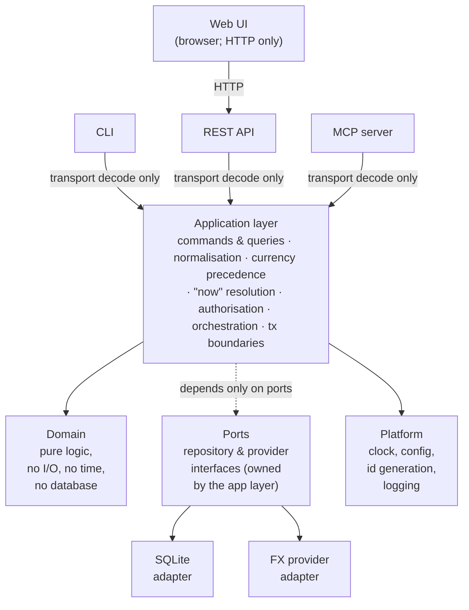

# Architecture

How `bodger` is put together: the layers, the boundary each surface is allowed to touch, the milestone sequence, and where the project currently stands.

For *what* the system stores, read [`data-model.md`](data-model.md) — it is the source of truth for financial semantics and was written first, deliberately. For *who it's for and how it should feel*, read [`ux-principles.md`](ux-principles.md), which every surface is held to. This document describes the machinery around it.

---

## 1. The one architectural principle

> One coherent set of financial capabilities, and several thin interfaces over them.

The CLI, the REST API, the web UI, and the MCP server are **peers**. None of them is the "real" application with the others bolted on. Any business rule that exists in only one of them is a bug, and the project has a test suite whose entire job is to catch that ([ADR-0005](decisions/0005-shared-application-layer.md)).

---

## 2. Layers



Dependencies point inward. `domain` imports nothing from the project. `app` imports `domain` and `ports`. Adapters import `ports`. Surfaces import `app`. A surface importing `domain` directly, or an adapter importing `app`, is a CI failure, not a code-review opinion (§6).

### What each layer is for

**`domain`** — Money, Currency, Account, Category, Transaction, Posting, Budget, and their invariants. Pure functions and value objects. No database, no clock, no network, no config. This is where the exhaustive test coverage lives, because it is the layer where correctness is cheap to assert.

**`app`** — The use-case layer, and the only layer that knows what "now" is. Exposes one method per user intent (`RecordOutflow`, `RecordTransfer`, `ListTransactions`, `AccountBalances`, …), each taking a **command or query struct** and returning a result struct. Owns transaction boundaries, authorisation, currency precedence, date resolution, and every default. See [ADR-0005](decisions/0005-shared-application-layer.md).

**`ports`** — Interfaces the app layer needs the outside world to satisfy: `TransactionRepository`, `AccountRepository`, `FxRateProvider`, `Clock`. Defined by the consumer, not the implementer.

**`adapters`** — Implementations of ports. SQLite persistence, migrations, FX providers. Swappable without the app layer noticing.

**`surface`** — HTTP handlers, CLI commands, MCP tools. Each one does exactly three things: decode transport input into a command struct, call one app method, encode the result. Any `if` statement in a surface that isn't about presentation is a design smell.

Surfaces are also where [`ux-principles.md`](ux-principles.md) applies: they own every string a person reads, and they are the only place the product's vocabulary and defaults can go wrong.

They render errors, they never classify them. An error arrives from the application layer already carrying its code, its user-safe message, and its field path; the surface looks up the status or exit code in one shared table. A handler choosing its own HTTP status is the same class of defect as a handler parsing its own date — see [ADR-0011](decisions/0011-error-model.md).

**`platform`** — Cross-cutting infrastructure: the clock, config loading, ID generation, structured logging, and the error registry ([ADR-0011](decisions/0011-error-model.md)) that every surface renders from.

### The rule that matters most

**A surface may not resolve a default, parse a domain value, or ask what time it is.**

If the CLI parses `"2026-08-14"` into a date and the API parses it too, they will eventually disagree about `"14/08/2026"`, `"today"`, or what happens at a month boundary in `Asia/Kolkata`. So a surface never resolves a date itself — it passes the raw string through and the app layer normalises, because only the app layer holds the clock and the user's timezone. The same is true of anything else that needs a repository lookup (which account does "hdfc savings" mean?) or instance config (what currency applies by default?): only fields with no such dependency are typed at the boundary. This is CLAUDE.md's normalise-once rule, and with four surfaces it is the rule most likely to erode silently. [ADR-0005](decisions/0005-shared-application-layer.md) specifies both the contract, precisely which fields it applies to and why, and the mechanism that enforces it.

---

## 3. Surface boundaries

| Surface | Reaches the app layer via | Ships in | Purpose |
| --- | --- | --- | --- |
| **CLI** | Direct in-process call | `bodger` binary | Fast entry, scripting, automation, debugging |
| **REST API** | Direct in-process call | `bodger serve` | The web UI's only interface; external clients and integrations |
| **MCP server** | Direct in-process call | `bodger mcp` | Local tool-calling agents over the user's own data |
| **Web UI** | HTTP → REST API | Static assets embedded in the binary | Dashboards, charts, review-heavy workflows |

Three of the four surfaces link the application layer directly. Only the web UI must cross a network boundary, because it runs in a browser.

This is the arrangement that makes the normalise-once rule easiest to keep: the CLI and MCP call the *same Go function* the HTTP handler calls, so there is no second implementation to drift. Routing the CLI and MCP through HTTP instead would also satisfy normalise-once, but it would force a server to be running to record a transaction, and would make the MCP server a network client of a service it usually shares a machine with. See [ADR-0001](decisions/0001-technology-stack.md).

**Consequence to know about:** more than one process can open the same SQLite database — `bodger serve` in Docker and `bodger tx add` in a terminal. WAL mode plus a busy timeout makes this safe for personal-scale concurrency, and this is a documented constraint rather than an accident. [ADR-0007](decisions/0007-persistence-and-migrations.md) covers it, including the Postgres path that removes it.

### What the web UI may not do

The web UI holds **no financial logic**. No client-side balance summation, no client-side currency conversion, no client-side period arithmetic, no client-side category rollup. It renders what the API computed. The moment a number is computed in TypeScript, the CLI and MCP cannot produce it, and the product has quietly grown a second financial model.

Formatting a server-supplied minor-unit integer for display is presentation and belongs in the browser. Deciding *which* rate converted it is not.

### What MCP tools may not do

MCP tools map one-to-one onto app-layer methods. They never touch the repository layer or emit SQL, and they are classified explicitly:

- **read** — queries and analytics. Always allowed.
- **write** — creating and editing transactions. Allowed, audited.
- **destructive** — deletion, bulk edits, import commit, rollback. Requires explicit confirmation and is disabled by default.

Details land with the MCP milestone; the classification is fixed now so tools aren't retrofitted into it.

---

## 4. Technology

Full rationale in [ADR-0001](decisions/0001-technology-stack.md). Summary:

| Concern | Choice |
| --- | --- |
| Backend, CLI, MCP | **Go 1.27** — one static binary, trivial cross-compilation for a NAS or VPS, strong stdlib HTTP, cheap to keep layers separated |
| Database | **SQLite** via `modernc.org/sqlite` (pure Go, no cgo) |
| Migrations | **goose**, SQL files embedded with `embed.FS` |
| HTTP routing | **stdlib `net/http.ServeMux`** — method+pattern routing since Go 1.22; no framework |
| CLI framework | **cobra** |
| OpenAPI generation/validation | **`github.com/getkin/kin-openapi`** — generates `internal/surface/http/openapi.json` from the REST API's own DTOs and route table, and validates real e2e-test responses against it (issue #36) |
| MCP | **`github.com/modelcontextprotocol/go-sdk`** (official) |
| Web UI | **React + TypeScript + Vite**, built to static assets embedded in the Go binary |
| Auth | Session cookies for the browser, hashed API tokens for CLI/MCP/scripts; see [ADR-0006](decisions/0006-authentication-and-multi-user-path.md) |
| Deployment | Single container + Docker Compose; SQLite file on a volume |
| Toolchain pin | `.tool-versions` (asdf/mise) |
| Task runner | `Makefile` |
| CI | GitHub Actions running the same `make` targets |

Self-hosting is the deployment target that shaped most of this: one binary with the web UI baked in, one SQLite file to back up, `docker compose up`, and no separate database container to operate.

---

## 5. Repository layout

```
cmd/bodger/            single binary: serve, mcp, and all CLI commands
internal/
  domain/              pure financial model — money, ledger, budget
  app/                 use cases; commands, queries, normalisation
    normalize/         the ONLY place raw input becomes domain values
  ports/               repository and provider interfaces
  adapters/
    sqlite/            repositories + migrations/
    fxprovider/        FX rate providers
  surface/
    http/              REST handlers, router, DTOs
    cli/               cobra commands
    mcp/               MCP tool definitions
  platform/            clock, config, idgen, logging, error registry
web/                   React + Vite app; built assets embedded at compile time
docs/                  architecture, data model, ADRs, guides
```

---

## 6. Enforcement

Conventions that live only in a document decay. These are checked by `make check`, which is exactly what CI runs:

- **Layer boundaries** — an import-graph check fails the build if `domain` imports anything project-local, if a surface imports `domain` or an adapter, or if an adapter imports `app`.
- **No wall clock outside the clock** — `time.Now()` anywhere but `internal/platform/clock` fails the build. Time is injected, which also makes date-boundary tests deterministic.
- **No environment reads outside config** — `os.Getenv` outside `internal/platform/config` fails the build.
- **No unclassified errors out of the app layer** — a `fmt.Errorf` or `errors.New` in `internal/app` that isn't wrapped as an `*errs.Error`'s cause fails the build, so every failure a surface receives arrives with a code ([ADR-0011](decisions/0011-error-model.md)). `internal/domain` and the adapters are unaffected: their errors are meant to be plain, or to *become* that cause.
- **Surface conformance suite** — one table of raw inputs driven through the CLI, the REST API, and MCP, asserting all three produce identical normalised command structs. This is the test that catches normalise-once erosion, and it is why the API is in milestone 1 alongside the CLI rather than after it.
- **Vocabulary** — [`ux-principles.md` §2](ux-principles.md#2-vocabulary)'s banned-term table is checked against the error registry's default messages and every cobra help and flag usage string. Conformance checks that surfaces *behave* alike; this checks that they *speak* alike. See [`contributing.md`](contributing.md#the-vocabulary-check).
- **OpenAPI document freshness and response validation** — `internal/surface/http/openapi.json` is generated from the REST API's own DTOs and route table (issue #36); one test re-runs the generator and fails the build on any drift from a forgotten `go generate`, and the package's end-to-end tests validate every real response against that same document, so a handler whose response doesn't match its own declared schema fails too.
- **`TZ=UTC` in CI** — so a test that accidentally depends on the host timezone fails on the machine that matters.

---

## 7. Testing strategy

Weighted toward the layer where correctness is decided:

- **Domain** — exhaustive, deterministic, table-driven. Every invariant in [`data-model.md` §14](data-model.md#14-invariants-that-must-have-tests).
- **App** — use-case tests against an in-memory repository, with a frozen clock and a fixed timezone. Currency precedence, period boundaries, authorisation.
- **Persistence** — repository tests against a real temp-file SQLite database, plus a migrate-up/migrate-down cycle on every migration.
- **Surfaces** — thin. Enough to prove decoding and encoding; the shared conformance suite covers the rest.
- **Round-trip** — export → import → export is byte-identical modulo surrogate IDs and timestamps.
- **Web UI** — component tests with Vitest; end-to-end kept deliberately sparse. UI tests are not where financial correctness is established.

Fixtures cover multiple currencies, transfers, splits, refunds, credit cards, imported duplicates, month boundaries, and a leap day.

---

## 8. Milestones

Each milestone leaves the application working, testable, and useful. Ordering after M2 is revisable as the product teaches us something.

Milestones get a **name** as well as a number, taken from fantasy and sci-fi worlds and planets — M1 is *Arda*, the world itself, which is what everything after it sits on. Names are assigned when a milestone is actually created and scoped, not reserved in advance; the unnamed ones below are sketches, and naming them now would imply more certainty about their scope than exists. Eventual releases will take the name of the milestone they complete rather than inventing a second vocabulary — see [`docs/releasing.md`](releasing.md) for how a release is actually cut.

### M1 · Arda — Ledger core, CLI, and REST API
The smallest genuinely usable slice: record money moving and see where you stand.

Domain model (money, accounts, categories, transactions, postings, transfers, splits) · SQLite persistence and migrations · application layer with the normalisation contract · CLI · read/write REST API · derived balances · the layer-boundary and conformance checks from §6.

Single currency per account; a cross-currency transfer is rejected with a clear error rather than silently mis-converted. No auth — the server binds `127.0.0.1` and refuses a non-loopback bind until auth exists ([ADR-0006](decisions/0006-authentication-and-multi-user-path.md)). No web UI, no MCP, no FX, no budgets, no import.

Two surfaces ship together deliberately: the conformance suite needs two surfaces to compare, and the normalise-once contract is far cheaper to establish now than to retrofit across four.

### M2 · The Shire — Web UI and authentication
Fast transaction entry, transaction list with filters, account balances, settings. Session-cookie auth for the browser, hashed API tokens for CLI/MCP. Docker image and Compose file. This is the milestone where a non-technical person can use the product — ordinary folk, no accountants, which is the Shire's whole character in the Arda (M1) world.

### M3 — Multi-currency and FX
Cross-currency transfers enabled. FX provider abstraction, rate storage, explicit conversion policies, reporting currency. Every converted figure carries its rate, date, source, and policy ([ADR-0004](decisions/0004-multi-currency-and-fx.md)).

### M4 — Analytics and charts
The shared query/filter model ([ADR-0009](decisions/0009-query-and-analytics-model.md)), spending and income by category, cash flow, trends, savings rate. Charts in the web UI and machine-readable output from the CLI, both over the same analytics methods.

### M5 — Import and export
The staged import pipeline, CSV import with column mapping, duplicate detection, preview and commit. Canonical versioned JSON export and full backup ([ADR-0008](decisions/0008-import-export-architecture.md)). Export lands before or with import: backup is what makes import safe to attempt.

### M6 — Budgets
Monthly category budgets, actual vs budget, remaining, utilisation, history. Rollover stays deferred.

### M7 — MCP server
`bodger mcp` over stdio. Read, write, and destructive tool tiers with confirmation and audit.

### M8 — Recurring transactions
Rules, scheduled occurrences, materialisation, forecasting. Occurrences never touch a balance.

---

## 9. Status

**M1 · Arda shipped as [v0.1.0](https://github.com/anirudhgray/bodger/releases/tag/v0.1.0).**
M2 · The Shire is underway — see the [M2 milestone](https://github.com/anirudhgray/bodger/milestone/2)
for its issues.

| Milestone | Status |
| --- | --- |
| M0 — Architecture, docs, toolchain, CI | ✅ Complete |
| M1 · Arda — Ledger core, CLI, REST API | ✅ Complete (v0.1.0) |
| M2 · The Shire — Web UI and authentication | 🟨 In progress |
| M3 — Multi-currency and FX | ⬜ Not started |
| M4 — Analytics and charts | ⬜ Not started |
| M5 — Import and export | ⬜ Not started |
| M6 — Budgets | ⬜ Not started |
| M7 — MCP server | ⬜ Not started |
| M8 — Recurring transactions | ⬜ Not started |

Delivered in M0: this document, [`data-model.md`](data-model.md), [`ux-principles.md`](ux-principles.md), ADRs 0001–0011, [`contributing.md`](contributing.md), a placeholder [`user-guide.md`](user-guide.md), `.tool-versions`, `Makefile`, and the GitHub Actions workflow.

The bootstrap product brief has been fully absorbed into these documents and can be deleted; nothing in `docs/` cites it. See [`decisions/README.md`](decisions/README.md#on-the-brief).

Delivered so far in M1:

- `internal/domain/money` and `internal/domain` — `Money` and `Date` value
  objects, currency reference data, arithmetic, formatting/parsing, JSON
  marshalling (issue #1).
- `internal/platform/clock`, `internal/platform/config`,
  `internal/platform/idgen`, `internal/platform/logging`,
  `internal/platform/errs` — injected clock, layered config, ID
  generation, structured logging, shared error registry (issue #4).
- `internal/domain/ledger` — `Account`, `Category`, `Tag`, `Transaction`,
  and `Posting`, with the invariants from data-model.md §14 and a pure
  `Balance` function (issue #2). `Account` and `Category` carry the full
  data-model.md §4/§6 field set — `Institution`, `SortOrder`, and
  `ArchivedAt` — persisted through the SQLite adapter below (issue #22).
- `internal/ports` — `AccountRepository`, `CategoryRepository`,
  `TransactionRepository`, and `TagRepository` interfaces, and
  `internal/adapters/sqlite` — their `modernc.org/sqlite` implementation:
  the ADR-0007 pragmas, a single-connection write pool and a pooled read
  pool, goose migrations embedded via `embed.FS` with a tested
  `-- +goose Down` and pre-migration `VACUUM INTO` backup, and the single
  M1 user seeded with a fixed UUID (ADR-0006) by the first migration
  (issue #3).
- `internal/app/normalize` — `Amount`, `Currency`, `DateOf`, `Ref`,
  `Text`, and `Tag`: the only place raw surface input becomes a domain
  value, per the normalise-once contract (ADR-0005). `internal/app`'s
  `Service` container wires the clock, config, ID generator, and
  repository ports together once for every future surface to share, and
  the `cmd/bodger` root command bootstraps config, the database,
  migrations, and the container, with no subcommands registered yet
  (issue #5).
- `internal/app`'s use-case methods: account and category CRUD (create,
  rename, archive, list — plus reparent for categories), `RecordOutflow`,
  `RecordInflow`, `RecordTransfer`, edit and soft-delete a transaction
  (writing a `transaction_revision` row per data-model.md §7),
  `ListTransactions` with the reduced M1 filter (date range, account,
  category subtree, kind), offset pagination, and a fully deterministic
  sort, and `AccountBalances(asOf)` computed from postings per ADR-0002
  (issue #6).
- `internal/surface/cli` — `spend`, `receive`, `move`, `balance`,
  `transactions` (list/edit/delete), `accounts`
  (list/add/rename/archive/set-opening-balance), and `categories`
  (list/tree/add/rename/reparent/archive), registered onto `cmd/bodger`'s
  root command. Every command decodes flags into a command struct and
  calls exactly one application method; `--json` gives stable
  machine-readable output on every data-returning command (issues #7 and
  #30). Every use case `internal/app` exposes now has a command; the CLI
  speaks one vocabulary throughout, so a transaction is filtered and
  described with the verb that recorded it (`spend`/`receive`/`move`)
  rather than the application layer's own kind names.
- `internal/surface/http` — bodger's REST API, on stdlib
  `net/http.ServeMux`, registered as `bodger serve` onto the same root
  command. Every handler decodes JSON into a command or query struct,
  calls exactly one application method, and encodes the result — the same
  adapter-contract discipline as the CLI. Covers accounts, categories,
  transactions (including cursor-paginated listing), transfers, and
  balances, plus `/healthz`; `GetAccount`, `GetCategory`, and
  `GetTransaction` were added to `internal/app` alongside it so a single
  resource's `GET /{id}` route has one application method to call.
  Ships with an OpenAPI 3 description (`internal/surface/http/openapi.json`)
  generated, not hand-written, from `routeTable` and this surface's own
  request/response DTOs via [`kin-openapi`](https://github.com/getkin/kin-openapi)'s
  `openapi3gen` (issue #36) — a CI test regenerates it and fails the
  build on any drift from a forgotten `go generate`, and the package's
  end-to-end tests validate every real response against the same
  document via `openapi3filter`, so a handler whose response doesn't
  match its own declared schema fails CI too. `internal/platform/config`
  gained `HTTPBindAddr` (default `127.0.0.1:8080`) and refuses to load a
  configuration that binds anywhere but loopback, since there is no
  authentication yet (issue #8, ADR-0006).

- `internal/lint` — the mechanical guard ADR-0011 names but didn't have:
  a parse of `internal/app` that fails `make check` on any `fmt.Errorf` or
  `errors.New` not nested inside a `Wrap(...)` call, so no error can reach
  a surface without a code. `NewService`'s nil-dependency checks, the one
  existing violation, now return `errs.Internal` with the dependency name
  in the logged cause (issue #12).
- `internal/lint`'s remaining two mechanical checks from §6: an
  import-graph test enforcing the layer table in §2 (`domain` imports
  nothing project-local outside its own subtree; `app` imports `domain`,
  `ports`, `platform`; adapters import `ports`, `domain`, `platform`;
  surfaces import `app`, `platform`, and `ports` — never `domain`, never
  an adapter), and a banned-symbol check confining `time.Now()` to
  `internal/platform/clock` and `os.Getenv` to `internal/platform/config`
  across the whole tree, superseding `internal/surface/http`'s own
  narrower stopgap for the latter. `internal/surface/conformance` drives
  outflow, inflow, and transfer through the CLI and REST API's real entry
  points under a frozen, deliberately hostile instant, asserting an
  identical observable result — or an identical error code and field —
  across date resolution, amount and currency parsing, account/category
  resolution (exact, case-insensitive, ambiguous, not-found), Unicode
  text normalisation, and tag normalisation (issue #9). This was M1's
  last remaining item against the scope in §8: everything the milestone
  promised is now built and mechanically enforced.

Delivered so far in M2:

- `web/` — the React + TypeScript + Vite scaffold (issue #58): Tailwind
  and shadcn/ui (Radix primitives copied into `web/src/components/ui`,
  not an npm-installed themed component library), a routing skeleton
  (`web/src/routes.tsx`) with placeholder screens for the issues below to
  fill in, and `npm run dev`'s Vite dev server proxying `/api` and
  `/healthz` to a locally running `bodger serve` so frontend iteration
  doesn't need a production build each time. `make build-web` builds
  straight into `internal/platform/webui/dist`, which that package
  `go:embed`s; nothing under `dist/` is tracked except an empty
  `.gitkeep` (so `go build`/`go test`/`go vet` keep working on a Go-only
  checkout before `npm run build` has ever run), and a real build is free
  to empty and rewrite the directory without ever touching a tracked file
  — `internal/platform/webui`'s own placeholder page lives in a sibling
  `placeholder/` directory outside Vite's output path instead, and is
  served in `dist/index.html`'s place until a real build exists.
  `internal/surface/http.NewServerHandler` serves whichever one `Dist()`
  returns alongside the REST API, falling back to `index.html` for any
  path that isn't a real static asset so a hard refresh on a client-side
  route still resolves. Holds no financial logic and imports no domain
  type, per §3.
- `internal/platform/auth` — pure, no-I/O Argon2id password hashing
  (`golang.org/x/crypto/argon2`) behind a hand-rolled, self-describing
  PHC-string encode/decode, with default parameters starting from
  RFC 9106 §4's small-memory recommended set per ADR-0006's "tuned for a
  small server" line; opaque cryptographically random session-token
  generation and hashing; and `bdg_`-prefixed API-token generation stored
  as a SHA-256 hash per ADR-0006's credential table. No repository,
  use-case, HTTP, or CLI code yet — this is the foundation the
  persistence, application, and surface auth issues build on (issue #53).
- **Structured logging is actually wired up.** `internal/platform/logging.New`
  (constructed in M1, issue #4) was never called anywhere in the running
  binary — `cmd/bodger` now constructs one `*slog.Logger` in `main`, shared
  by the CLI and `bodger serve`, writing JSON to stderr. `internal/surface/cli.RenderError`
  and `internal/surface/http`'s `respondError` both log an `*errs.Error`'s
  full cause chain through it (via `LogValue`) before rendering the safe
  message, closing the gap ADR-0011 left open: an `Internal`-coded error's
  driver detail was previously discarded, not logged. `internal/platform/config`
  gained `LogLevel` (`BODGER_LOG_LEVEL`; default `"info"`, shared by both
  surfaces — see [`contributing.md`](contributing.md#logging) for why). A
  rotating log file was considered and deliberately deferred rather than
  adding a dependency unilaterally (issue #43).

Not yet built: everything else in §2.

This section is updated **in the same PR** as the work it describes, per CLAUDE.md — not in a later docs pass.

---

## 10. Decision records

Indexed, with their status and a one-line summary each, in [`decisions/README.md`](decisions/README.md). That file is the single list — this document links to individual ADRs inline where they're relevant rather than duplicating the table.
