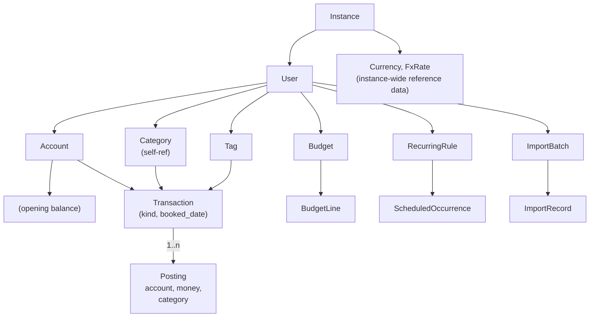

# Data model

The domain model for `bodger`. This document describes the **financial semantics** of the system, independent of any API, CLI, MCP, or UI shape. Surfaces consume this model; they never define it.

Read this before `architecture.md` if you want to understand *what* the system stores. Read `architecture.md` first if you want to understand *how* the surfaces reach it.

The rule this document exists to enforce (CLAUDE.md, "domain model before UI"): if you find yourself wanting to add a field because a screen or an endpoint needs it, the question is whether the *domain* needs it. If it does, it belongs here. If it doesn't, it belongs in a surface's view model.

---

## 1. Guiding constraints

Four constraints shape everything below.

1. **The authoritative record is what the user (or their bank) says happened.** Balances, budgets remaining, category totals, savings rate — all of these are *derived*, always recomputable, and never stored as the source of truth. See [ADR-0002](decisions/0002-authoritative-ledger-and-corrections.md).
2. **Every monetary value carries its currency.** There is no such thing as a bare amount in this system. See [ADR-0004](decisions/0004-multi-currency-and-fx.md).
3. **Accounting machinery stays internal.** The model borrows the *posting* idea from double-entry because it makes transfers and splits fall out correctly. It does not borrow debits, credits, journals, or a chart of accounts. A user never sees the word "posting."
4. **Money that hasn't moved is not a transaction.** Scheduled and forecast activity lives in separate entities and can never contribute to a balance.

---

## 2. Entity overview



This sketch is the domain's full intended shape, including entities not yet built (`Budget`/`BudgetLine`, `RecurringRule`/`ScheduledOccurrence` — see §13). For the *actual* current schema — every table and foreign key that exists right now, always in sync with `internal/adapters/sqlite/migrations` because it's generated from a real migrated database rather than hand-drawn — see [`docs/schema/README.md`](schema/README.md) (issue #248). Regenerate it with `make erd` after adding a migration; `make check`/CI fails if it's stale (`make check-erd`).

Everything user-owned carries a `user_id` from day one, even though the first deployments are single-user. See [ADR-0006](decisions/0006-authentication-and-multi-user-path.md) for why that column exists before the feature does.

---

## 3. Money and currency

### `Money`

A value object, never a bare number:

| Field | Type | Notes |
| --- | --- | --- |
| `amount_minor` | `int64` | Signed, in the currency's **minor units** |
| `currency` | `char(3)` | ISO 4217 code |

`amount_minor` is an integer count of the smallest unit — paise, cents, fils. Floating point is never used for money anywhere in the system, including in JSON on the wire, where amounts are serialised as strings (`"1500.00"`) alongside their currency and minor-unit exponent.

The exponent comes from the `Currency` table, not from a hardcoded assumption of 2. `JPY` has exponent 0; `INR` and `USD` have 2; `BHD` and `KWD` have 3. Getting this from data rather than from a constant is the difference between ¥1,500 and ¥15.

Arithmetic on two `Money` values of different currencies is a **compile-or-runtime error, never an implicit conversion**. Converting is an explicit operation that takes a rate and records which rate it used (§8).

### `Currency`

Instance-wide reference data, extensible by the user.

| Field | Type | Notes |
| --- | --- | --- |
| `code` | `char(3)` PK | |
| `name` | `text` | "Indian Rupee" |
| `symbol` | `text` | "₹" — display only |
| `minor_unit_exponent` | `int` | 0, 2, or 3 in practice |

**Seed the ~20 commonly used currencies, not all ~180 of ISO 4217.** A user with one to three currencies gains nothing from the long tail, and there is no `enabled` flag: a currency nobody holds an account in simply doesn't appear, because nothing references it. Adding a missing currency is a row insert, available to the user when they need it.

### Currency precedence

The effective currency of an entered amount resolves in this order:

```
explicit entry currency  →  account default currency  →  user reporting currency  →  instance default currency
```

This resolution happens **exactly once**, in the application layer, and never in a handler, command, tool, or component. That is the whole point of [ADR-0005](decisions/0005-shared-application-layer.md).

---

## 4. Accounts

An **Account** is a place the user's money actually sits or is owed. "HDFC Savings", "ICICI Credit Card", "Cash in wallet", "PayPal".

An account is *not* a category, and categories are *not* accounts. This system deliberately does **not** use a chart of accounts where expenses are modelled as accounts you transfer into. That design makes reports elegant and makes the everyday user experience worse, which is the wrong trade for this product. See [ADR-0010](decisions/0010-personal-finance-not-accounting-software.md).

| Field | Type | Notes |
| --- | --- | --- |
| `id` | uuid | |
| `user_id` | uuid | |
| `name` | text | User-defined, unique per user |
| `kind` | enum | `bank`, `cash`, `credit_card`, `wallet`, `investment`, `loan`, `other` |
| `currency` | char(3) | The account's default currency |
| `institution` | text? | Free text; not a modelled entity yet (§13) |
| `opening_balance_minor` | int64 | Defaults to 0 |
| `opening_balance_date` | date? | Balance is treated as true *as of* this date |
| `archived_at` | timestamptz? | Hidden from pickers, still present in history |
| `sort_order` | int | Display only |

### `kind`, and why it is not a hierarchy

The brief asks whether accounts need a type, a group, and a bucket. They need **one** discriminator, and it must earn its place by changing *behaviour*, not by organising a sidebar. `kind` does exactly two behavioural things:

- It sets the **normal sign** of the balance. `credit_card` and `loan` are liabilities: a negative stored balance means "you owe". Everything else is an asset: negative means overdrawn.
- It decides whether the account counts toward **net worth** as an asset or a liability.

Everything else people want from grouping — "show me all my savings accounts" — is a *reporting* concern and is served by tags and filters, not by a second structural hierarchy. A user-defined `AccountGroup` is deliberately deferred (§13) until a real reporting need shows up that filters cannot serve.

### Balance is derived, never stored

```
balance(account, as_of) = opening_balance
                        + Σ posting.amount_minor
                          where posting.account_id = account
                            and transaction.booked_date <= as_of
                            and transaction.deleted_at is null
```

`opening_balance` exists so a user can start using the app today without importing a decade of history. It is a declared starting point, not a cached aggregate — it never changes as transactions are added.

Cached balances may be added later as a pure performance optimisation, but only behind a test asserting they equal the recomputed value.

---

## 5. Transactions and postings

This is the core of the model.

### `Transaction`

One thing that happened, on one date, that the user would describe as a single event.

| Field | Type | Notes |
| --- | --- | --- |
| `id` | uuid | |
| `user_id` | uuid | |
| `kind` | enum | `outflow`, `inflow`, `transfer` |
| `booked_date` | date | **The** reporting date. No time, no zone. See §9 |
| `posted_date` | date? | From imports only; never used for reporting |
| `description` | text | Payee or free text — "Blue Tokai", "Salary" |
| `notes` | text? | Longer free text |
| `created_at` | timestamptz | Audit only |
| `updated_at` | timestamptz | Audit only |
| `deleted_at` | timestamptz? | Soft delete (§7) |
| `import_record_id` | uuid? | Provenance, if imported |
| `external_id` | text? | The source system's ID, for deduplication |
| `related_transaction_id` | uuid? | Refunds, reversals, corrections |

### `Posting`

One line of a transaction: an amount hitting one account, optionally attributed to one category.

| Field | Type | Notes |
| --- | --- | --- |
| `id` | uuid | |
| `transaction_id` | uuid | |
| `account_id` | uuid | |
| `amount_minor` | int64 | **Signed.** Negative = money left the account |
| `currency` | char(3) | Normally the account's currency |
| `category_id` | uuid? | Null for transfer postings |
| `sort_order` | int | Display order within a split |

The category lives on the **posting**, not the transaction. This one decision is what makes splits work without a special case anywhere in reporting: every report groups by `posting.category_id` and sums `posting.amount_minor`, and a split transaction is simply one with more than one posting.

### The three shapes

Everything the user can record is one of these. The invariants are enforced in the domain layer and asserted in tests.

**Outflow** — ₹800 on groceries from HDFC Savings:

```
Transaction(kind=outflow, booked_date=2026-08-14, description="More & More")
  Posting(account=HDFC Savings, amount=-80000, currency=INR, category=Groceries)
```

*Invariant:* every posting is on the same account; every `amount_minor` is negative.

**Inflow** — ₹1,50,000 salary:

```
Transaction(kind=inflow, booked_date=2026-08-01, description="Acme Corp salary")
  Posting(account=HDFC Savings, amount=+15000000, currency=INR, category=Salary)
```

*Invariant:* every posting is on the same account; every `amount_minor` is positive.

**Split** — a ₹5,000 supermarket run, three ways. Still `kind=outflow`; nothing special:

```
Transaction(kind=outflow, booked_date=2026-08-14, description="More & More")
  Posting(account=HDFC Savings, amount=-350000, category=Groceries)
  Posting(account=HDFC Savings, amount=-100000, category=Household)
  Posting(account=HDFC Savings, amount=-50000,  category=Personal)
```

*Invariant:* as outflow. The sum is the transaction total; no separate total is stored, because a stored total is a second source of truth waiting to disagree.

**Transfer** — ₹20,000 savings → checking:

```
Transaction(kind=transfer, booked_date=2026-08-05, description="Move to spending account")
  Posting(account=Savings,  amount=-2000000, currency=INR, category=null)
  Posting(account=Checking, amount=+2000000, currency=INR, category=null)
```

*Invariants:* exactly two postings; exactly two distinct accounts; opposite signs; both categories null; and — for a same-currency transfer only — the amounts sum to zero.

**Paying a credit card bill** is a transfer, not an expense. Money moves from `bank` to `credit_card`; the card's negative balance moves toward zero. The purchases already recorded on the card are where the expense was. Recording the bill payment as an expense too is the single most common way personal-finance apps double-count, and the model makes it structurally impossible: transfer postings carry no category and reports filter on `kind`.

### Why postings rather than a `from_account`/`to_account` pair

The brief asks this explicitly. A single transaction row with `from_account_id` and `to_account_id` is simpler to read and worse at everything else: splits need a second mechanism, cross-currency transfers need two more columns, balance queries need a `UNION` over two columns instead of one `GROUP BY`, and every import and export path has to special-case which shape it is emitting. Postings pay a small readability cost once and make transfers, splits, multi-currency, imports, exports, and every analytical query use one uniform code path. See [ADR-0003](decisions/0003-transaction-posting-model.md) for the alternatives considered.

### Cross-currency transfers

A cross-currency transfer does **not** balance to zero, and forcing it to would be a bug. ₹20,000 leaving an INR account and $230 arriving in a USD account are both facts the user knows; the exchange rate is the *derived* quantity.

```
Transaction(kind=transfer, booked_date=2026-08-05)
  Posting(account=HDFC Savings, amount=-2000000, currency=INR, category=null)
  Posting(account=Chase USD,    amount=+23000,   currency=USD, category=null)
```

*Invariant:* when the two posting currencies differ, the zero-sum rule is suspended and an implied rate is derived and stored on the transaction (`fx_rate_used`, `fx_rate_source = 'implied'`). Both legs remain authoritative. Any difference between the implied rate and the market rate on that date is a real FX cost the user actually paid, and the model records it rather than smoothing it away.

### Fees

A transfer or payment fee is recorded as a **separate outflow transaction**, linked with `related_transaction_id`. A `posting.role` discriminator (`primary` / `fee`) allowing a third categorised posting inside a transfer is the forward path if that proves annoying in practice, but it is not built yet — see §13.

---

## 6. Categories and tags

### `Category`

| Field | Type | Notes |
| --- | --- | --- |
| `id` | uuid | |
| `user_id` | uuid | |
| `parent_id` | uuid? | Self-referential; one hierarchy |
| `name` | text | Unique among siblings |
| `kind` | enum | `expense`, `income` |
| `archived_at` | timestamptz? | |
| `sort_order` | int | |

One hierarchy, typed by `kind`. The alternatives — two separate trees, or an untyped shared tree — were considered and rejected in [ADR-0003](decisions/0003-transaction-posting-model.md): two trees duplicate the traversal code, and an untyped tree lets "Salary" appear in an expense picker.

Depth is not constrained by the schema, but the UI and the seed data assume two levels (`Food` → `Groceries`). Reports roll up the full subtree.

Transfers have no category. This is enforced, not conventional.

### `Tag`

Free-form, many-to-many with `Transaction` (not with `Posting` — a tag describes the event, not the split line).

Tags are the escape hatch that keeps the category hierarchy from having to model every cross-cutting concern the user cares about. `#japan-trip-2026`, `#reimbursable`, `#tax-deductible` are tags, not categories, because they cut across Food, Transport, and Housing simultaneously.

---

## 7. Corrections, history, and audit

Transactions are **mutable**, with an append-only audit trail. This is a deliberate choice over both "immutable, corrections are reversal entries" (correct, but forces accounting concepts on a user who typoed an amount) and "mutable, no history" (convenient, unauditable). See [ADR-0002](decisions/0002-authoritative-ledger-and-corrections.md).

- Editing a transaction writes a row to `transaction_revision` capturing the previous state as JSON, plus actor and timestamp.
- Deleting sets `deleted_at`. Rows are never physically removed, so an import's `external_id` still deduplicates against a transaction the user deleted, and history is reconstructible.
- A **refund** is not a special entity: it is an inflow whose posting carries the *same category* as the original outflow, with `related_transaction_id` pointing at it. Category reports therefore net out automatically — a ₹2,000 refunded shirt leaves ₹0 in Clothing without anyone editing the original purchase.

Analytics never read `transaction_revision`. It exists for the user's "what did I change?" question and for debugging, not for reporting.

---

## 8. FX rates

| Field | Type | Notes |
| --- | --- | --- |
| `base` | char(3) | |
| `quote` | char(3) | |
| `rate_date` | date | |
| `rate` | decimal(24,12) | Stored as a decimal string, not a float |
| `source` | text | Provider ID, or `implied`, or `manual` |
| `fetched_at` | timestamptz | |

Primary key `(base, quote, rate_date, source)`.

This table is a durable **record**, not a cache — historical reports must be reproducible after the provider is gone, changes its history, or goes offline. The application must remain fully usable with no network. See [ADR-0004](decisions/0004-multi-currency-and-fx.md) for the conversion-policy rules, which are the part most likely to be got wrong.

The short version: every converted figure the system produces carries the rate, the rate's date, the source, and the policy used to pick it. There is no such thing as an unlabelled converted amount.

---

## 9. Dates, periods, and time

The single most important rule: **`booked_date` is a calendar date with no time and no timezone.** "I spent ₹800 on the 14th" is a fact about a date, and attaching 00:00:00+05:30 to it creates a value that silently changes meaning when the server moves.

- `booked_date` (date) — authoritative for every report, balance, and budget.
- `posted_date` (date, optional) — populated only by imports where the source distinguishes it. Never used for reporting; it exists so import deduplication can match on it and so the user can see the discrepancy.
- `created_at` / `updated_at` (timestamptz, UTC) — audit only. Never used for reporting.

A settlement date is not modelled. The brief asks not to introduce the distinction unless real workflows need it, and none of the milestone-1 workflows do.

**Reporting periods.** "August 2026" means `[2026-08-01, 2026-08-31]` in the *user's* configured IANA timezone, resolved once in the application layer. The server's timezone is never consulted; the process runs with `TZ=UTC` and code that calls `time.Now()` outside the injected clock fails CI. See [ADR-0005](decisions/0005-shared-application-layer.md).

---

## 10. Budgets

A budget is a **plan**, kept strictly separate from what happened.

| Entity | Fields |
| --- | --- |
| `Budget` | `id`, `user_id`, `name`, `period_type` (`monthly` initially), `currency`, `starts_on`, `archived_at?` |
| `BudgetLine` | `id`, `budget_id`, `category_id`, `amount_minor`, `rollover` (bool, default false) |

Budget **periods are computed, not stored.** A monthly budget starting 2026-01-01 has a period for August 2026 whether or not anyone has looked at it. Materialising period rows would create exactly the kind of derived-data-as-truth the model avoids, and would require a job to keep them going.

Actuals come from the same posting query every other report uses, filtered to the period and the line's category subtree. `remaining = budgeted − actual`; `utilisation = actual / budgeted`.

Rollover, planned income, planned transfers, savings targets, and non-monthly periods are all deferred (§13). The `rollover` column exists now because leaving it out costs a migration and adding it costs nothing.

---

## 11. Recurring activity

Strictly three separate things, and conflating any two of them is a correctness bug:

1. **`RecurringRule`** — a *template*. Amount, account, category, description, and a schedule (RFC 5545 `RRULE` subset: monthly-on-day-N, weekly, yearly). Money has never moved.
2. **`ScheduledOccurrence`** — a *projection* of one firing of a rule on a date. Status `pending` / `materialised` / `skipped`. Money has still never moved.
3. **`Transaction`** — money moved.

Only entity 3 contributes to balances, reports, budget actuals, or anything the user would call a number. Occurrences may appear in forecasts and reminders, always visually and structurally distinguished from actuals. Materialising an occurrence creates a real transaction and links back.

Modelled here first, because retrofitting the distinction after the fact is how forecast money ends up in a balance. [ADR-0014](decisions/0014-recurring-transactions-scheduling.md) settles the mechanics: the exact `RRULE` subset and its structured Go/SQL representation, why a monthly-on-the-31st rule clamps to 28 February rather than skipping it (a deliberate deviation from RFC 5545), where "what date is it" resolves, how far ahead occurrences are generated, and what makes an occurrence structurally incapable of reaching a balance. A rule posts to exactly one account/category pair; recurring transfers are deferred alongside split transfers (§13).

---

## 12. Import provenance

| Entity | Purpose |
| --- | --- |
| `ImportBatch` | One file/session: source format, filename, hash, target account, status, timestamps |
| `ImportRecord` | One source row: raw payload, normalised fields, resolved account/category, dedup verdict, status, resulting `transaction_id` |

Committing a batch is a single database transaction. Rolling back deletes the batch's transactions. Deduplication is decided at the `ImportRecord` stage against `external_id` first, then a heuristic (same account, exact amount, `booked_date` within ±3 days, similar description) which **surfaces a suspected duplicate for review and never auto-merges**. Details in [ADR-0008](decisions/0008-import-export-architecture.md).

---

## 13. Deliberately deferred

Modelled or left room for, but not built. Each becomes a GitHub issue rather than living only here.

| Deferred | Why, and what unblocks it |
| --- | --- |
| User-defined `AccountGroup` | `kind` + tags + filters cover the known reporting needs. Build it when a real report can't be expressed. |
| `Institution` as an entity | Free-text `institution` until something (logos, bank sync) needs the join. |
| `posting.role` (`fee`) | Fees as separate linked outflows first; promote if the workflow proves annoying. |
| Budget rollover, planned income, custom periods | Column reserved; monthly-category budgets must be right first. |
| Recurring rules and occurrences | Modelled in §11, built after budgets. |
| Split transfers | A transfer with more than two postings is rejected. Revisit only with a concrete use case. |
| Settlement date | Not introduced without a workflow that needs it. |
| Cached balances | Only as a measured optimisation, behind an equality test against the recomputed value. |
| Multi-user sharing / joint accounts | `user_id` exists; sharing semantics do not. See [ADR-0006](decisions/0006-authentication-and-multi-user-path.md). |

---

## 14. Invariants that must have tests

The domain layer is the one place in this system that gets exhaustive, deterministic test coverage. These are the assertions that must exist, and the list is a checklist for review, not a suggestion:

- Money arithmetic across differing currencies fails loudly; it never coerces.
- Minor-unit exponent is read from currency data — `¥1500` round-trips as `¥1500`, not `¥15`.
- Outflow postings are all negative and all on one account; inflow postings all positive.
- A same-currency transfer's postings sum to exactly zero.
- A cross-currency transfer's postings do *not* have to sum to zero, and the implied rate is recorded.
- A transfer posting never carries a category, and transfers never appear in income or expense totals.
- A split's postings sum to the amount the user entered, with no stored total to disagree.
- Credit-card purchases are expenses; credit-card bill payments are transfers; the two never double-count.
- A refund nets its category to zero without mutating the original transaction.
- `balance(account, as_of)` equals `opening_balance` plus every posting on or before `as_of`, and ignores soft-deleted transactions.
- Reporting-period boundaries are computed in the user's timezone; the same query returns identical results under `TZ=UTC` and `TZ=Asia/Kolkata`.
- Currency precedence resolves entry → account → user → instance, in that order.
- The same logical input, submitted through the CLI, the REST API, and MCP, produces an identical stored transaction and identical errors (the conformance suite of [ADR-0005](decisions/0005-shared-application-layer.md)).
- Export → import → export is byte-identical modulo surrogate IDs and timestamps ([ADR-0008](decisions/0008-import-export-architecture.md)).
