# bodger

## Tables

| Name | Columns | Comment | Type |
| ---- | ------- | ------- | ---- |
| [users](users.md) | 4 |  | table |
| [currencies](currencies.md) | 4 |  | table |
| [transactions](transactions.md) | 15 |  | table |
| [postings](postings.md) | 7 |  | table |
| [tags](tags.md) | 3 |  | table |
| [transaction_tags](transaction_tags.md) | 3 |  | table |
| [transaction_revisions](transaction_revisions.md) | 5 |  | table |
| [accounts](accounts.md) | 12 |  | table |
| [categories](categories.md) | 9 |  | table |
| [sessions](sessions.md) | 6 |  | table |
| [api_tokens](api_tokens.md) | 8 |  | table |
| [fx_rates](fx_rates.md) | 6 |  | table |
| [import_batch](import_batch.md) | 9 |  | table |
| [import_record](import_record.md) | 21 |  | table |

## Relations

```mermaid
erDiagram

"transactions" }o--o| "transactions" : "FOREIGN KEY (related_transaction_id) REFERENCES transactions (id) ON UPDATE NO ACTION ON DELETE NO ACTION MATCH NONE"
"transactions" }o--|| "users" : "FOREIGN KEY (user_id) REFERENCES users (id) ON UPDATE NO ACTION ON DELETE NO ACTION MATCH NONE"
"postings" }o--o| "categories" : "FOREIGN KEY (category_id) REFERENCES categories (id) ON UPDATE NO ACTION ON DELETE NO ACTION MATCH NONE"
"postings" }o--|| "currencies" : "FOREIGN KEY (currency) REFERENCES currencies (code) ON UPDATE NO ACTION ON DELETE NO ACTION MATCH NONE"
"postings" }o--|| "accounts" : "FOREIGN KEY (account_id) REFERENCES accounts (id) ON UPDATE NO ACTION ON DELETE NO ACTION MATCH NONE"
"postings" }o--|| "transactions" : "FOREIGN KEY (transaction_id) REFERENCES transactions (id) ON UPDATE NO ACTION ON DELETE CASCADE MATCH NONE"
"tags" |o--|| "users" : "FOREIGN KEY (user_id) REFERENCES users (id) ON UPDATE NO ACTION ON DELETE NO ACTION MATCH NONE"
"transaction_tags" }o--|| "tags" : "FOREIGN KEY (user_id, tag_value) REFERENCES tags (user_id, value) ON UPDATE NO ACTION ON DELETE NO ACTION MATCH NONE"
"transaction_tags" |o--|| "transactions" : "FOREIGN KEY (transaction_id) REFERENCES transactions (id) ON UPDATE NO ACTION ON DELETE CASCADE MATCH NONE"
"transaction_revisions" }o--|| "users" : "FOREIGN KEY (user_id) REFERENCES users (id) ON UPDATE NO ACTION ON DELETE NO ACTION MATCH NONE"
"transaction_revisions" }o--|| "transactions" : "FOREIGN KEY (transaction_id) REFERENCES transactions (id) ON UPDATE NO ACTION ON DELETE NO ACTION MATCH NONE"
"accounts" }o--|| "currencies" : "FOREIGN KEY (currency) REFERENCES currencies (code) ON UPDATE NO ACTION ON DELETE NO ACTION MATCH NONE"
"accounts" }o--|| "users" : "FOREIGN KEY (user_id) REFERENCES users (id) ON UPDATE NO ACTION ON DELETE NO ACTION MATCH NONE"
"categories" }o--o| "categories" : "FOREIGN KEY (parent_id) REFERENCES categories (id) ON UPDATE NO ACTION ON DELETE NO ACTION MATCH NONE"
"categories" }o--|| "users" : "FOREIGN KEY (user_id) REFERENCES users (id) ON UPDATE NO ACTION ON DELETE NO ACTION MATCH NONE"
"sessions" }o--|| "users" : "FOREIGN KEY (user_id) REFERENCES users (id) ON UPDATE NO ACTION ON DELETE NO ACTION MATCH NONE"
"api_tokens" }o--|| "users" : "FOREIGN KEY (user_id) REFERENCES users (id) ON UPDATE NO ACTION ON DELETE NO ACTION MATCH NONE"
"import_batch" }o--|| "accounts" : "FOREIGN KEY (target_account_id) REFERENCES accounts (id) ON UPDATE NO ACTION ON DELETE NO ACTION MATCH NONE"
"import_batch" }o--|| "users" : "FOREIGN KEY (user_id) REFERENCES users (id) ON UPDATE NO ACTION ON DELETE NO ACTION MATCH NONE"
"import_record" }o--o| "import_record" : "FOREIGN KEY (transfer_candidate_record_id) REFERENCES import_record (id) ON UPDATE NO ACTION ON DELETE NO ACTION MATCH NONE"
"import_record" }o--o| "transactions" : "FOREIGN KEY (transaction_id) REFERENCES transactions (id) ON UPDATE NO ACTION ON DELETE NO ACTION MATCH NONE"
"import_record" }o--o| "transactions" : "FOREIGN KEY (duplicate_matched_transaction_id) REFERENCES transactions (id) ON UPDATE NO ACTION ON DELETE NO ACTION MATCH NONE"
"import_record" }o--o| "categories" : "FOREIGN KEY (resolved_category_id) REFERENCES categories (id) ON UPDATE NO ACTION ON DELETE NO ACTION MATCH NONE"
"import_record" }o--o| "accounts" : "FOREIGN KEY (resolved_account_id) REFERENCES accounts (id) ON UPDATE NO ACTION ON DELETE NO ACTION MATCH NONE"
"import_record" }o--|| "currencies" : "FOREIGN KEY (currency) REFERENCES currencies (code) ON UPDATE NO ACTION ON DELETE NO ACTION MATCH NONE"
"import_record" }o--|| "users" : "FOREIGN KEY (user_id) REFERENCES users (id) ON UPDATE NO ACTION ON DELETE NO ACTION MATCH NONE"
"import_record" }o--|| "import_batch" : "FOREIGN KEY (import_batch_id) REFERENCES import_batch (id) ON UPDATE NO ACTION ON DELETE CASCADE MATCH NONE"

"users" {
  TEXT id PK
  TEXT created_at
  TEXT password_hash
  TEXT reporting_currency
}
"currencies" {
  TEXT code PK
  TEXT name
  TEXT symbol
  INTEGER minor_unit_exponent
}
"transactions" {
  TEXT id PK
  TEXT user_id FK
  TEXT kind
  TEXT booked_date
  TEXT posted_date
  TEXT description
  TEXT notes
  TEXT deleted_at
  TEXT import_record_id
  TEXT external_id
  TEXT related_transaction_id FK
  TEXT created_at
  TEXT updated_at
  TEXT fx_rate_used
  TEXT fx_rate_source
}
"postings" {
  TEXT id PK
  TEXT transaction_id FK
  TEXT account_id FK
  INTEGER amount_minor
  TEXT currency FK
  TEXT category_id FK
  INTEGER sort_order
}
"tags" {
  TEXT user_id PK
  TEXT value PK
  TEXT created_at
}
"transaction_tags" {
  TEXT transaction_id PK
  TEXT user_id FK
  TEXT tag_value PK
}
"transaction_revisions" {
  INTEGER id
  TEXT transaction_id FK
  TEXT user_id FK
  TEXT previous_state
  TEXT created_at
}
"accounts" {
  TEXT id PK
  TEXT user_id FK
  TEXT name
  TEXT kind
  TEXT currency FK
  TEXT institution
  INTEGER opening_balance_minor
  TEXT opening_balance_date
  TEXT archived_at
  INTEGER sort_order
  TEXT created_at
  TEXT updated_at
}
"categories" {
  TEXT id PK
  TEXT user_id FK
  TEXT parent_id FK
  TEXT name
  TEXT kind
  TEXT archived_at
  INTEGER sort_order
  TEXT created_at
  TEXT updated_at
}
"sessions" {
  TEXT id PK
  TEXT user_id FK
  TEXT token_hash
  TEXT created_at
  TEXT last_used_at
  TEXT expires_at
}
"api_tokens" {
  TEXT id PK
  TEXT user_id FK
  TEXT token_hash
  TEXT name
  TEXT created_at
  TEXT last_used_at
  TEXT expires_at
  TEXT revoked_at
}
"fx_rates" {
  TEXT base PK
  TEXT quote PK
  TEXT rate_date PK
  TEXT rate
  TEXT source PK
  TEXT fetched_at
}
"import_batch" {
  TEXT id PK
  TEXT user_id FK
  TEXT source_format
  TEXT filename
  TEXT file_hash
  TEXT target_account_id FK
  TEXT status
  TEXT created_at
  TEXT updated_at
}
"import_record" {
  TEXT id PK
  TEXT import_batch_id FK
  TEXT user_id FK
  TEXT raw_payload
  TEXT booked_date
  TEXT posted_date
  TEXT description
  INTEGER amount_minor
  TEXT currency FK
  TEXT external_id
  TEXT resolved_account_id FK
  TEXT resolved_category_id FK
  TEXT duplicate_tier
  TEXT duplicate_matched_transaction_id FK
  TEXT duplicate_resolution
  TEXT status
  TEXT transaction_id FK
  INTEGER sort_order
  TEXT created_at
  TEXT updated_at
  TEXT transfer_candidate_record_id FK
}
```

---

> Generated by [tbls](https://github.com/k1LoW/tbls)
