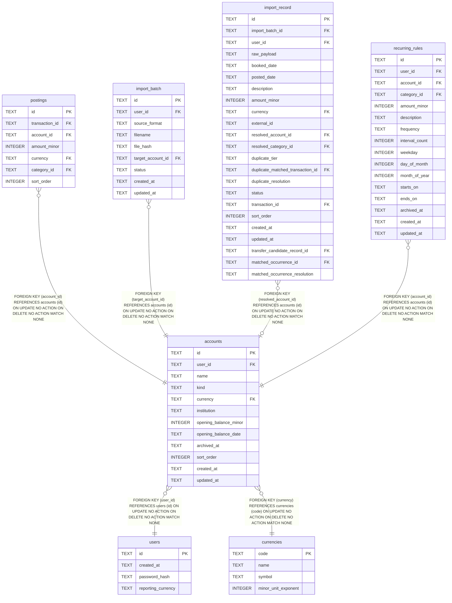

# accounts

## Description

<details>
<summary><strong>Table Definition</strong></summary>

```sql
CREATE TABLE "accounts" (
    id                     TEXT PRIMARY KEY,
    user_id                TEXT NOT NULL REFERENCES users (id),
    name                   TEXT NOT NULL,
    kind                   TEXT NOT NULL CHECK (kind IN ('bank', 'cash', 'credit_card', 'wallet', 'investment', 'loan', 'other')),
    currency               TEXT NOT NULL REFERENCES currencies (code),
    institution            TEXT,
    opening_balance_minor  INTEGER NOT NULL DEFAULT 0,
    opening_balance_date   TEXT,
    archived_at            TEXT,
    sort_order             INTEGER NOT NULL DEFAULT 0,
    created_at             TEXT NOT NULL,
    updated_at             TEXT NOT NULL,
    UNIQUE (user_id, name)
)
```

</details>

## Columns

| Name | Type | Default | Nullable | Children | Parents | Comment |
| ---- | ---- | ------- | -------- | -------- | ------- | ------- |
| id | TEXT |  | true | [postings](postings.md) [import_batch](import_batch.md) [import_record](import_record.md) [recurring_rules](recurring_rules.md) |  |  |
| user_id | TEXT |  | false |  | [users](users.md) |  |
| name | TEXT |  | false |  |  |  |
| kind | TEXT |  | false |  |  |  |
| currency | TEXT |  | false |  | [currencies](currencies.md) |  |
| institution | TEXT |  | true |  |  |  |
| opening_balance_minor | INTEGER | 0 | false |  |  |  |
| opening_balance_date | TEXT |  | true |  |  |  |
| archived_at | TEXT |  | true |  |  |  |
| sort_order | INTEGER | 0 | false |  |  |  |
| created_at | TEXT |  | false |  |  |  |
| updated_at | TEXT |  | false |  |  |  |

## Constraints

| Name | Type | Definition |
| ---- | ---- | ---------- |
| id | PRIMARY KEY | PRIMARY KEY (id) |
| - (Foreign key ID: 0) | FOREIGN KEY | FOREIGN KEY (currency) REFERENCES currencies (code) ON UPDATE NO ACTION ON DELETE NO ACTION MATCH NONE |
| - (Foreign key ID: 1) | FOREIGN KEY | FOREIGN KEY (user_id) REFERENCES users (id) ON UPDATE NO ACTION ON DELETE NO ACTION MATCH NONE |
| sqlite_autoindex_accounts_2 | UNIQUE | UNIQUE (user_id, name) |
| sqlite_autoindex_accounts_1 | PRIMARY KEY | PRIMARY KEY (id) |
| - | CHECK | CHECK (kind IN ('bank', 'cash', 'credit_card', 'wallet', 'investment', 'loan', 'other')) |

## Indexes

| Name | Definition |
| ---- | ---------- |
| idx_accounts_user_id | CREATE INDEX idx_accounts_user_id ON accounts (user_id) |
| sqlite_autoindex_accounts_2 | UNIQUE (user_id, name) |
| sqlite_autoindex_accounts_1 | PRIMARY KEY (id) |

## Relations



---

> Generated by [tbls](https://github.com/k1LoW/tbls)
