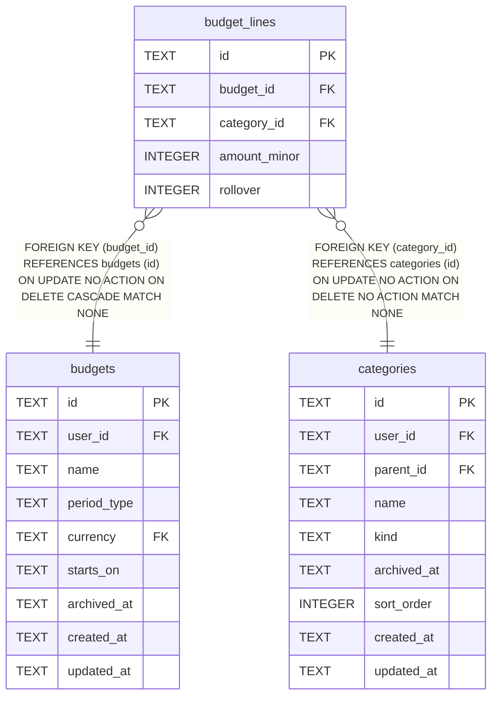

# budget_lines

## Description

<details>
<summary><strong>Table Definition</strong></summary>

```sql
CREATE TABLE budget_lines (
    id           TEXT NOT NULL PRIMARY KEY,
    budget_id    TEXT NOT NULL REFERENCES budgets (id) ON DELETE CASCADE,
    category_id  TEXT NOT NULL REFERENCES categories (id),
    amount_minor INTEGER NOT NULL,
    -- Reserved for a later milestone (data-model.md §13): leaving the
    -- column out now would cost a migration later, and adding it now
    -- costs nothing. Nothing reads or interprets it yet.
    rollover     INTEGER NOT NULL DEFAULT 0 CHECK (rollover IN (0, 1)),
    -- One line per category per budget -- data-model.md §10 has no notion
    -- of "the" actual/remaining for a category split across two lines of
    -- the same budget.
    UNIQUE (budget_id, category_id)
)
```

</details>

## Columns

| Name | Type | Default | Nullable | Children | Parents | Comment |
| ---- | ---- | ------- | -------- | -------- | ------- | ------- |
| id | TEXT |  | false |  |  |  |
| budget_id | TEXT |  | false |  | [budgets](budgets.md) |  |
| category_id | TEXT |  | false |  | [categories](categories.md) |  |
| amount_minor | INTEGER |  | false |  |  |  |
| rollover | INTEGER | 0 | false |  |  |  |

## Constraints

| Name | Type | Definition |
| ---- | ---- | ---------- |
| id | PRIMARY KEY | PRIMARY KEY (id) |
| - (Foreign key ID: 0) | FOREIGN KEY | FOREIGN KEY (category_id) REFERENCES categories (id) ON UPDATE NO ACTION ON DELETE NO ACTION MATCH NONE |
| - (Foreign key ID: 1) | FOREIGN KEY | FOREIGN KEY (budget_id) REFERENCES budgets (id) ON UPDATE NO ACTION ON DELETE CASCADE MATCH NONE |
| sqlite_autoindex_budget_lines_2 | UNIQUE | UNIQUE (budget_id, category_id) |
| sqlite_autoindex_budget_lines_1 | PRIMARY KEY | PRIMARY KEY (id) |
| - | CHECK | CHECK (rollover IN (0, 1)) |

## Indexes

| Name | Definition |
| ---- | ---------- |
| idx_budget_lines_category_id | CREATE INDEX idx_budget_lines_category_id ON budget_lines (category_id) |
| idx_budget_lines_budget_id | CREATE INDEX idx_budget_lines_budget_id ON budget_lines (budget_id) |
| sqlite_autoindex_budget_lines_2 | UNIQUE (budget_id, category_id) |
| sqlite_autoindex_budget_lines_1 | PRIMARY KEY (id) |

## Relations



---

> Generated by [tbls](https://github.com/k1LoW/tbls)
