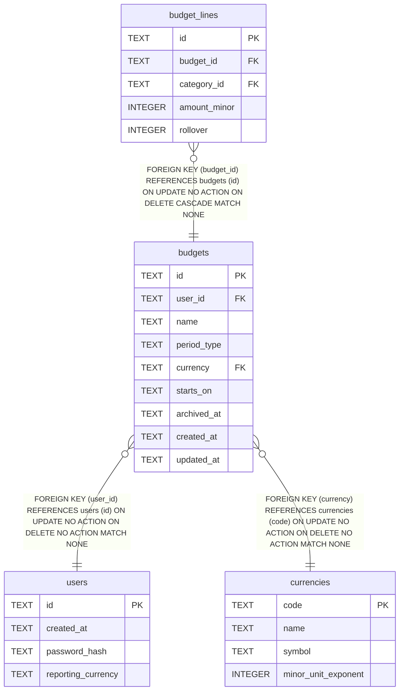

# budgets

## Description

<details>
<summary><strong>Table Definition</strong></summary>

```sql
CREATE TABLE budgets (
    id          TEXT NOT NULL PRIMARY KEY,
    user_id     TEXT NOT NULL REFERENCES users (id),
    name        TEXT NOT NULL,
    -- budgeting.PeriodType's only value today (data-model.md §10:
    -- "monthly initially"). The state machine itself, if this ever grows
    -- one, would live in the domain package, not here -- this CHECK only
    -- guards against a value outside the known set ever reaching the
    -- column, the same role the import_batch.status CHECK plays.
    period_type TEXT NOT NULL DEFAULT 'monthly' CHECK (period_type IN ('monthly')),
    currency    TEXT NOT NULL REFERENCES currencies (code),
    starts_on   TEXT NOT NULL,
    archived_at TEXT,
    created_at  TEXT NOT NULL,
    updated_at  TEXT NOT NULL
)
```

</details>

## Columns

| Name | Type | Default | Nullable | Children | Parents | Comment |
| ---- | ---- | ------- | -------- | -------- | ------- | ------- |
| id | TEXT |  | false | [budget_lines](budget_lines.md) |  |  |
| user_id | TEXT |  | false |  | [users](users.md) |  |
| name | TEXT |  | false |  |  |  |
| period_type | TEXT | 'monthly' | false |  |  |  |
| currency | TEXT |  | false |  | [currencies](currencies.md) |  |
| starts_on | TEXT |  | false |  |  |  |
| archived_at | TEXT |  | true |  |  |  |
| created_at | TEXT |  | false |  |  |  |
| updated_at | TEXT |  | false |  |  |  |

## Constraints

| Name | Type | Definition |
| ---- | ---- | ---------- |
| id | PRIMARY KEY | PRIMARY KEY (id) |
| - (Foreign key ID: 0) | FOREIGN KEY | FOREIGN KEY (currency) REFERENCES currencies (code) ON UPDATE NO ACTION ON DELETE NO ACTION MATCH NONE |
| - (Foreign key ID: 1) | FOREIGN KEY | FOREIGN KEY (user_id) REFERENCES users (id) ON UPDATE NO ACTION ON DELETE NO ACTION MATCH NONE |
| sqlite_autoindex_budgets_1 | PRIMARY KEY | PRIMARY KEY (id) |
| - | CHECK | CHECK (period_type IN ('monthly')) |

## Indexes

| Name | Definition |
| ---- | ---------- |
| idx_budgets_user_id | CREATE INDEX idx_budgets_user_id ON budgets (user_id) |
| sqlite_autoindex_budgets_1 | PRIMARY KEY (id) |

## Relations



---

> Generated by [tbls](https://github.com/k1LoW/tbls)
