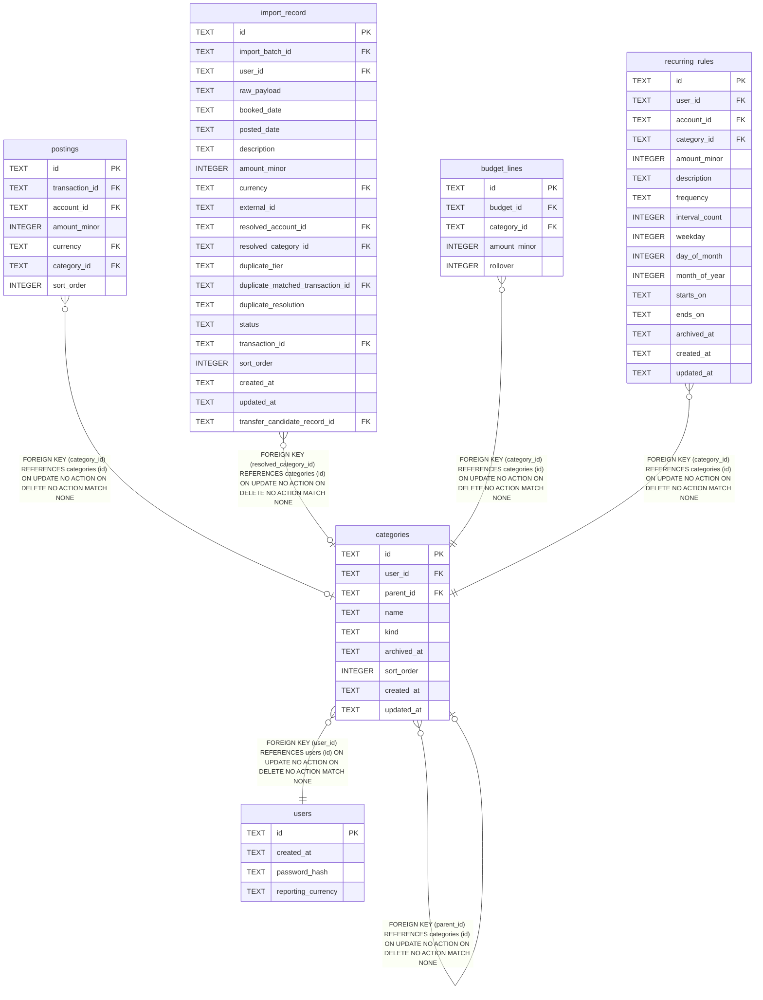

# categories

## Description

<details>
<summary><strong>Table Definition</strong></summary>

```sql
CREATE TABLE "categories" (
    id         TEXT PRIMARY KEY,
    user_id    TEXT NOT NULL REFERENCES users (id),
    parent_id  TEXT REFERENCES categories (id),
    name       TEXT NOT NULL,
    kind       TEXT NOT NULL CHECK (kind IN ('expense', 'income')),
    archived_at TEXT,
    sort_order INTEGER NOT NULL DEFAULT 0,
    created_at TEXT NOT NULL,
    updated_at TEXT NOT NULL
)
```

</details>

## Columns

| Name | Type | Default | Nullable | Children | Parents | Comment |
| ---- | ---- | ------- | -------- | -------- | ------- | ------- |
| id | TEXT |  | true | [postings](postings.md) [categories](categories.md) [import_record](import_record.md) [budget_lines](budget_lines.md) [recurring_rules](recurring_rules.md) |  |  |
| user_id | TEXT |  | false |  | [users](users.md) |  |
| parent_id | TEXT |  | true |  | [categories](categories.md) |  |
| name | TEXT |  | false |  |  |  |
| kind | TEXT |  | false |  |  |  |
| archived_at | TEXT |  | true |  |  |  |
| sort_order | INTEGER | 0 | false |  |  |  |
| created_at | TEXT |  | false |  |  |  |
| updated_at | TEXT |  | false |  |  |  |

## Constraints

| Name | Type | Definition |
| ---- | ---- | ---------- |
| id | PRIMARY KEY | PRIMARY KEY (id) |
| - (Foreign key ID: 0) | FOREIGN KEY | FOREIGN KEY (parent_id) REFERENCES categories (id) ON UPDATE NO ACTION ON DELETE NO ACTION MATCH NONE |
| - (Foreign key ID: 1) | FOREIGN KEY | FOREIGN KEY (user_id) REFERENCES users (id) ON UPDATE NO ACTION ON DELETE NO ACTION MATCH NONE |
| sqlite_autoindex_categories_1 | PRIMARY KEY | PRIMARY KEY (id) |
| - | CHECK | CHECK (kind IN ('expense', 'income')) |

## Indexes

| Name | Definition |
| ---- | ---------- |
| idx_categories_unique_sibling_name | CREATE UNIQUE INDEX idx_categories_unique_sibling_name<br />    ON categories (user_id, parent_id, name)<br />    WHERE parent_id IS NOT NULL |
| idx_categories_unique_top_level_name | CREATE UNIQUE INDEX idx_categories_unique_top_level_name<br />    ON categories (user_id, name)<br />    WHERE parent_id IS NULL |
| idx_categories_parent_id | CREATE INDEX idx_categories_parent_id ON categories (parent_id) |
| idx_categories_user_id | CREATE INDEX idx_categories_user_id ON categories (user_id) |
| sqlite_autoindex_categories_1 | PRIMARY KEY (id) |

## Relations



---

> Generated by [tbls](https://github.com/k1LoW/tbls)
