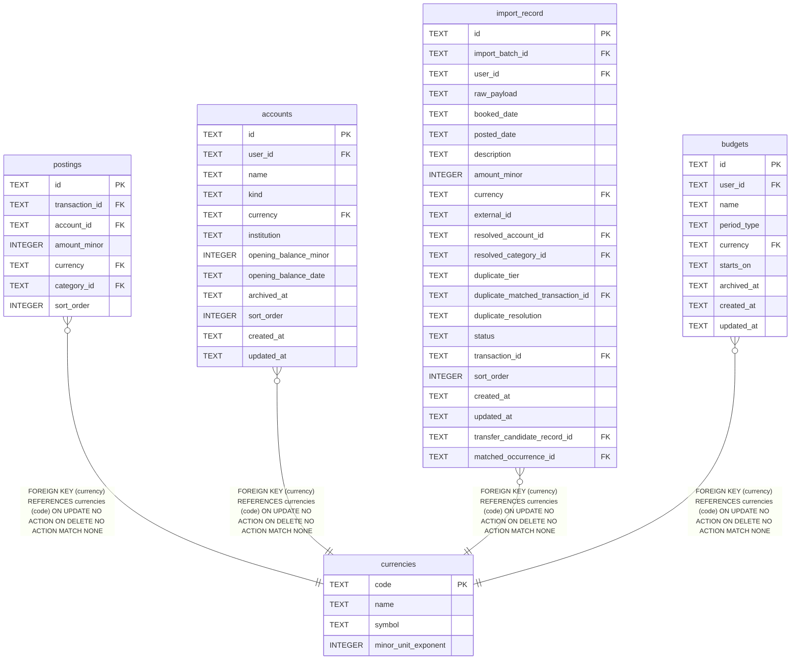

# currencies

## Description

<details>
<summary><strong>Table Definition</strong></summary>

```sql
CREATE TABLE currencies (
    code                TEXT PRIMARY KEY,
    name                TEXT NOT NULL,
    symbol              TEXT NOT NULL,
    minor_unit_exponent INTEGER NOT NULL
)
```

</details>

## Columns

| Name | Type | Default | Nullable | Children | Parents | Comment |
| ---- | ---- | ------- | -------- | -------- | ------- | ------- |
| code | TEXT |  | true | [postings](postings.md) [accounts](accounts.md) [import_record](import_record.md) [budgets](budgets.md) |  |  |
| name | TEXT |  | false |  |  |  |
| symbol | TEXT |  | false |  |  |  |
| minor_unit_exponent | INTEGER |  | false |  |  |  |

## Constraints

| Name | Type | Definition |
| ---- | ---- | ---------- |
| code | PRIMARY KEY | PRIMARY KEY (code) |
| sqlite_autoindex_currencies_1 | PRIMARY KEY | PRIMARY KEY (code) |

## Indexes

| Name | Definition |
| ---- | ---------- |
| sqlite_autoindex_currencies_1 | PRIMARY KEY (code) |

## Relations



---

> Generated by [tbls](https://github.com/k1LoW/tbls)
