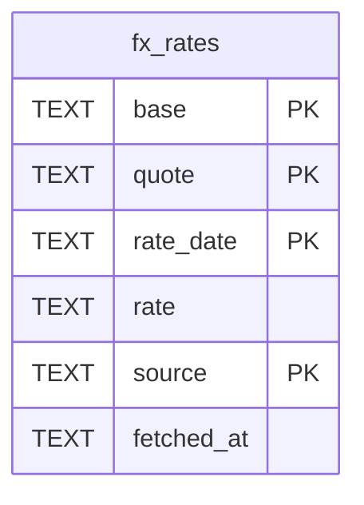

# fx_rates

## Description

<details>
<summary><strong>Table Definition</strong></summary>

```sql
CREATE TABLE fx_rates (
    base       TEXT NOT NULL,
    quote      TEXT NOT NULL,
    rate_date  TEXT NOT NULL,
    rate       TEXT NOT NULL,
    source     TEXT NOT NULL,
    fetched_at TEXT NOT NULL,
    PRIMARY KEY (base, quote, rate_date, source)
)
```

</details>

## Columns

| Name | Type | Default | Nullable | Children | Parents | Comment |
| ---- | ---- | ------- | -------- | -------- | ------- | ------- |
| base | TEXT |  | false |  |  |  |
| quote | TEXT |  | false |  |  |  |
| rate_date | TEXT |  | false |  |  |  |
| rate | TEXT |  | false |  |  |  |
| source | TEXT |  | false |  |  |  |
| fetched_at | TEXT |  | false |  |  |  |

## Constraints

| Name | Type | Definition |
| ---- | ---- | ---------- |
| base | PRIMARY KEY | PRIMARY KEY (base) |
| quote | PRIMARY KEY | PRIMARY KEY (quote) |
| rate_date | PRIMARY KEY | PRIMARY KEY (rate_date) |
| source | PRIMARY KEY | PRIMARY KEY (source) |
| sqlite_autoindex_fx_rates_1 | PRIMARY KEY | PRIMARY KEY (base, quote, rate_date, source) |

## Indexes

| Name | Definition |
| ---- | ---------- |
| sqlite_autoindex_fx_rates_1 | PRIMARY KEY (base, quote, rate_date, source) |

## Relations



---

> Generated by [tbls](https://github.com/k1LoW/tbls)
