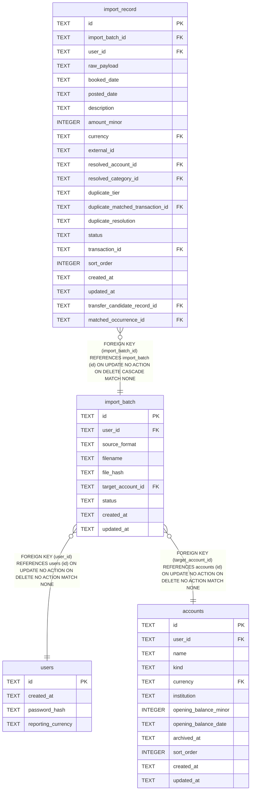

# import_batch

## Description

<details>
<summary><strong>Table Definition</strong></summary>

```sql
CREATE TABLE import_batch (
    id                TEXT NOT NULL PRIMARY KEY,
    user_id           TEXT NOT NULL REFERENCES users (id),
    -- Free-text label identifying which parser produced this batch's
    -- records (e.g. "csv", "ofx") — not CHECK-constrained to a known list,
    -- because recognising formats is the parser registry's job (a later,
    -- out-of-scope issue), not this migration's.
    source_format     TEXT NOT NULL,
    filename          TEXT NOT NULL,
    -- Content hash of the source file, for an idempotency check a later
    -- issue may add (e.g. refusing to re-stage an already-imported file).
    file_hash         TEXT NOT NULL,
    target_account_id TEXT NOT NULL REFERENCES accounts (id),
    -- importing.ImportBatchStatus's four values, in ADR-0008's linear
    -- staged -> reviewed -> committed -> rolled_back order. The state
    -- machine itself (which transitions are legal) lives in the domain
    -- package, not here — this CHECK only guards against a value outside
    -- the known set ever reaching the column.
    status            TEXT NOT NULL CHECK (status IN ('staged', 'reviewed', 'committed', 'rolled_back')),
    created_at        TEXT NOT NULL,
    updated_at        TEXT NOT NULL
)
```

</details>

## Columns

| Name | Type | Default | Nullable | Children | Parents | Comment |
| ---- | ---- | ------- | -------- | -------- | ------- | ------- |
| id | TEXT |  | false | [import_record](import_record.md) |  |  |
| user_id | TEXT |  | false |  | [users](users.md) |  |
| source_format | TEXT |  | false |  |  |  |
| filename | TEXT |  | false |  |  |  |
| file_hash | TEXT |  | false |  |  |  |
| target_account_id | TEXT |  | false |  | [accounts](accounts.md) |  |
| status | TEXT |  | false |  |  |  |
| created_at | TEXT |  | false |  |  |  |
| updated_at | TEXT |  | false |  |  |  |

## Constraints

| Name | Type | Definition |
| ---- | ---- | ---------- |
| id | PRIMARY KEY | PRIMARY KEY (id) |
| - (Foreign key ID: 0) | FOREIGN KEY | FOREIGN KEY (target_account_id) REFERENCES accounts (id) ON UPDATE NO ACTION ON DELETE NO ACTION MATCH NONE |
| - (Foreign key ID: 1) | FOREIGN KEY | FOREIGN KEY (user_id) REFERENCES users (id) ON UPDATE NO ACTION ON DELETE NO ACTION MATCH NONE |
| sqlite_autoindex_import_batch_1 | PRIMARY KEY | PRIMARY KEY (id) |
| - | CHECK | check       (e.g. refusing to re-stage an already-imported file) |
| - | CHECK | CHECK (status IN ('staged', 'reviewed', 'committed', 'rolled_back')) |

## Indexes

| Name | Definition |
| ---- | ---------- |
| idx_import_batch_user_id | CREATE INDEX idx_import_batch_user_id ON import_batch (user_id) |
| sqlite_autoindex_import_batch_1 | PRIMARY KEY (id) |

## Relations



---

> Generated by [tbls](https://github.com/k1LoW/tbls)
