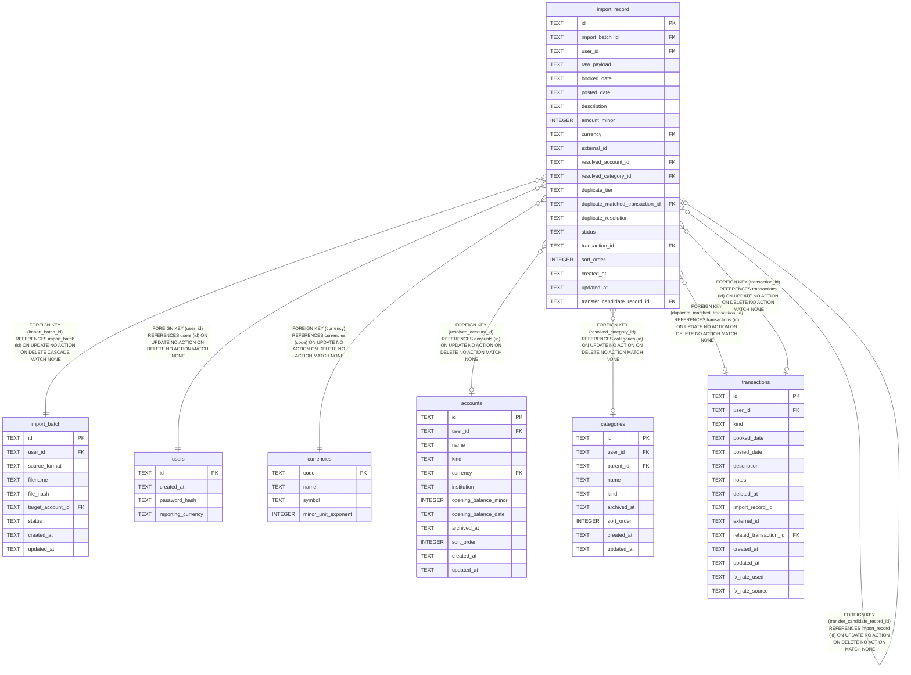

# import_record

## Description

<details>
<summary><strong>Table Definition</strong></summary>

```sql
CREATE TABLE import_record (
    id                                TEXT NOT NULL PRIMARY KEY,
    import_batch_id                   TEXT NOT NULL REFERENCES import_batch (id) ON DELETE CASCADE,
    user_id                           TEXT NOT NULL REFERENCES users (id),
    -- The untouched source row, exactly as the parser received it (CSV
    -- text, a JSON object, ...). This package has no opinion on its shape.
    raw_payload                       TEXT NOT NULL,
    -- The parser's already-normalised output (ADR-0008: "a parser's only
    -- job is to turn bytes into normalised ImportRecord fields") —
    -- data-model.md §9's booked_date/posted_date split applies here the
    -- same way it does on transactions.
    booked_date                       TEXT NOT NULL,
    posted_date                       TEXT,
    description                       TEXT NOT NULL,
    amount_minor                      INTEGER NOT NULL,
    currency                          TEXT NOT NULL REFERENCES currencies (code),
    -- The source system's own transaction ID, if it has one — ADR-0008's
    -- tier-1 exact-duplicate key is (account_id, external_id), checked
    -- against resolved_account_id once mapping (a later issue) has run.
    external_id                       TEXT,
    -- Written by the mapping stage (a later, out-of-scope issue); NULL
    -- until then.
    resolved_account_id               TEXT REFERENCES accounts (id),
    resolved_category_id              TEXT REFERENCES categories (id),
    -- The duplicate-detection candidate (a later, out-of-scope issue) this
    -- row matched against, if any. Both columns are NULL together or set
    -- together — there is no match without a matched transaction, and vice
    -- versa.
    duplicate_tier                    TEXT CHECK (duplicate_tier IN ('exact', 'suspected_duplicate')),
    duplicate_matched_transaction_id  TEXT REFERENCES transactions (id),
    -- The user's decision on that match (ADR-0008: "the decision is
    -- recorded on the ImportRecord for auditability"). Defaults to
    -- 'pending' rather than NULL because a row with no match at all is
    -- still, trivially, "no decision made" — the same value a matched-but-
    -- not-yet-reviewed row holds.
    duplicate_resolution              TEXT NOT NULL DEFAULT 'pending'
                                          CHECK (duplicate_resolution IN ('pending', 'confirmed_duplicate', 'not_duplicate')),
    -- importing.ImportRecordStatus's four values: pending is the only
    -- branching point (pending -> ready or pending -> excluded), then
    -- ready -> committed. See import_batch.status above for why the state
    -- machine itself isn't expressed as a CHECK.
    status                            TEXT NOT NULL CHECK (status IN ('pending', 'ready', 'excluded', 'committed')),
    -- The transaction this row produced, once its batch commits (a later,
    -- out-of-scope issue). Required exactly when status = 'committed'.
    transaction_id                    TEXT REFERENCES transactions (id),
    -- Preserves the source file's row order — display and processing
    -- order only, the same role posting.sort_order plays for a
    -- transaction's postings.
    sort_order                        INTEGER NOT NULL DEFAULT 0,
    created_at                        TEXT NOT NULL,
    updated_at                        TEXT NOT NULL, transfer_candidate_record_id TEXT REFERENCES import_record (id),
    -- Table-level constraints must come after every column definition
    -- (SQLite syntax) — both cross-column invariants live here rather
    -- than inline next to the columns they mention.
    CHECK ((duplicate_tier IS NULL) = (duplicate_matched_transaction_id IS NULL)),
    CHECK (status != 'committed' OR transaction_id IS NOT NULL)
)
```

</details>

## Columns

| Name | Type | Default | Nullable | Children | Parents | Comment |
| ---- | ---- | ------- | -------- | -------- | ------- | ------- |
| id | TEXT |  | false | [import_record](import_record.md) |  |  |
| import_batch_id | TEXT |  | false |  | [import_batch](import_batch.md) |  |
| user_id | TEXT |  | false |  | [users](users.md) |  |
| raw_payload | TEXT |  | false |  |  |  |
| booked_date | TEXT |  | false |  |  |  |
| posted_date | TEXT |  | true |  |  |  |
| description | TEXT |  | false |  |  |  |
| amount_minor | INTEGER |  | false |  |  |  |
| currency | TEXT |  | false |  | [currencies](currencies.md) |  |
| external_id | TEXT |  | true |  |  |  |
| resolved_account_id | TEXT |  | true |  | [accounts](accounts.md) |  |
| resolved_category_id | TEXT |  | true |  | [categories](categories.md) |  |
| duplicate_tier | TEXT |  | true |  |  |  |
| duplicate_matched_transaction_id | TEXT |  | true |  | [transactions](transactions.md) |  |
| duplicate_resolution | TEXT | 'pending' | false |  |  |  |
| status | TEXT |  | false |  |  |  |
| transaction_id | TEXT |  | true |  | [transactions](transactions.md) |  |
| sort_order | INTEGER | 0 | false |  |  |  |
| created_at | TEXT |  | false |  |  |  |
| updated_at | TEXT |  | false |  |  |  |
| transfer_candidate_record_id | TEXT |  | true |  | [import_record](import_record.md) |  |

## Constraints

| Name | Type | Definition |
| ---- | ---- | ---------- |
| id | PRIMARY KEY | PRIMARY KEY (id) |
| - (Foreign key ID: 0) | FOREIGN KEY | FOREIGN KEY (transfer_candidate_record_id) REFERENCES import_record (id) ON UPDATE NO ACTION ON DELETE NO ACTION MATCH NONE |
| - (Foreign key ID: 1) | FOREIGN KEY | FOREIGN KEY (transaction_id) REFERENCES transactions (id) ON UPDATE NO ACTION ON DELETE NO ACTION MATCH NONE |
| - (Foreign key ID: 2) | FOREIGN KEY | FOREIGN KEY (duplicate_matched_transaction_id) REFERENCES transactions (id) ON UPDATE NO ACTION ON DELETE NO ACTION MATCH NONE |
| - (Foreign key ID: 3) | FOREIGN KEY | FOREIGN KEY (resolved_category_id) REFERENCES categories (id) ON UPDATE NO ACTION ON DELETE NO ACTION MATCH NONE |
| - (Foreign key ID: 4) | FOREIGN KEY | FOREIGN KEY (resolved_account_id) REFERENCES accounts (id) ON UPDATE NO ACTION ON DELETE NO ACTION MATCH NONE |
| - (Foreign key ID: 5) | FOREIGN KEY | FOREIGN KEY (currency) REFERENCES currencies (code) ON UPDATE NO ACTION ON DELETE NO ACTION MATCH NONE |
| - (Foreign key ID: 6) | FOREIGN KEY | FOREIGN KEY (user_id) REFERENCES users (id) ON UPDATE NO ACTION ON DELETE NO ACTION MATCH NONE |
| - (Foreign key ID: 7) | FOREIGN KEY | FOREIGN KEY (import_batch_id) REFERENCES import_batch (id) ON UPDATE NO ACTION ON DELETE CASCADE MATCH NONE |
| sqlite_autoindex_import_record_1 | PRIMARY KEY | PRIMARY KEY (id) |
| - | CHECK | CHECK (duplicate_tier IN ('exact', 'suspected_duplicate')) |
| - | CHECK | CHECK (duplicate_resolution IN ('pending', 'confirmed_duplicate', 'not_duplicate')) |
| - | CHECK | CHECK (status IN ('pending', 'ready', 'excluded', 'committed')) |
| - | CHECK | CHECK ((duplicate_tier IS NULL) = (duplicate_matched_transaction_id IS NULL)) |
| - | CHECK | CHECK (status != 'committed' OR transaction_id IS NOT NULL) |

## Indexes

| Name | Definition |
| ---- | ---------- |
| idx_import_record_user_id | CREATE INDEX idx_import_record_user_id ON import_record (user_id) |
| idx_import_record_batch_id | CREATE INDEX idx_import_record_batch_id ON import_record (import_batch_id) |
| sqlite_autoindex_import_record_1 | PRIMARY KEY (id) |

## Relations



---

> Generated by [tbls](https://github.com/k1LoW/tbls)
