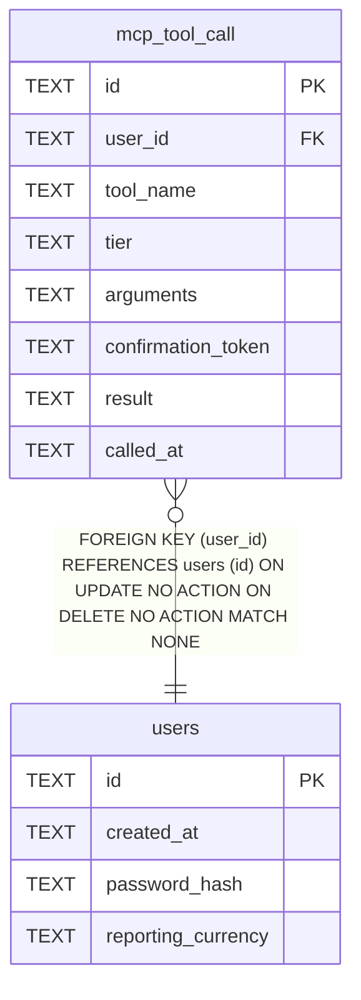

# mcp_tool_call

## Description

<details>
<summary><strong>Table Definition</strong></summary>

```sql
CREATE TABLE mcp_tool_call (
    id                 TEXT NOT NULL PRIMARY KEY,
    user_id            TEXT NOT NULL REFERENCES users (id),
    tool_name          TEXT NOT NULL,
    tier               TEXT NOT NULL CHECK (tier IN ('read', 'write', 'destructive')),
    arguments          TEXT NOT NULL,
    confirmation_token TEXT,
    result             TEXT NOT NULL,
    called_at          TEXT NOT NULL
)
```

</details>

## Columns

| Name | Type | Default | Nullable | Children | Parents | Comment |
| ---- | ---- | ------- | -------- | -------- | ------- | ------- |
| id | TEXT |  | false |  |  |  |
| user_id | TEXT |  | false |  | [users](users.md) |  |
| tool_name | TEXT |  | false |  |  |  |
| tier | TEXT |  | false |  |  |  |
| arguments | TEXT |  | false |  |  |  |
| confirmation_token | TEXT |  | true |  |  |  |
| result | TEXT |  | false |  |  |  |
| called_at | TEXT |  | false |  |  |  |

## Constraints

| Name | Type | Definition |
| ---- | ---- | ---------- |
| id | PRIMARY KEY | PRIMARY KEY (id) |
| - (Foreign key ID: 0) | FOREIGN KEY | FOREIGN KEY (user_id) REFERENCES users (id) ON UPDATE NO ACTION ON DELETE NO ACTION MATCH NONE |
| sqlite_autoindex_mcp_tool_call_1 | PRIMARY KEY | PRIMARY KEY (id) |
| - | CHECK | CHECK (tier IN ('read', 'write', 'destructive')) |

## Indexes

| Name | Definition |
| ---- | ---------- |
| idx_mcp_tool_call_user_id_called_at | CREATE INDEX idx_mcp_tool_call_user_id_called_at ON mcp_tool_call (user_id, called_at DESC) |
| sqlite_autoindex_mcp_tool_call_1 | PRIMARY KEY (id) |

## Relations



---

> Generated by [tbls](https://github.com/k1LoW/tbls)
