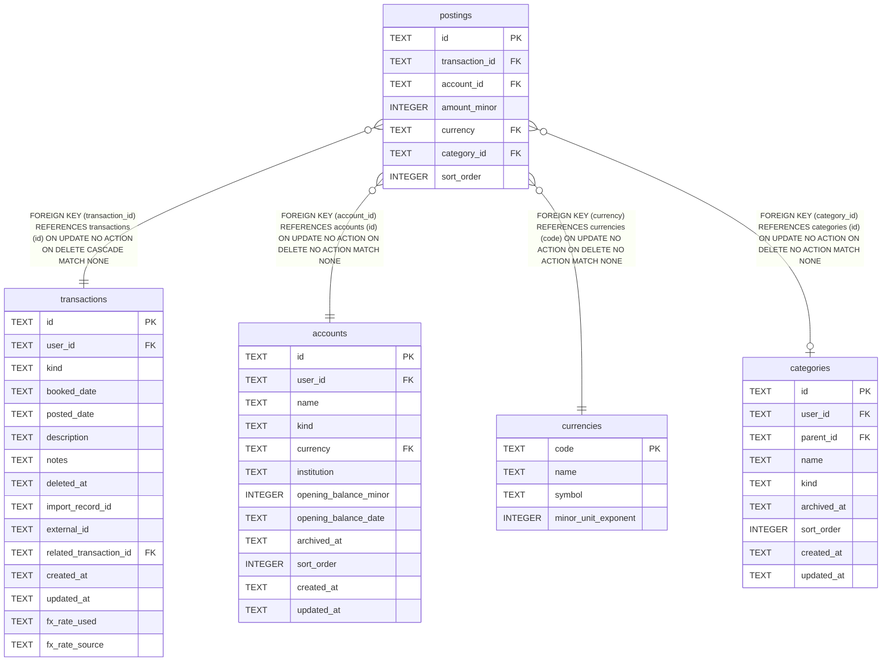

# postings

## Description

<details>
<summary><strong>Table Definition</strong></summary>

```sql
CREATE TABLE postings (
    id           TEXT PRIMARY KEY,
    transaction_id TEXT NOT NULL REFERENCES transactions (id) ON DELETE CASCADE,
    account_id   TEXT NOT NULL REFERENCES accounts (id),
    amount_minor INTEGER NOT NULL,
    currency     TEXT NOT NULL REFERENCES currencies (code),
    category_id  TEXT REFERENCES categories (id),
    sort_order   INTEGER NOT NULL DEFAULT 0
)
```

</details>

## Columns

| Name | Type | Default | Nullable | Children | Parents | Comment |
| ---- | ---- | ------- | -------- | -------- | ------- | ------- |
| id | TEXT |  | true |  |  |  |
| transaction_id | TEXT |  | false |  | [transactions](transactions.md) |  |
| account_id | TEXT |  | false |  | [accounts](accounts.md) |  |
| amount_minor | INTEGER |  | false |  |  |  |
| currency | TEXT |  | false |  | [currencies](currencies.md) |  |
| category_id | TEXT |  | true |  | [categories](categories.md) |  |
| sort_order | INTEGER | 0 | false |  |  |  |

## Constraints

| Name | Type | Definition |
| ---- | ---- | ---------- |
| id | PRIMARY KEY | PRIMARY KEY (id) |
| - (Foreign key ID: 0) | FOREIGN KEY | FOREIGN KEY (category_id) REFERENCES categories (id) ON UPDATE NO ACTION ON DELETE NO ACTION MATCH NONE |
| - (Foreign key ID: 1) | FOREIGN KEY | FOREIGN KEY (currency) REFERENCES currencies (code) ON UPDATE NO ACTION ON DELETE NO ACTION MATCH NONE |
| - (Foreign key ID: 2) | FOREIGN KEY | FOREIGN KEY (account_id) REFERENCES accounts (id) ON UPDATE NO ACTION ON DELETE NO ACTION MATCH NONE |
| - (Foreign key ID: 3) | FOREIGN KEY | FOREIGN KEY (transaction_id) REFERENCES transactions (id) ON UPDATE NO ACTION ON DELETE CASCADE MATCH NONE |
| sqlite_autoindex_postings_1 | PRIMARY KEY | PRIMARY KEY (id) |

## Indexes

| Name | Definition |
| ---- | ---------- |
| idx_postings_category_id | CREATE INDEX idx_postings_category_id ON postings (category_id) |
| idx_postings_account_id | CREATE INDEX idx_postings_account_id ON postings (account_id) |
| idx_postings_transaction_id | CREATE INDEX idx_postings_transaction_id ON postings (transaction_id) |
| sqlite_autoindex_postings_1 | PRIMARY KEY (id) |

## Relations



---

> Generated by [tbls](https://github.com/k1LoW/tbls)
