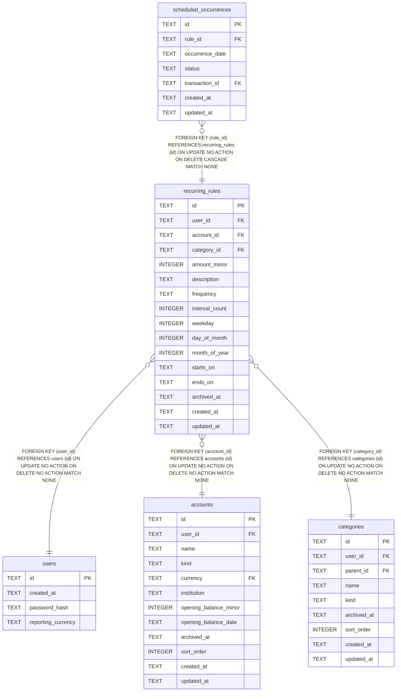

# recurring_rules

## Description

<details>
<summary><strong>Table Definition</strong></summary>

```sql
CREATE TABLE recurring_rules (
    id             TEXT NOT NULL PRIMARY KEY,
    user_id        TEXT NOT NULL REFERENCES users (id),
    account_id     TEXT NOT NULL REFERENCES accounts (id),
    category_id    TEXT NOT NULL REFERENCES categories (id),
    amount_minor   INTEGER NOT NULL CHECK (amount_minor > 0),
    description    TEXT NOT NULL,
    frequency      TEXT NOT NULL CHECK (frequency IN ('weekly', 'monthly', 'yearly')),
    interval_count INTEGER NOT NULL DEFAULT 1 CHECK (interval_count >= 1),
    weekday        INTEGER CHECK (weekday BETWEEN 0 AND 6),
    day_of_month   INTEGER CHECK (day_of_month BETWEEN 1 AND 31),
    month_of_year  INTEGER CHECK (month_of_year BETWEEN 1 AND 12),
    starts_on      TEXT NOT NULL,
    ends_on        TEXT,
    archived_at    TEXT,
    created_at     TEXT NOT NULL,
    updated_at     TEXT NOT NULL,
    -- Exactly the positional fields the declared frequency needs, and no
    -- others -- the schema half of recurring.Schedule's own "only one way
    -- to construct this" rule.
    CHECK (
        (frequency = 'weekly'  AND weekday IS NOT NULL AND day_of_month IS NULL     AND month_of_year IS NULL)
        OR (frequency = 'monthly' AND weekday IS NULL  AND day_of_month IS NOT NULL AND month_of_year IS NULL)
        OR (frequency = 'yearly'  AND weekday IS NULL  AND day_of_month IS NOT NULL AND month_of_year IS NOT NULL)
    )
)
```

</details>

## Columns

| Name | Type | Default | Nullable | Children | Parents | Comment |
| ---- | ---- | ------- | -------- | -------- | ------- | ------- |
| id | TEXT |  | false | [scheduled_occurrences](scheduled_occurrences.md) |  |  |
| user_id | TEXT |  | false |  | [users](users.md) |  |
| account_id | TEXT |  | false |  | [accounts](accounts.md) |  |
| category_id | TEXT |  | false |  | [categories](categories.md) |  |
| amount_minor | INTEGER |  | false |  |  |  |
| description | TEXT |  | false |  |  |  |
| frequency | TEXT |  | false |  |  |  |
| interval_count | INTEGER | 1 | false |  |  |  |
| weekday | INTEGER |  | true |  |  |  |
| day_of_month | INTEGER |  | true |  |  |  |
| month_of_year | INTEGER |  | true |  |  |  |
| starts_on | TEXT |  | false |  |  |  |
| ends_on | TEXT |  | true |  |  |  |
| archived_at | TEXT |  | true |  |  |  |
| created_at | TEXT |  | false |  |  |  |
| updated_at | TEXT |  | false |  |  |  |

## Constraints

| Name | Type | Definition |
| ---- | ---- | ---------- |
| id | PRIMARY KEY | PRIMARY KEY (id) |
| - (Foreign key ID: 0) | FOREIGN KEY | FOREIGN KEY (category_id) REFERENCES categories (id) ON UPDATE NO ACTION ON DELETE NO ACTION MATCH NONE |
| - (Foreign key ID: 1) | FOREIGN KEY | FOREIGN KEY (account_id) REFERENCES accounts (id) ON UPDATE NO ACTION ON DELETE NO ACTION MATCH NONE |
| - (Foreign key ID: 2) | FOREIGN KEY | FOREIGN KEY (user_id) REFERENCES users (id) ON UPDATE NO ACTION ON DELETE NO ACTION MATCH NONE |
| sqlite_autoindex_recurring_rules_1 | PRIMARY KEY | PRIMARY KEY (id) |
| - | CHECK | CHECK (amount_minor > 0) |
| - | CHECK | CHECK (frequency IN ('weekly', 'monthly', 'yearly')) |
| - | CHECK | CHECK (interval_count >= 1) |
| - | CHECK | CHECK (weekday BETWEEN 0 AND 6) |
| - | CHECK | CHECK (day_of_month BETWEEN 1 AND 31) |
| - | CHECK | CHECK (month_of_year BETWEEN 1 AND 12) |
| - | CHECK | CHECK ( (frequency = 'weekly' AND weekday IS NOT NULL AND day_of_month IS NULL AND month_of_year IS NULL) OR (frequency = 'monthly' AND weekday IS NULL AND day_of_month IS NOT NULL AND month_of_year IS NULL) OR (frequency = 'yearly' AND weekday IS NULL AND day_of_month IS NOT NULL AND month_of_year IS NOT NULL) ) |

## Indexes

| Name | Definition |
| ---- | ---------- |
| idx_recurring_rules_category_id | CREATE INDEX idx_recurring_rules_category_id ON recurring_rules (category_id) |
| idx_recurring_rules_account_id | CREATE INDEX idx_recurring_rules_account_id ON recurring_rules (account_id) |
| idx_recurring_rules_user_id | CREATE INDEX idx_recurring_rules_user_id ON recurring_rules (user_id) |
| sqlite_autoindex_recurring_rules_1 | PRIMARY KEY (id) |

## Relations



---

> Generated by [tbls](https://github.com/k1LoW/tbls)
