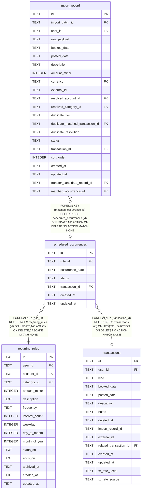

# scheduled_occurrences

## Description

<details>
<summary><strong>Table Definition</strong></summary>

```sql
CREATE TABLE scheduled_occurrences (
    id              TEXT NOT NULL PRIMARY KEY,
    rule_id         TEXT NOT NULL REFERENCES recurring_rules (id) ON DELETE CASCADE,
    occurrence_date TEXT NOT NULL,
    status          TEXT NOT NULL DEFAULT 'pending' CHECK (status IN ('pending', 'materialised', 'skipped')),
    transaction_id  TEXT REFERENCES transactions (id),
    created_at      TEXT NOT NULL,
    updated_at      TEXT NOT NULL,
    -- Status and provenance can't drift apart, even through a direct
    -- write: a materialised occurrence has a transaction, and a pending
    -- or skipped one does not. recurring.NewScheduledOccurrence enforces
    -- the same rule in the domain layer.
    CHECK ((status = 'materialised') = (transaction_id IS NOT NULL)),
    UNIQUE (rule_id, occurrence_date)
)
```

</details>

## Columns

| Name | Type | Default | Nullable | Children | Parents | Comment |
| ---- | ---- | ------- | -------- | -------- | ------- | ------- |
| id | TEXT |  | false | [import_record](import_record.md) |  |  |
| rule_id | TEXT |  | false |  | [recurring_rules](recurring_rules.md) |  |
| occurrence_date | TEXT |  | false |  |  |  |
| status | TEXT | 'pending' | false |  |  |  |
| transaction_id | TEXT |  | true |  | [transactions](transactions.md) |  |
| created_at | TEXT |  | false |  |  |  |
| updated_at | TEXT |  | false |  |  |  |

## Constraints

| Name | Type | Definition |
| ---- | ---- | ---------- |
| id | PRIMARY KEY | PRIMARY KEY (id) |
| - (Foreign key ID: 0) | FOREIGN KEY | FOREIGN KEY (transaction_id) REFERENCES transactions (id) ON UPDATE NO ACTION ON DELETE NO ACTION MATCH NONE |
| - (Foreign key ID: 1) | FOREIGN KEY | FOREIGN KEY (rule_id) REFERENCES recurring_rules (id) ON UPDATE NO ACTION ON DELETE CASCADE MATCH NONE |
| sqlite_autoindex_scheduled_occurrences_2 | UNIQUE | UNIQUE (rule_id, occurrence_date) |
| sqlite_autoindex_scheduled_occurrences_1 | PRIMARY KEY | PRIMARY KEY (id) |
| - | CHECK | CHECK (status IN ('pending', 'materialised', 'skipped')) |
| - | CHECK | CHECK ((status = 'materialised') = (transaction_id IS NOT NULL)) |

## Indexes

| Name | Definition |
| ---- | ---------- |
| idx_scheduled_occurrences_transaction_id | CREATE INDEX idx_scheduled_occurrences_transaction_id ON scheduled_occurrences (transaction_id) |
| idx_scheduled_occurrences_status_date | CREATE INDEX idx_scheduled_occurrences_status_date ON scheduled_occurrences (status, occurrence_date) |
| sqlite_autoindex_scheduled_occurrences_2 | UNIQUE (rule_id, occurrence_date) |
| sqlite_autoindex_scheduled_occurrences_1 | PRIMARY KEY (id) |

## Relations



---

> Generated by [tbls](https://github.com/k1LoW/tbls)
