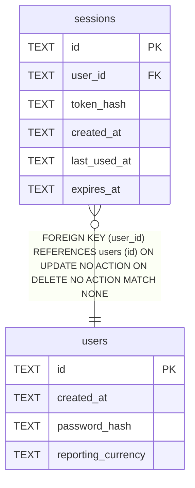

# sessions

## Description

<details>
<summary><strong>Table Definition</strong></summary>

```sql
CREATE TABLE sessions (
    id           TEXT PRIMARY KEY,
    user_id      TEXT NOT NULL REFERENCES users (id),
    token_hash   TEXT NOT NULL UNIQUE,
    created_at   TEXT NOT NULL,
    last_used_at TEXT NOT NULL,
    expires_at   TEXT NOT NULL
)
```

</details>

## Columns

| Name | Type | Default | Nullable | Children | Parents | Comment |
| ---- | ---- | ------- | -------- | -------- | ------- | ------- |
| id | TEXT |  | true |  |  |  |
| user_id | TEXT |  | false |  | [users](users.md) |  |
| token_hash | TEXT |  | false |  |  |  |
| created_at | TEXT |  | false |  |  |  |
| last_used_at | TEXT |  | false |  |  |  |
| expires_at | TEXT |  | false |  |  |  |

## Constraints

| Name | Type | Definition |
| ---- | ---- | ---------- |
| id | PRIMARY KEY | PRIMARY KEY (id) |
| - (Foreign key ID: 0) | FOREIGN KEY | FOREIGN KEY (user_id) REFERENCES users (id) ON UPDATE NO ACTION ON DELETE NO ACTION MATCH NONE |
| sqlite_autoindex_sessions_2 | UNIQUE | UNIQUE (token_hash) |
| sqlite_autoindex_sessions_1 | PRIMARY KEY | PRIMARY KEY (id) |

## Indexes

| Name | Definition |
| ---- | ---------- |
| idx_sessions_user_id | CREATE INDEX idx_sessions_user_id ON sessions (user_id) |
| sqlite_autoindex_sessions_2 | UNIQUE (token_hash) |
| sqlite_autoindex_sessions_1 | PRIMARY KEY (id) |

## Relations



---

> Generated by [tbls](https://github.com/k1LoW/tbls)
