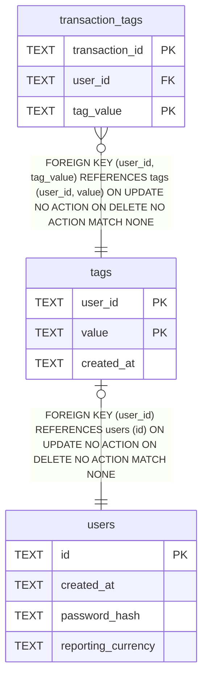

# tags

## Description

<details>
<summary><strong>Table Definition</strong></summary>

```sql
CREATE TABLE tags (
    user_id    TEXT NOT NULL REFERENCES users (id),
    value      TEXT NOT NULL,
    created_at TEXT NOT NULL,
    PRIMARY KEY (user_id, value)
)
```

</details>

## Columns

| Name | Type | Default | Nullable | Children | Parents | Comment |
| ---- | ---- | ------- | -------- | -------- | ------- | ------- |
| user_id | TEXT |  | false | [transaction_tags](transaction_tags.md) | [users](users.md) |  |
| value | TEXT |  | false | [transaction_tags](transaction_tags.md) |  |  |
| created_at | TEXT |  | false |  |  |  |

## Constraints

| Name | Type | Definition |
| ---- | ---- | ---------- |
| user_id | PRIMARY KEY | PRIMARY KEY (user_id) |
| value | PRIMARY KEY | PRIMARY KEY (value) |
| - (Foreign key ID: 0) | FOREIGN KEY | FOREIGN KEY (user_id) REFERENCES users (id) ON UPDATE NO ACTION ON DELETE NO ACTION MATCH NONE |
| sqlite_autoindex_tags_1 | PRIMARY KEY | PRIMARY KEY (user_id, value) |

## Indexes

| Name | Definition |
| ---- | ---------- |
| sqlite_autoindex_tags_1 | PRIMARY KEY (user_id, value) |

## Relations



---

> Generated by [tbls](https://github.com/k1LoW/tbls)
