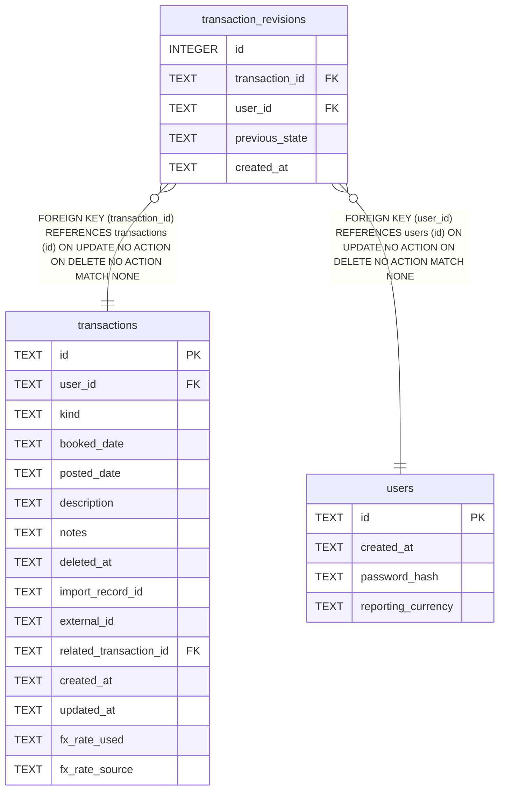

# transaction_revisions

## Description

<details>
<summary><strong>Table Definition</strong></summary>

```sql
CREATE TABLE transaction_revisions (
    id             INTEGER PRIMARY KEY AUTOINCREMENT,
    transaction_id TEXT NOT NULL REFERENCES transactions (id),
    user_id        TEXT NOT NULL REFERENCES users (id),
    previous_state TEXT NOT NULL,
    created_at     TEXT NOT NULL
)
```

</details>

## Columns

| Name | Type | Default | Nullable | Children | Parents | Comment |
| ---- | ---- | ------- | -------- | -------- | ------- | ------- |
| id | INTEGER |  | true |  |  |  |
| transaction_id | TEXT |  | false |  | [transactions](transactions.md) |  |
| user_id | TEXT |  | false |  | [users](users.md) |  |
| previous_state | TEXT |  | false |  |  |  |
| created_at | TEXT |  | false |  |  |  |

## Constraints

| Name | Type | Definition |
| ---- | ---- | ---------- |
| id | PRIMARY KEY | PRIMARY KEY (id) |
| - (Foreign key ID: 0) | FOREIGN KEY | FOREIGN KEY (user_id) REFERENCES users (id) ON UPDATE NO ACTION ON DELETE NO ACTION MATCH NONE |
| - (Foreign key ID: 1) | FOREIGN KEY | FOREIGN KEY (transaction_id) REFERENCES transactions (id) ON UPDATE NO ACTION ON DELETE NO ACTION MATCH NONE |

## Indexes

| Name | Definition |
| ---- | ---------- |
| idx_transaction_revisions_transaction_id | CREATE INDEX idx_transaction_revisions_transaction_id ON transaction_revisions (transaction_id) |

## Relations



---

> Generated by [tbls](https://github.com/k1LoW/tbls)
