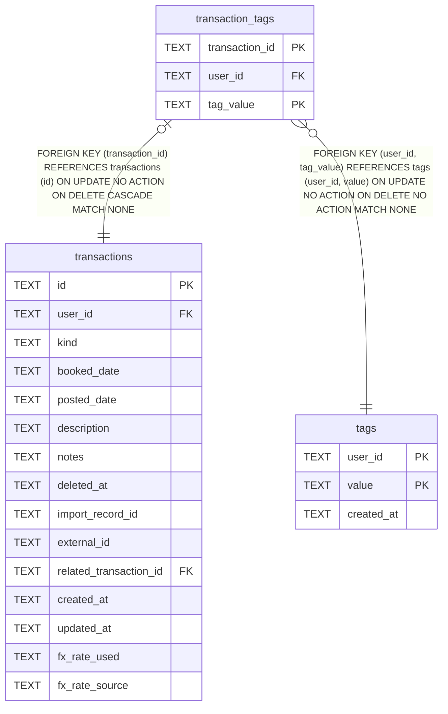

# transaction_tags

## Description

<details>
<summary><strong>Table Definition</strong></summary>

```sql
CREATE TABLE transaction_tags (
    transaction_id TEXT NOT NULL REFERENCES transactions (id) ON DELETE CASCADE,
    user_id        TEXT NOT NULL,
    tag_value      TEXT NOT NULL,
    PRIMARY KEY (transaction_id, tag_value),
    FOREIGN KEY (user_id, tag_value) REFERENCES tags (user_id, value)
)
```

</details>

## Columns

| Name | Type | Default | Nullable | Children | Parents | Comment |
| ---- | ---- | ------- | -------- | -------- | ------- | ------- |
| transaction_id | TEXT |  | false |  | [transactions](transactions.md) |  |
| user_id | TEXT |  | false |  | [tags](tags.md) |  |
| tag_value | TEXT |  | false |  | [tags](tags.md) |  |

## Constraints

| Name | Type | Definition |
| ---- | ---- | ---------- |
| transaction_id | PRIMARY KEY | PRIMARY KEY (transaction_id) |
| tag_value | PRIMARY KEY | PRIMARY KEY (tag_value) |
| - (Foreign key ID: 0) | FOREIGN KEY | FOREIGN KEY (user_id, tag_value) REFERENCES tags (user_id, value) ON UPDATE NO ACTION ON DELETE NO ACTION MATCH NONE |
| - (Foreign key ID: 1) | FOREIGN KEY | FOREIGN KEY (transaction_id) REFERENCES transactions (id) ON UPDATE NO ACTION ON DELETE CASCADE MATCH NONE |
| sqlite_autoindex_transaction_tags_1 | PRIMARY KEY | PRIMARY KEY (transaction_id, tag_value) |

## Indexes

| Name | Definition |
| ---- | ---------- |
| idx_transaction_tags_user_tag | CREATE INDEX idx_transaction_tags_user_tag ON transaction_tags (user_id, tag_value) |
| sqlite_autoindex_transaction_tags_1 | PRIMARY KEY (transaction_id, tag_value) |

## Relations



---

> Generated by [tbls](https://github.com/k1LoW/tbls)
