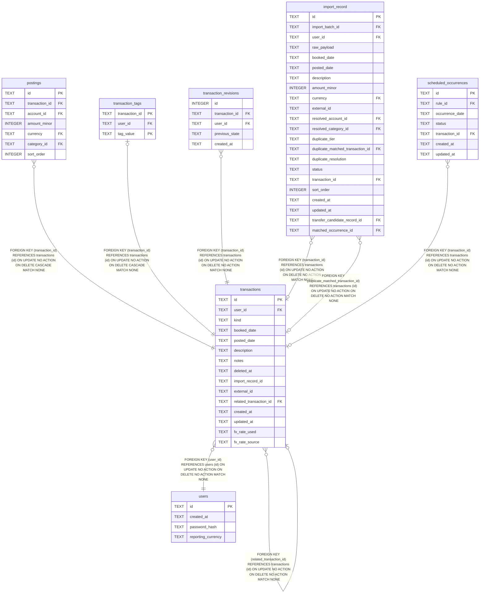

# transactions

## Description

<details>
<summary><strong>Table Definition</strong></summary>

```sql
CREATE TABLE transactions (
    id                      TEXT PRIMARY KEY,
    user_id                 TEXT NOT NULL REFERENCES users (id),
    kind                    TEXT NOT NULL CHECK (kind IN ('outflow', 'inflow', 'transfer')),
    booked_date             TEXT NOT NULL,
    posted_date             TEXT,
    description             TEXT NOT NULL,
    notes                   TEXT NOT NULL DEFAULT '',
    deleted_at              TEXT,
    import_record_id        TEXT,
    external_id             TEXT,
    related_transaction_id  TEXT REFERENCES transactions (id),
    created_at              TEXT NOT NULL,
    updated_at              TEXT NOT NULL
, fx_rate_used TEXT, fx_rate_source TEXT)
```

</details>

## Columns

| Name | Type | Default | Nullable | Children | Parents | Comment |
| ---- | ---- | ------- | -------- | -------- | ------- | ------- |
| id | TEXT |  | true | [transactions](transactions.md) [postings](postings.md) [transaction_tags](transaction_tags.md) [transaction_revisions](transaction_revisions.md) [import_record](import_record.md) [scheduled_occurrences](scheduled_occurrences.md) |  |  |
| user_id | TEXT |  | false |  | [users](users.md) |  |
| kind | TEXT |  | false |  |  |  |
| booked_date | TEXT |  | false |  |  |  |
| posted_date | TEXT |  | true |  |  |  |
| description | TEXT |  | false |  |  |  |
| notes | TEXT | '' | false |  |  |  |
| deleted_at | TEXT |  | true |  |  |  |
| import_record_id | TEXT |  | true |  |  |  |
| external_id | TEXT |  | true |  |  |  |
| related_transaction_id | TEXT |  | true |  | [transactions](transactions.md) |  |
| created_at | TEXT |  | false |  |  |  |
| updated_at | TEXT |  | false |  |  |  |
| fx_rate_used | TEXT |  | true |  |  |  |
| fx_rate_source | TEXT |  | true |  |  |  |

## Constraints

| Name | Type | Definition |
| ---- | ---- | ---------- |
| id | PRIMARY KEY | PRIMARY KEY (id) |
| - (Foreign key ID: 0) | FOREIGN KEY | FOREIGN KEY (related_transaction_id) REFERENCES transactions (id) ON UPDATE NO ACTION ON DELETE NO ACTION MATCH NONE |
| - (Foreign key ID: 1) | FOREIGN KEY | FOREIGN KEY (user_id) REFERENCES users (id) ON UPDATE NO ACTION ON DELETE NO ACTION MATCH NONE |
| sqlite_autoindex_transactions_1 | PRIMARY KEY | PRIMARY KEY (id) |
| - | CHECK | CHECK (kind IN ('outflow', 'inflow', 'transfer')) |

## Indexes

| Name | Definition |
| ---- | ---------- |
| idx_transactions_related | CREATE INDEX idx_transactions_related ON transactions (related_transaction_id) |
| idx_transactions_user_deleted_booked | CREATE INDEX idx_transactions_user_deleted_booked<br />    ON transactions (user_id, deleted_at, booked_date) |
| sqlite_autoindex_transactions_1 | PRIMARY KEY (id) |

## Relations



---

> Generated by [tbls](https://github.com/k1LoW/tbls)
