# users

## Description

<details>
<summary><strong>Table Definition</strong></summary>

```sql
CREATE TABLE users (
    id         TEXT PRIMARY KEY,
    created_at TEXT NOT NULL
, password_hash TEXT, reporting_currency TEXT)
```

</details>

## Columns

| Name | Type | Default | Nullable | Children | Parents | Comment |
| ---- | ---- | ------- | -------- | -------- | ------- | ------- |
| id | TEXT |  | true | [transactions](transactions.md) [tags](tags.md) [transaction_revisions](transaction_revisions.md) [accounts](accounts.md) [categories](categories.md) [sessions](sessions.md) [api_tokens](api_tokens.md) [import_batch](import_batch.md) [import_record](import_record.md) [budgets](budgets.md) [mcp_tool_call](mcp_tool_call.md) [recurring_rules](recurring_rules.md) |  |  |
| created_at | TEXT |  | false |  |  |  |
| password_hash | TEXT |  | true |  |  |  |
| reporting_currency | TEXT |  | true |  |  |  |

## Constraints

| Name | Type | Definition |
| ---- | ---- | ---------- |
| id | PRIMARY KEY | PRIMARY KEY (id) |
| sqlite_autoindex_users_1 | PRIMARY KEY | PRIMARY KEY (id) |

## Indexes

| Name | Definition |
| ---- | ---------- |
| sqlite_autoindex_users_1 | PRIMARY KEY (id) |

## Relations

```mermaid
erDiagram

"transactions" }o--|| "users" : "FOREIGN KEY (user_id) REFERENCES users (id) ON UPDATE NO ACTION ON DELETE NO ACTION MATCH NONE"
"tags" |o--|| "users" : "FOREIGN KEY (user_id) REFERENCES users (id) ON UPDATE NO ACTION ON DELETE NO ACTION MATCH NONE"
"transaction_revisions" }o--|| "users" : "FOREIGN KEY (user_id) REFERENCES users (id) ON UPDATE NO ACTION ON DELETE NO ACTION MATCH NONE"
"accounts" }o--|| "users" : "FOREIGN KEY (user_id) REFERENCES users (id) ON UPDATE NO ACTION ON DELETE NO ACTION MATCH NONE"
"categories" }o--|| "users" : "FOREIGN KEY (user_id) REFERENCES users (id) ON UPDATE NO ACTION ON DELETE NO ACTION MATCH NONE"
"sessions" }o--|| "users" : "FOREIGN KEY (user_id) REFERENCES users (id) ON UPDATE NO ACTION ON DELETE NO ACTION MATCH NONE"
"api_tokens" }o--|| "users" : "FOREIGN KEY (user_id) REFERENCES users (id) ON UPDATE NO ACTION ON DELETE NO ACTION MATCH NONE"
"import_batch" }o--|| "users" : "FOREIGN KEY (user_id) REFERENCES users (id) ON UPDATE NO ACTION ON DELETE NO ACTION MATCH NONE"
"import_record" }o--|| "users" : "FOREIGN KEY (user_id) REFERENCES users (id) ON UPDATE NO ACTION ON DELETE NO ACTION MATCH NONE"
"budgets" }o--|| "users" : "FOREIGN KEY (user_id) REFERENCES users (id) ON UPDATE NO ACTION ON DELETE NO ACTION MATCH NONE"
"mcp_tool_call" }o--|| "users" : "FOREIGN KEY (user_id) REFERENCES users (id) ON UPDATE NO ACTION ON DELETE NO ACTION MATCH NONE"
"recurring_rules" }o--|| "users" : "FOREIGN KEY (user_id) REFERENCES users (id) ON UPDATE NO ACTION ON DELETE NO ACTION MATCH NONE"

"users" {
  TEXT id PK
  TEXT created_at
  TEXT password_hash
  TEXT reporting_currency
}
"transactions" {
  TEXT id PK
  TEXT user_id FK
  TEXT kind
  TEXT booked_date
  TEXT posted_date
  TEXT description
  TEXT notes
  TEXT deleted_at
  TEXT import_record_id
  TEXT external_id
  TEXT related_transaction_id FK
  TEXT created_at
  TEXT updated_at
  TEXT fx_rate_used
  TEXT fx_rate_source
}
"tags" {
  TEXT user_id PK
  TEXT value PK
  TEXT created_at
}
"transaction_revisions" {
  INTEGER id
  TEXT transaction_id FK
  TEXT user_id FK
  TEXT previous_state
  TEXT created_at
}
"accounts" {
  TEXT id PK
  TEXT user_id FK
  TEXT name
  TEXT kind
  TEXT currency FK
  TEXT institution
  INTEGER opening_balance_minor
  TEXT opening_balance_date
  TEXT archived_at
  INTEGER sort_order
  TEXT created_at
  TEXT updated_at
}
"categories" {
  TEXT id PK
  TEXT user_id FK
  TEXT parent_id FK
  TEXT name
  TEXT kind
  TEXT archived_at
  INTEGER sort_order
  TEXT created_at
  TEXT updated_at
}
"sessions" {
  TEXT id PK
  TEXT user_id FK
  TEXT token_hash
  TEXT created_at
  TEXT last_used_at
  TEXT expires_at
}
"api_tokens" {
  TEXT id PK
  TEXT user_id FK
  TEXT token_hash
  TEXT name
  TEXT created_at
  TEXT last_used_at
  TEXT expires_at
  TEXT revoked_at
}
"import_batch" {
  TEXT id PK
  TEXT user_id FK
  TEXT source_format
  TEXT filename
  TEXT file_hash
  TEXT target_account_id FK
  TEXT status
  TEXT created_at
  TEXT updated_at
}
"import_record" {
  TEXT id PK
  TEXT import_batch_id FK
  TEXT user_id FK
  TEXT raw_payload
  TEXT booked_date
  TEXT posted_date
  TEXT description
  INTEGER amount_minor
  TEXT currency FK
  TEXT external_id
  TEXT resolved_account_id FK
  TEXT resolved_category_id FK
  TEXT duplicate_tier
  TEXT duplicate_matched_transaction_id FK
  TEXT duplicate_resolution
  TEXT status
  TEXT transaction_id FK
  INTEGER sort_order
  TEXT created_at
  TEXT updated_at
  TEXT transfer_candidate_record_id FK
  TEXT matched_occurrence_id FK
}
"budgets" {
  TEXT id PK
  TEXT user_id FK
  TEXT name
  TEXT period_type
  TEXT currency FK
  TEXT starts_on
  TEXT archived_at
  TEXT created_at
  TEXT updated_at
}
"mcp_tool_call" {
  TEXT id PK
  TEXT user_id FK
  TEXT tool_name
  TEXT tier
  TEXT arguments
  TEXT confirmation_token
  TEXT result
  TEXT called_at
}
"recurring_rules" {
  TEXT id PK
  TEXT user_id FK
  TEXT account_id FK
  TEXT category_id FK
  INTEGER amount_minor
  TEXT description
  TEXT frequency
  INTEGER interval_count
  INTEGER weekday
  INTEGER day_of_month
  INTEGER month_of_year
  TEXT starts_on
  TEXT ends_on
  TEXT archived_at
  TEXT created_at
  TEXT updated_at
}
```



---

> Generated by [tbls](https://github.com/k1LoW/tbls)
